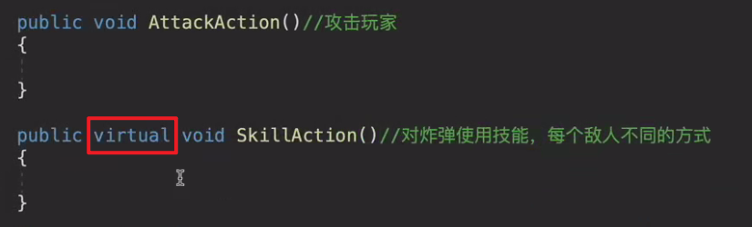
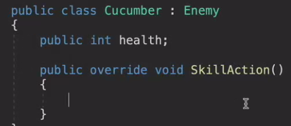
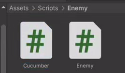

# 13.继承Enemy脚本并重写攻击和技能攻击

同一个代码中实现各种功能，会写的很复杂而且不易读

怎么解决？

引入状态机的写法，用抽象类继承的方法实现

在 C# 中，抽象方法是没有方法体的，它只定义了方法的签名，具体的实现由继承该抽象类的子类来提供。

什么叫继承的方法？

继承类就可以得到所有的变量和方法，父类中私有变量，子类无法继承，如果想要子类访问父类的代码，且其他没有继承的类不能访问，则可以设置为保护的Protected

 

给需要单独写功能的代码写成虚函数，这样子类就可以在父类的基础上继续写这个方法了

1

1.给Cucumber写一个自己的代码,继承Enemy

在Enemy中写敌人的通用逻辑，单独的逻辑，单独创建一个脚本

然后攻击和技能攻击写成虚函数，子类重写它

