# 14.代码方面的状态机

怎么写有限状态机？

if..else和Switch也都是状态机

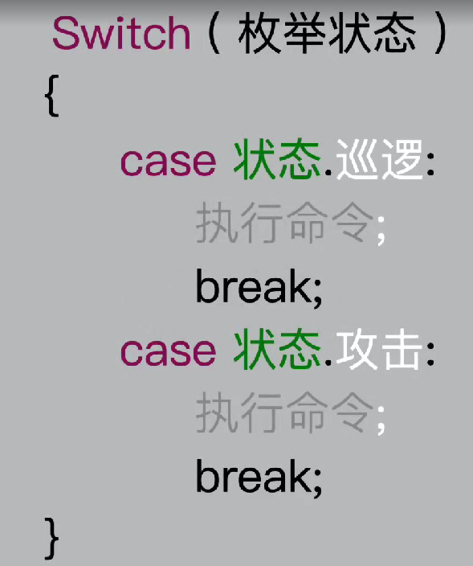

今天用抽象类继承的方式写一个状态机

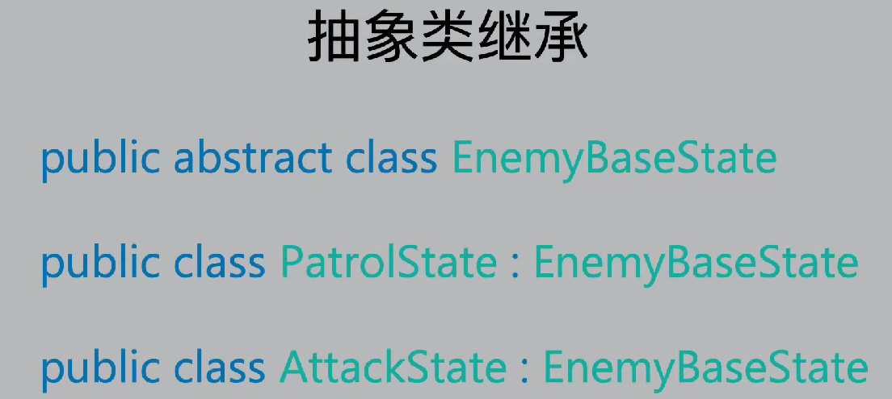

好处：

方便增加一个其他状态

现有敌人逻辑有两个状态，巡逻的状态和攻击的状态(一旦碰见玩家就会切换攻击的状态，选择攻击的状态，追击玩家或者吹熄炸弹)

1.创建一个敌人的基本状态，不需要继承Monoberhavior,实现一个模板化的方法

在 C# 中，抽象方法是没有方法体的，它只定义了方法的签名，具体的实现由继承该抽象类的子类来提供。

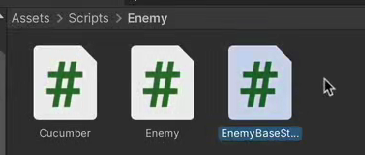

2.将脚本定义成抽象类，只在脚本中声明这些函数方法，具体方法的实现，需要写在子类继承中

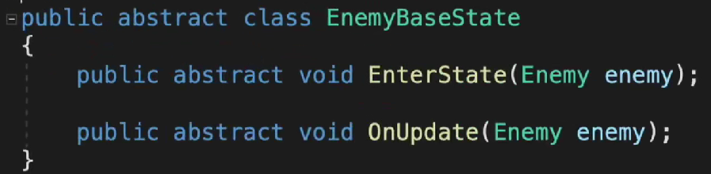

3.为人物创建两个脚本，实现巡逻和攻击的两个状态，这里险些巡逻状态，巡逻有开始进入状态和持续更新状态的逻辑，开始选择方向，持续的移动和判断转向

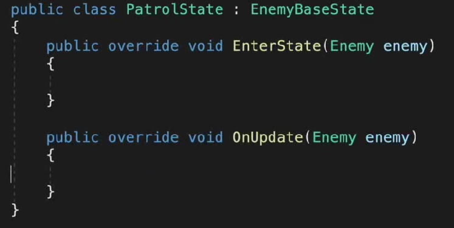

然后将Enemy中写的开始和持续的状态剪切到动画状态机中

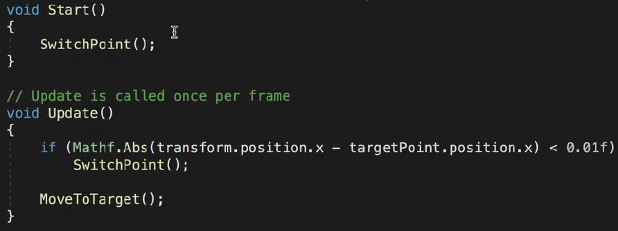

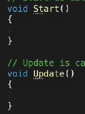

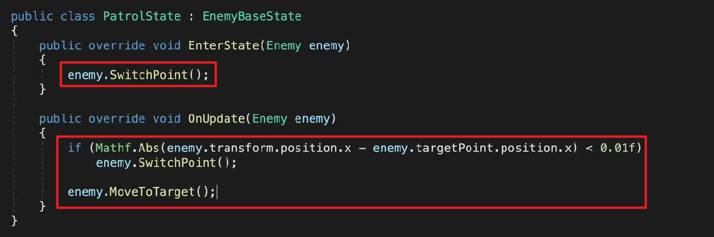

4.两个方法写在了不同的类中，且新脚本没有挂载到Monobehavior，如何让敌人Enemy脚本实现动画状态机中的状态呢？

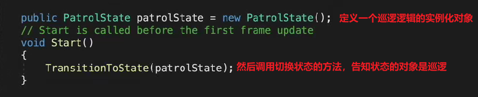

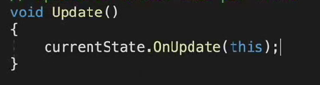

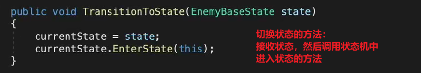

总结:

通过实例化不同的状态对象，调用对应状态里的方法
