# 15.动画的有限状态机

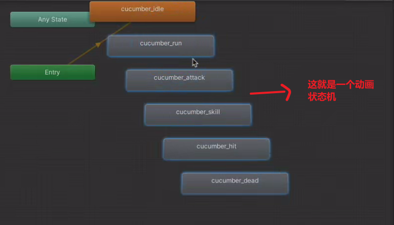

构建动画状态机：

1.除了run等都设置为单次播放

2.调整idel到run的参数，要完整播放完才能切换

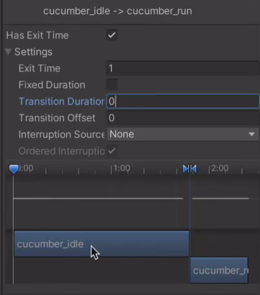

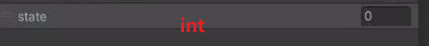

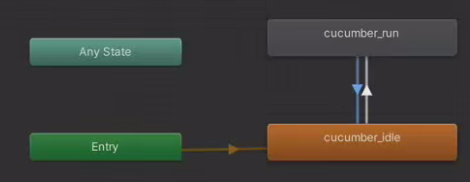

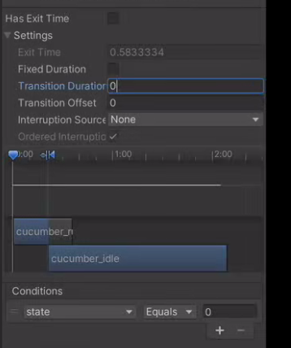

2.代码配合动画状态机的参数

为了通用，把名字改成idel

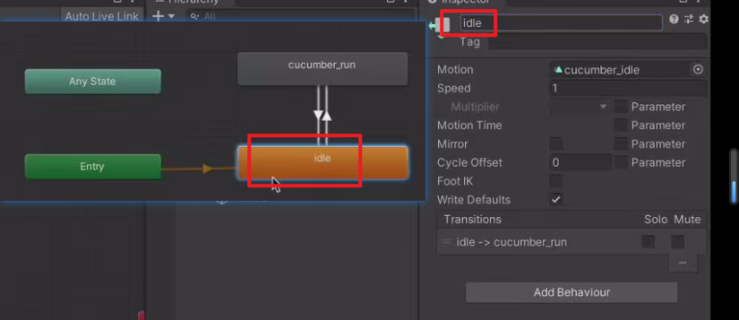

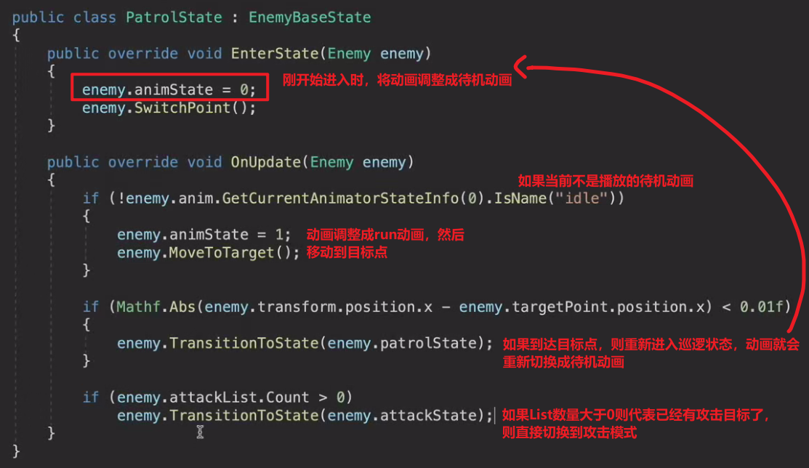

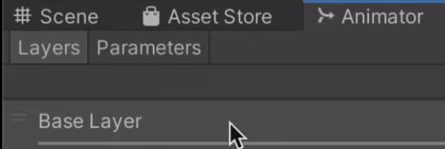

Enemy类

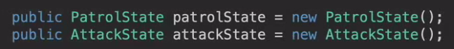

animState是设置当前动画是什么的标记，0是待机，1是run

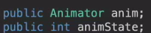

因为Animator只有在子类进行使用，所以写成一个初始化方法，在Awake里调用一次就可以

假如有两个敌人，分别调用Init就可以各自得到自身的动画了，不用每次都写相同的代码

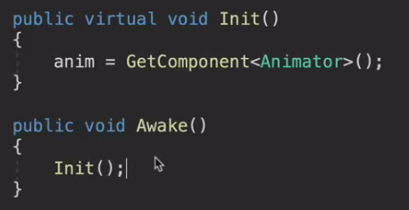

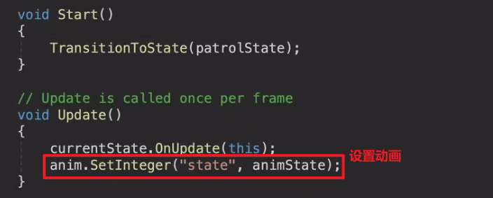

小问题总结：

为什么实现不了巡逻到目标点停下来等待机动画播完再继续巡逻？

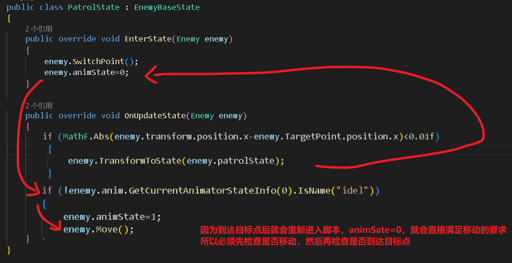

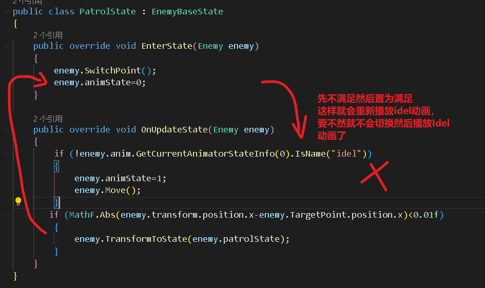

待机到run动画，怎么设置的？

这里不用添加条件，等待机动画播完就可以直接播放run动画了，是否播放run动画的条件就变成了idel动画是否播放完毕

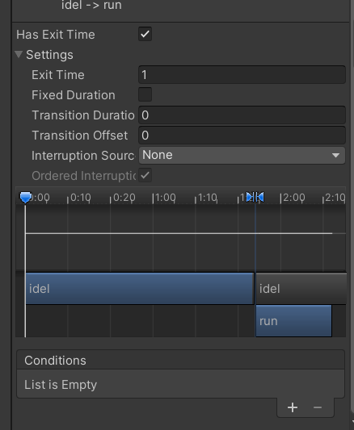
