# 20.接口实现敌人和玩家的受伤逻辑

如何通过一个方法让所有的人物和敌人都实现受伤的效果？

用接口的方法

什么叫接口呢？

将两个东西连接起来的东西就叫接口，将两个物体或者多个物体连接就是接口的功能

通过接口就可以访问所有连接的物体，代码中也一样，如果写了一个接口，可以用接口里的方法

同时访问所有继承了接口的方法的代码

1.创建接口脚本

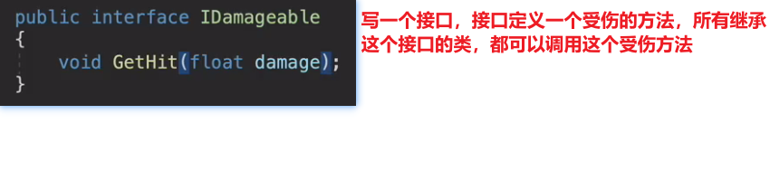

2.设置玩家受伤的动画

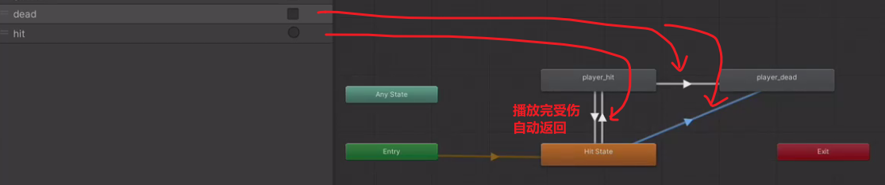

3.代码实现动画

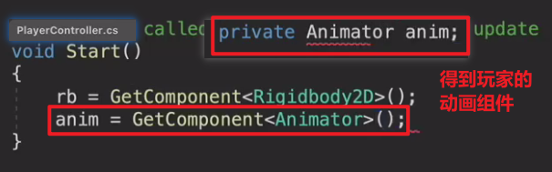

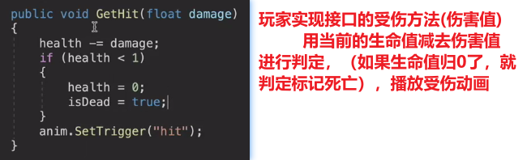

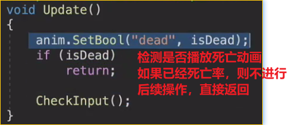

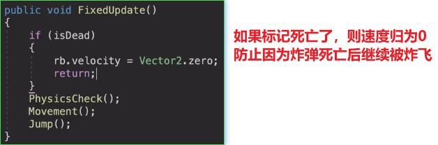

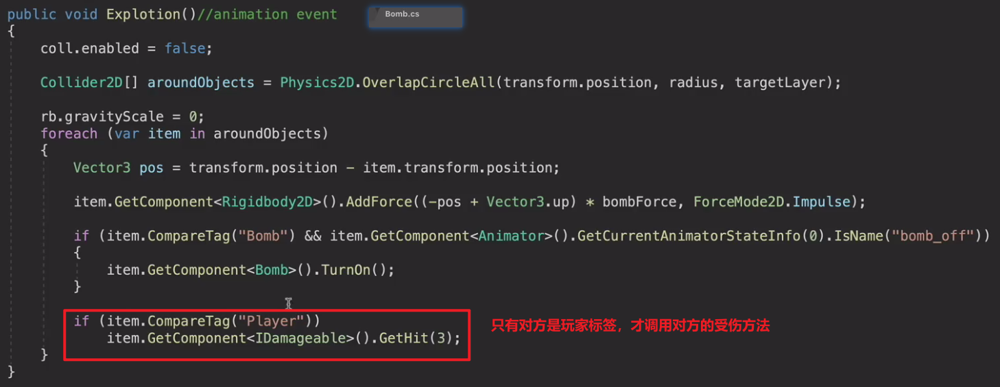

敌人受伤：

和玩家类似的逻辑

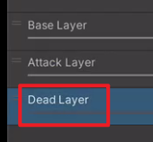

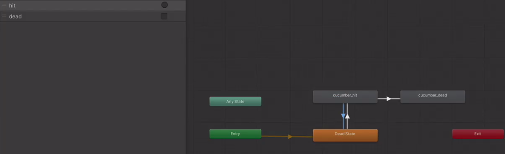

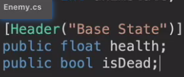

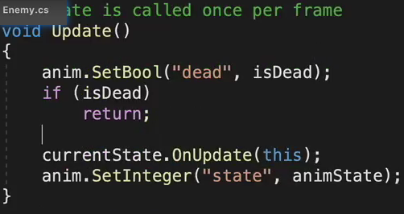

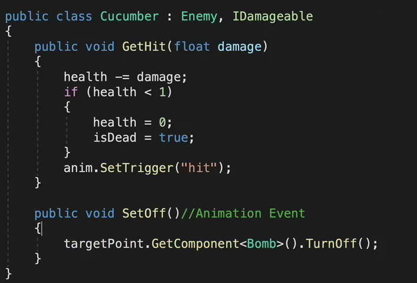

因为炸弹检测玩家时调用基于对方伤害，黄瓜怪也设成Player，减少代码量

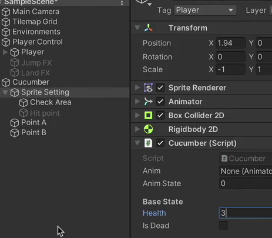

为什么玩家没有被炸到

在炸弹的层级检测里，把玩家也勾选上

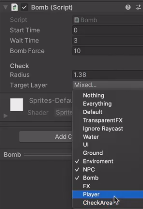
