# 23.各个敌人攻击炸弹的方式

光头怪攻击炸弹的方式：

会把玩家和炸弹都踢飞

踢飞炸弹：

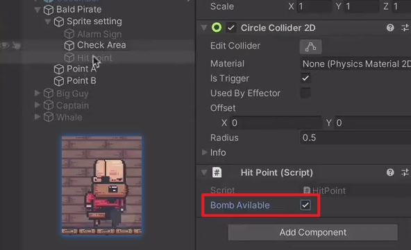

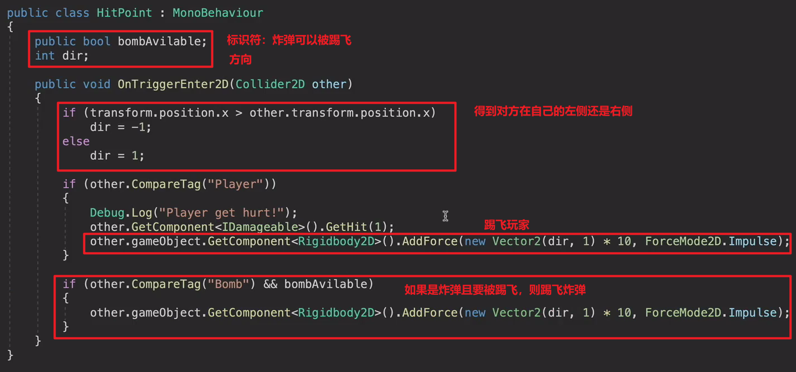

蓝胖子攻击炸弹的方式：

捡炸弹：

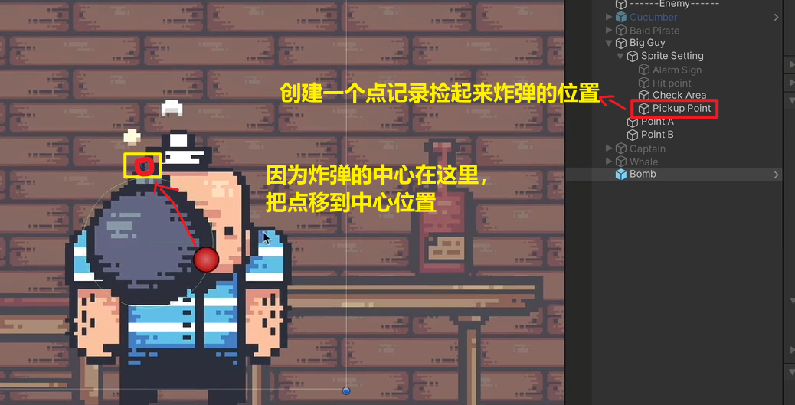

**Kinematic** 物体不受物理引擎影响并由脚本直接控制，而 **Dynamic** 物体受物理引擎完全控制，运动由物理引擎自动计算。

切换这两个模式就可以让对象是否受重力的影响

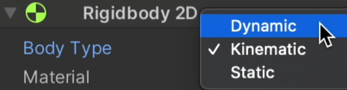

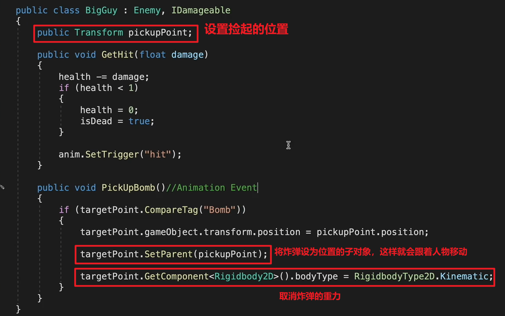

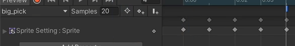

问题：为什么捡起来人物会左右乱动？

因为被捡起来炸弹还是会判断为我们的攻击目标

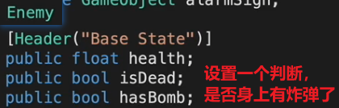

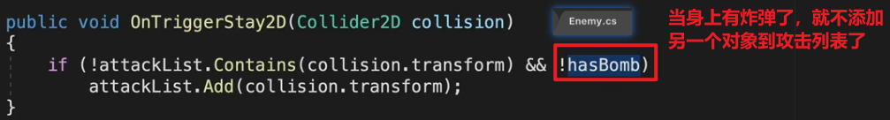

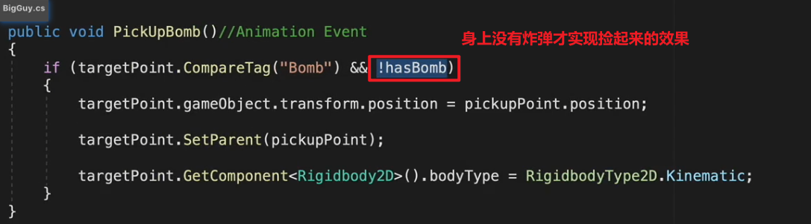

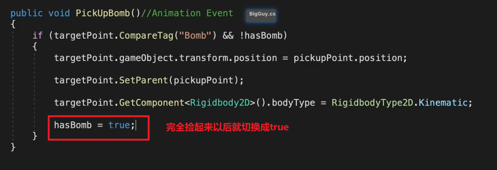

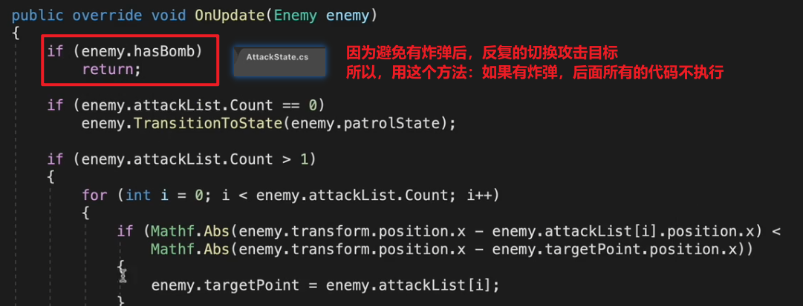

扔炸弹：

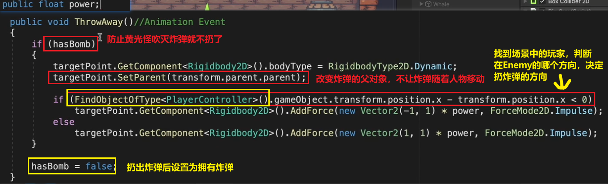

船长：

遇见炸弹往相反的地方跑

为什么不写一个方法放在动画事件中，每次往相反的跑？

不行，因为在update中会不断的覆盖，跑向目标点而不是往相反的方向跑？

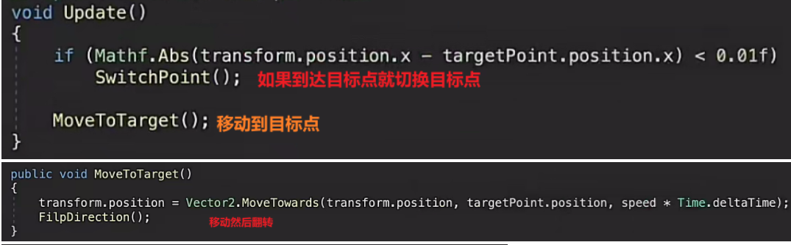

所以在技能栏里写就不会被覆盖

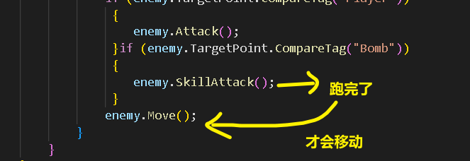

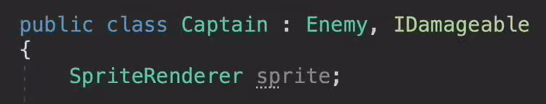

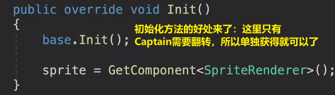

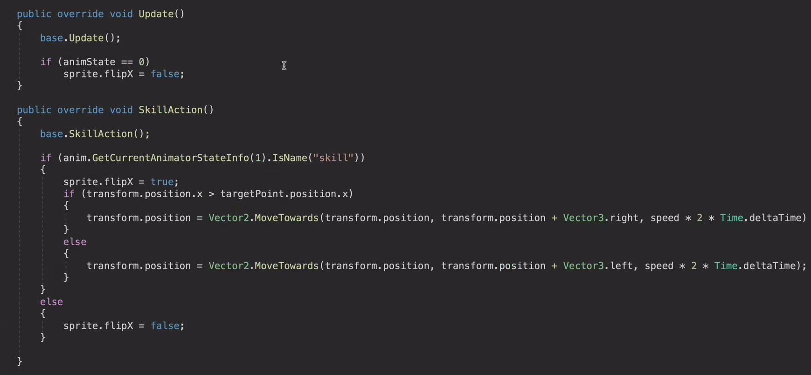

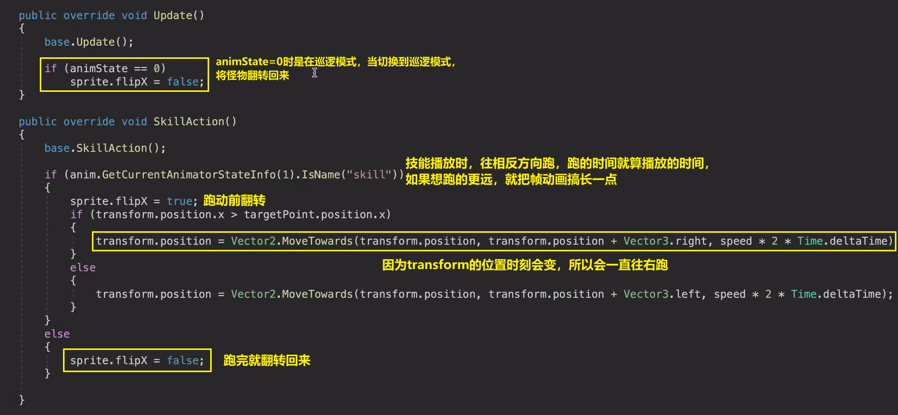

鲸鱼：

吞掉炸弹

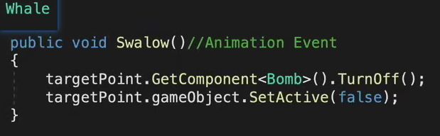

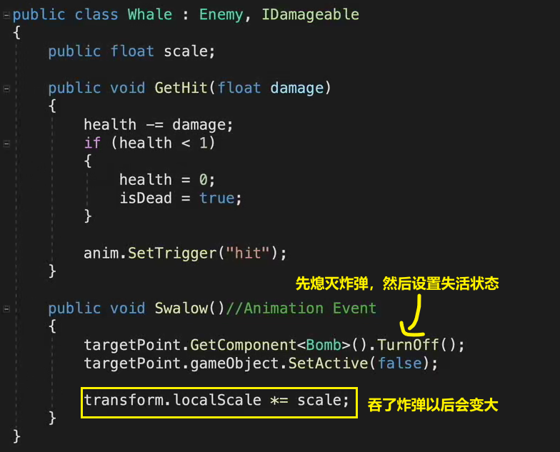

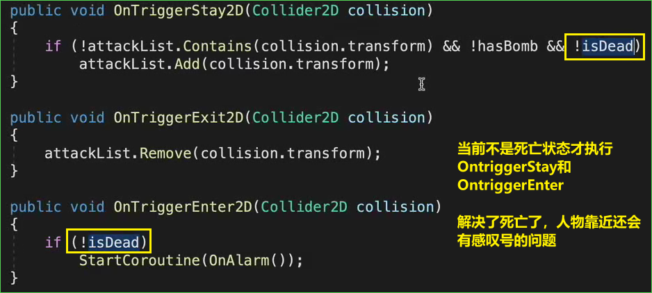
