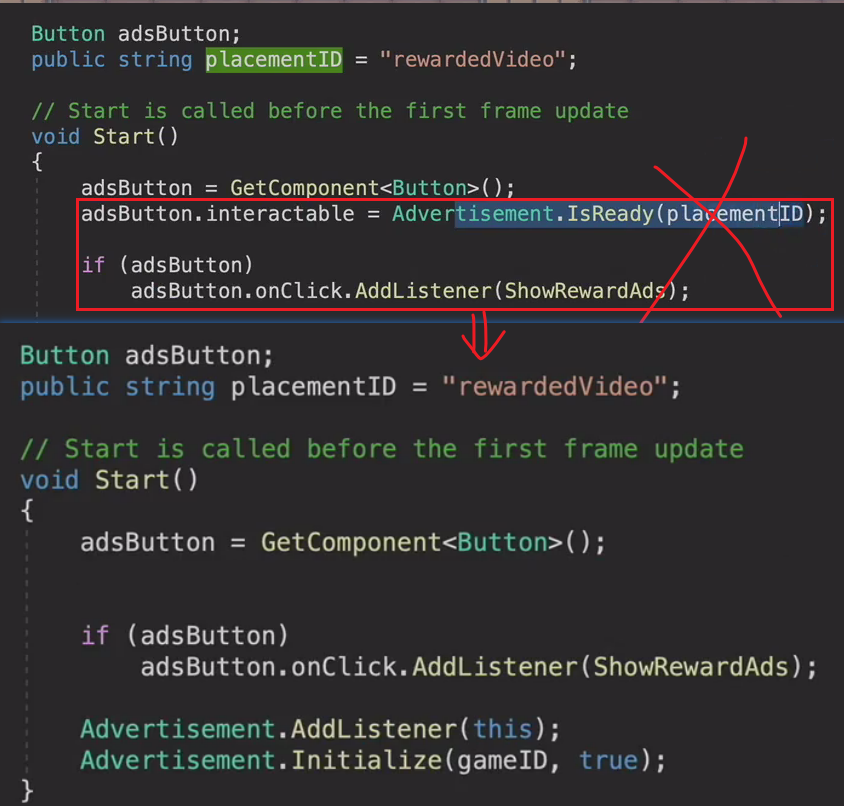

# 32.UnityAds广告

1.添加广告播放键和脚本

2.写逻辑

3.条件编译语句，灰色代表切换到安卓平台时才会被执行

4.按下按钮显示广告

5.广告初始化

测试：广告准备好的时候输出：“广告准备好了”

5.完成播放完广告的逻辑

小问题：

死亡后，观看广告的按钮不能按

——广告按钮一开始是失活状态，广告就不会准备好，所以就不能播放

————解决方法：删掉广告是否准备好的判断条件

6.广告播放完给奖励

由于是在Unity编辑器中，所以现在看不到广告

小问题：

可以移动但是出错了

解决办法：

为玩家添加死亡到Idel状态的切换

7.

小补充:

