# 7.给人物写移动脚本

实现人物左右移动

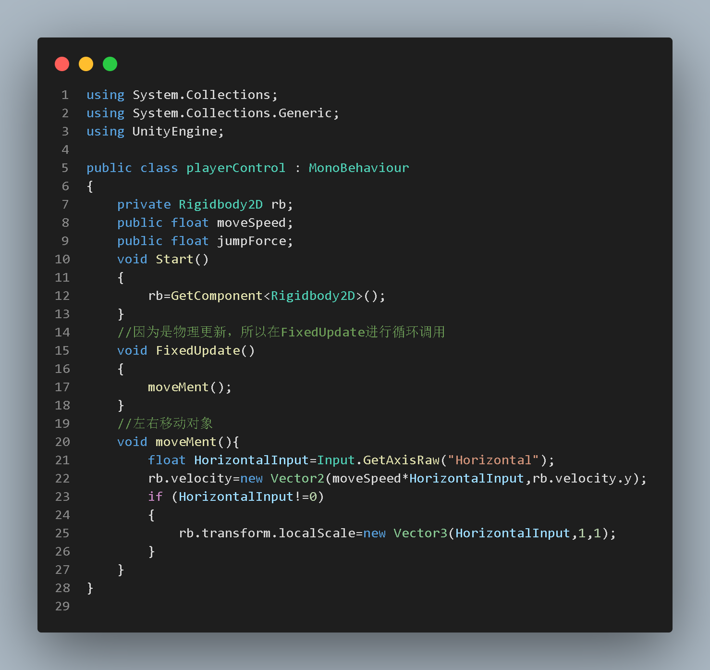

三种翻转人物的方法：

这里用前两种都可以，第三种不建议，因为第三种字对象或者碰撞器不会进行翻转，可能会造成意想不到的错误

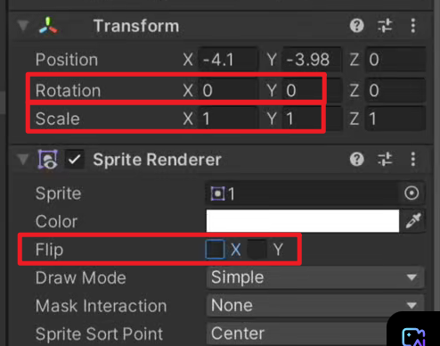

---

---

跳：

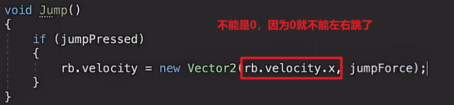

Input.GetButtonDown(string buttonName) 接受一个字符串参数，表示按钮的名称。按钮名称是通过 Unity 的 Input Manager 定义的。

- **Input.GetButtonDown("Vertical")**: 用于检测按钮是否在当前帧被按下，适合触发一次性事件。
- **Input.GetAxis("Vertical")**: 用于检测轴输入的强度和方向，适合连续或平滑的移动控制。

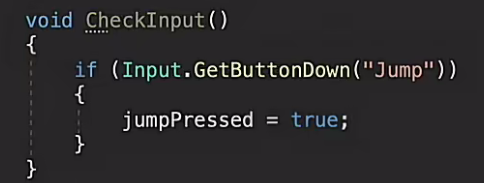

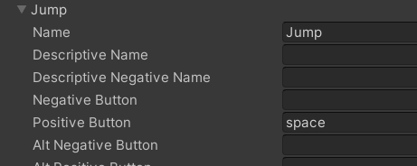

跳跃的时候调整rigibody人物下落更真实

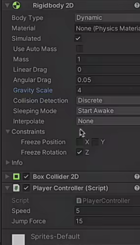

给rigibody添加物理材质，摩擦力跳到0，贴近墙壁就不会卡在那儿了

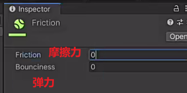

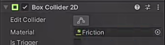

如何解决无限跳跃？

创建人物子对象，检测在地上才可以跳跃

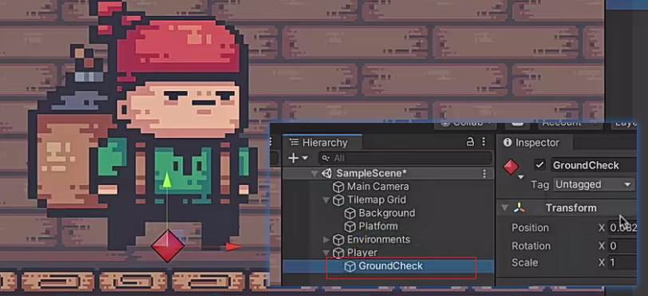

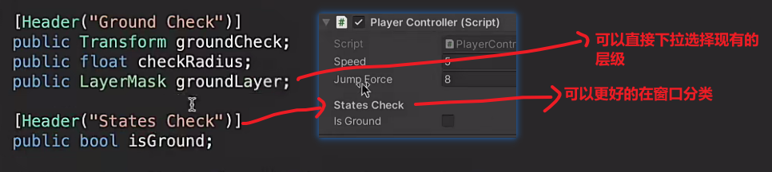

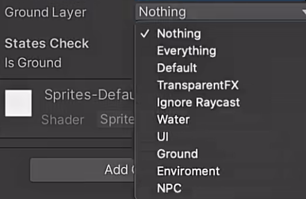

如何集中更改变量名？

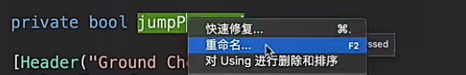

如何范围检测？

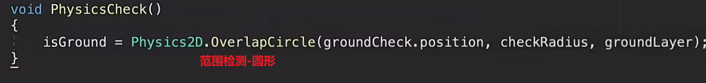

如何看到范围检测的范围？

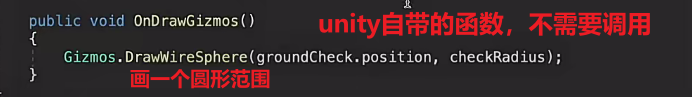

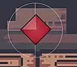

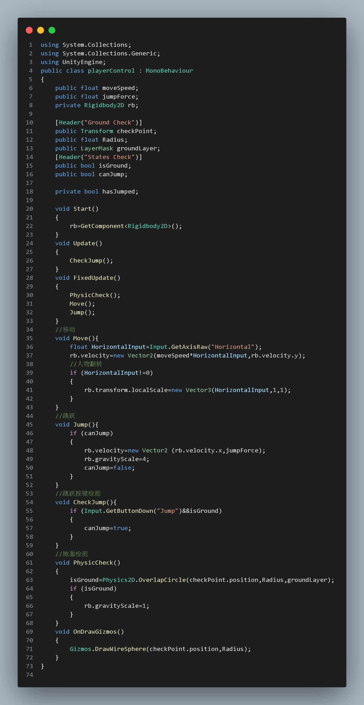
