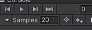
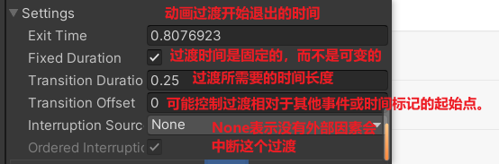
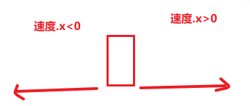
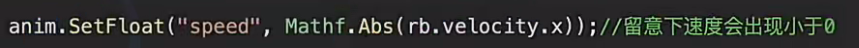
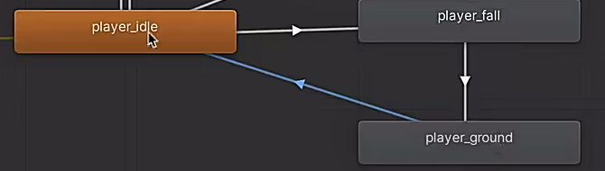
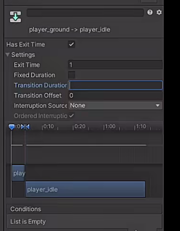
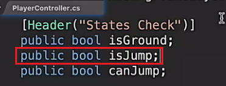
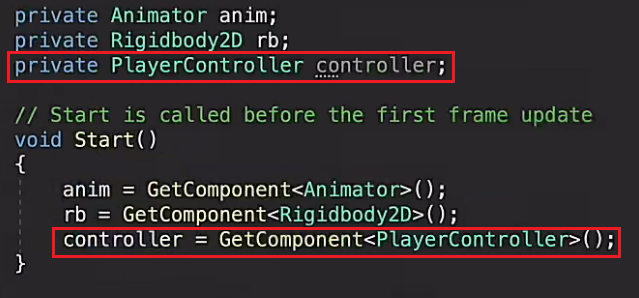
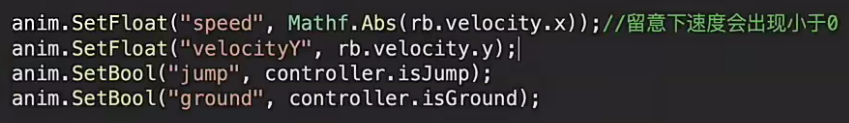
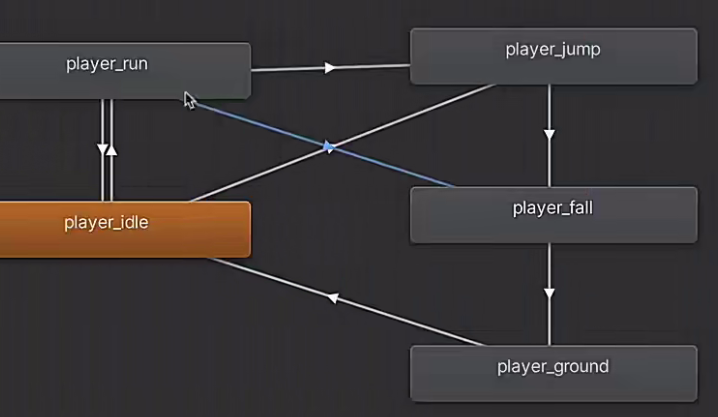

# 8.给人物制作动画

太快了怎么办？调整帧率

统一取名方便寻找

除了待机和跑步，其他动画全部改成不循环

设置成可变的过渡，且过渡所需的时间长度为0

怎么获得人物的速度？

通过Rigibody得到速度，因为往左走速度.x是小于0的，所以不满足切换跑步动画的条件，就会造成往右走会播放动画，而往左就不会

落地到待机怎么转换？

过渡时间改成1，可变的过渡，且过渡所需的时间长度为0

在PlayerController脚本中添加一个正在跳跃的标签，然后在PlayerAnimation中获得她，直接像获得组件的方法就可以，这样就不用设置单例模式或者静态变量

跑步条件：>0.1

下落条件：<-0.1

跳跃条件：true

待机落地条件：true

