# 13.可编程厨房物品ScriptableObject

1.创建一个西红柿并做好视觉逻辑分层

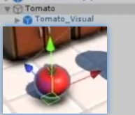 

做好预设体的整理

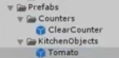 

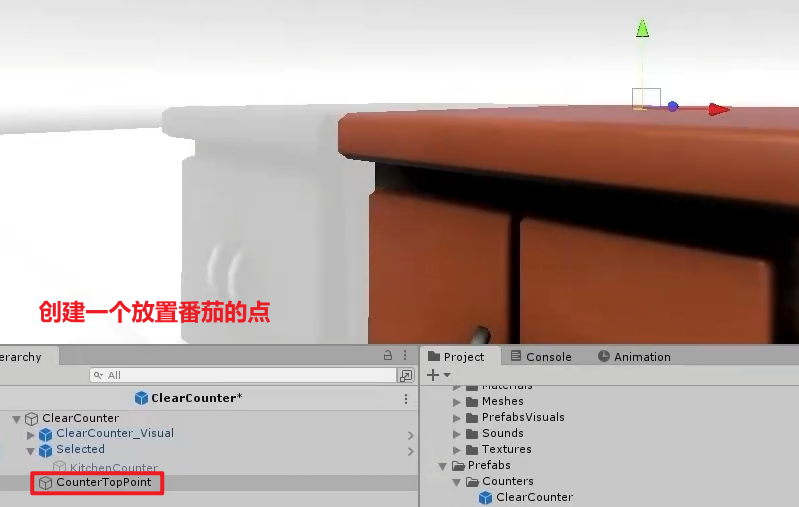

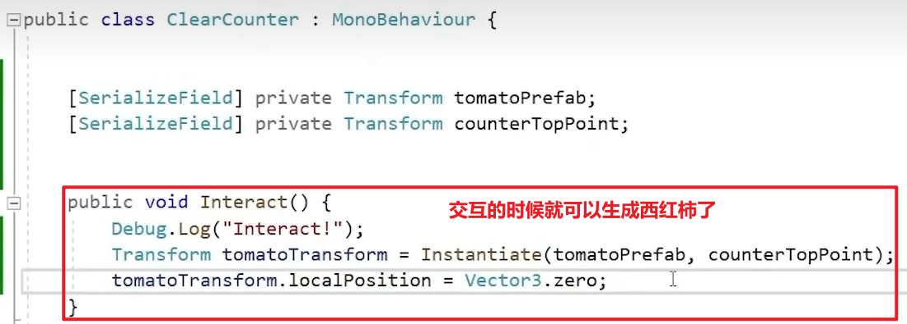

2.除了生成西红柿，想生成其他的怎么办？

一：创建脚本生成各自的文件

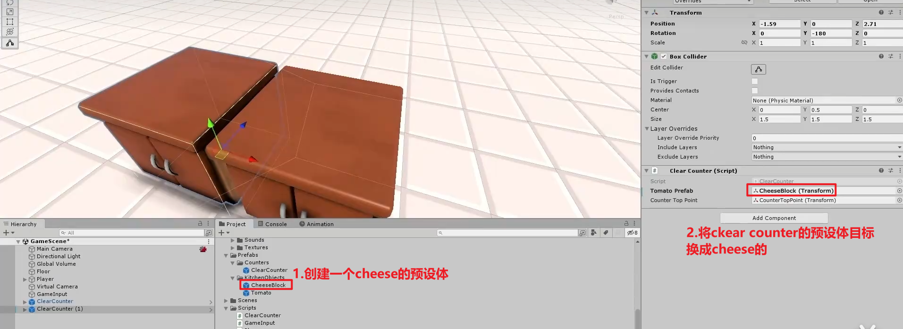

问题：桌台怎么知道想生成谁（目前是自己拽上去的）

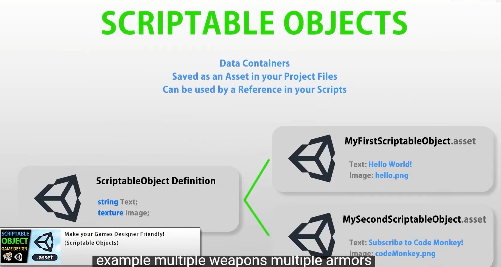

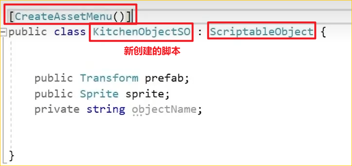

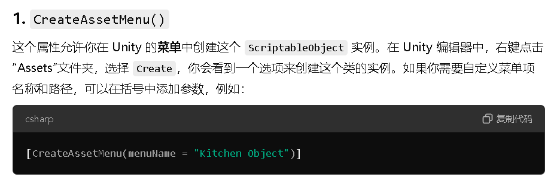

```c#
在Unity中，`ScriptableObject` 是一种特殊的类，允许你存储和管理数据，而不需要创建和运行场景中的游戏对象。这里的关键概念是“**无需实例化场景对象**”。
### 传统对象 vs. ScriptableObject
通常在Unity中，你会创建**场景对象**（GameObjects），它们有各种组件（如`Transform`、`Rigidbody`等），并存在于场景中。比如，角色、敌人、道具都是场景对象。这些对象只有在场景中实例化时，才能被管理和操作。

而`ScriptableObject`则不同，它并不依赖于场景中的对象。它可以独立于场景存在，作为一种纯粹的数据容器。你可以把它看作是“游戏数据的配置文件”，比如存储物品属性、技能数据、关卡设定等，而不需要在场景中创建一个可见的对象。

### ScriptableObject的作用
1. **节省内存**：`ScriptableObject`在使用时只会加载一次，并可以被多个场景或对象共享，减少了重复实例化的内存占用。
2. **便于编辑和管理**：通过`CreateAssetMenu`，你可以在Unity编辑器中直接创建这些资产，并且在Inspector面板中轻松编辑。
3. **保持场景独立性**：因为它们不依赖场景对象，`ScriptableObject`可以存储跨场景的数据或全局配置，而不会随着场景的销毁而丢失。

### 举例：
假设你在做一个烹饪游戏，你需要定义各种厨房道具（比如锅、碗、菜刀）。你不需要每次在场景中实例化这些对象，而是可以使用 `ScriptableObject` 来创建一个数据资产文件，保存这些厨房道具的属性（例如图片、预制体等），并且在需要时读取这个数据。这样，数据是独立存储的，与你的场景或游戏对象分离，方便管理。

例如：

```csharp
[CreateAssetMenu(menuName = "Kitchen Object")]
public class KitchenObjectSO : ScriptableObject {
    public Transform prefab;
    public Sprite sprite;
    public string objectName;
}
```

你可以在Unity中右键创建这个资产，然后为它设置各种数据（比如图片、预制体等），而不需要创建实际的物体实例。

### 总结：
`ScriptableObject`是一种优化和简化数据管理的方法，允许你在Unity中存储资产和配置，而无需在场景中创建实际的游戏对象。这使得它非常适合保存跨场景共享的静态数据或配置文件。

二：设置各自的文件

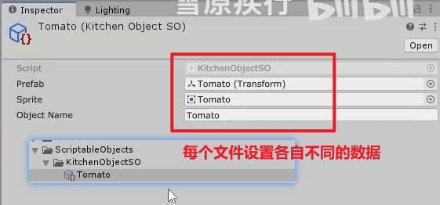

三：改脚本代码，将直接得到预设体的代码改成得到对应的SO文件

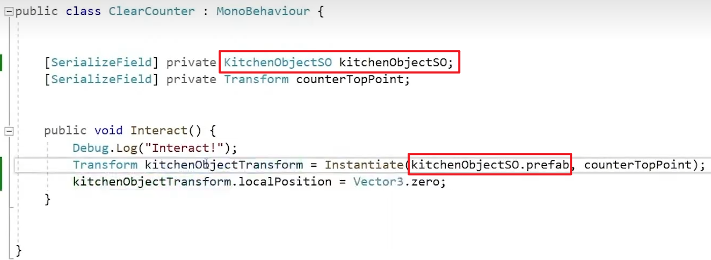

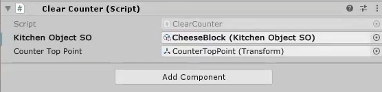

四：


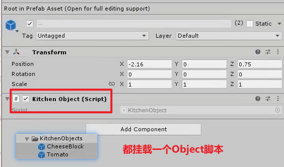

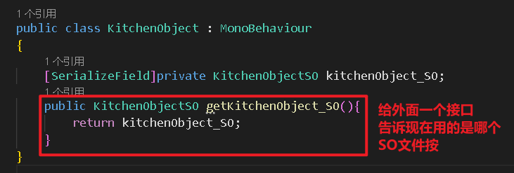

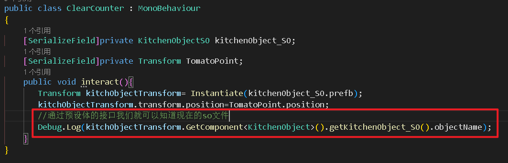

总结：

SO=在面板中可以编辑的一个类
