# 20.切菜动画和世界范围UI

%!(EXTRA markdown.ResourceType=, string=, string=)

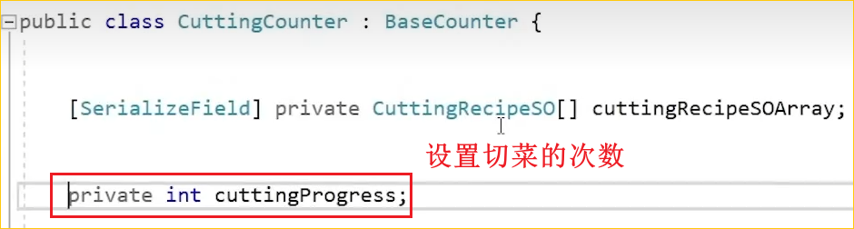

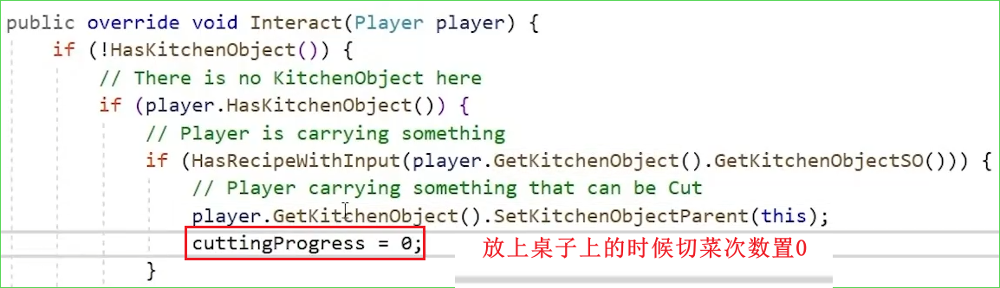

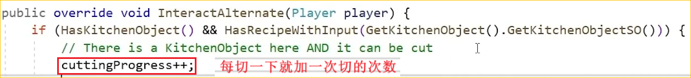

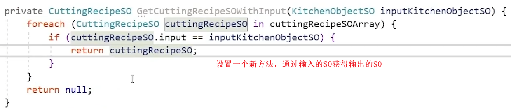

---

---

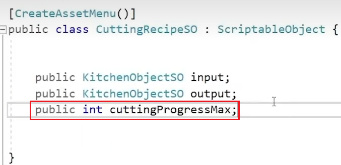

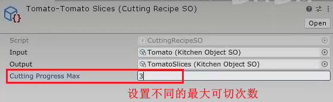

---

---

%!(EXTRA markdown.ResourceType=, string=, string=)

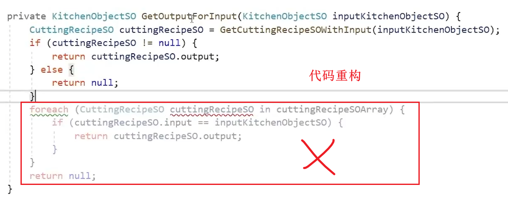

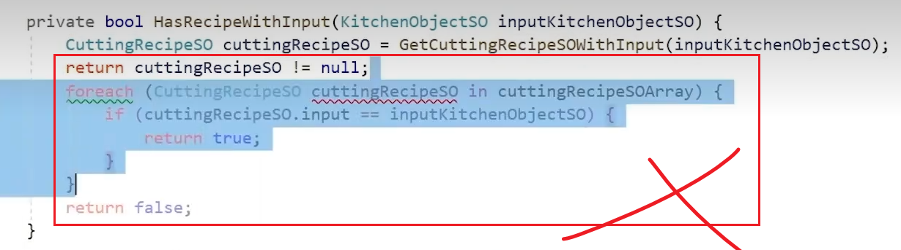

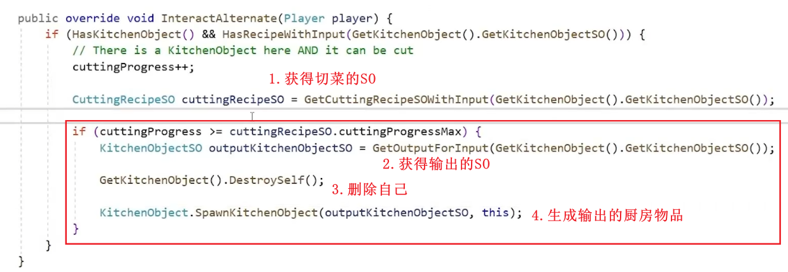

---

---

视觉反馈的实现

1.

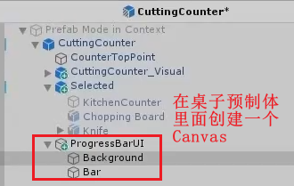

2.

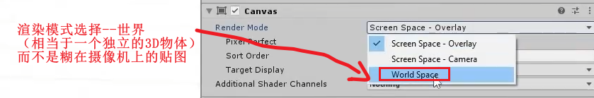

3.

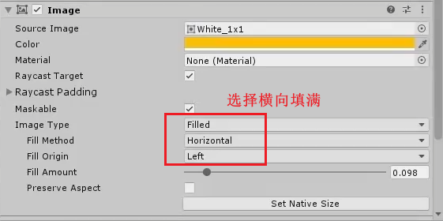

4.

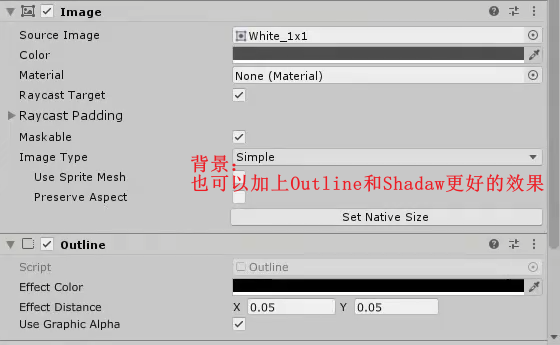

5.

6.创建一个UI的脚本

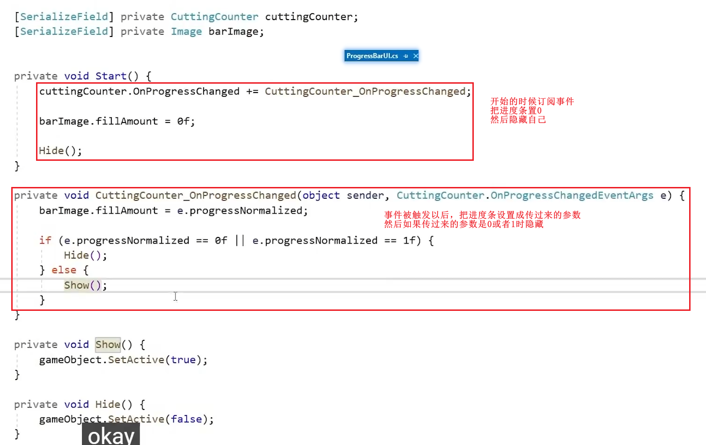

7.切菜桌台发布事件

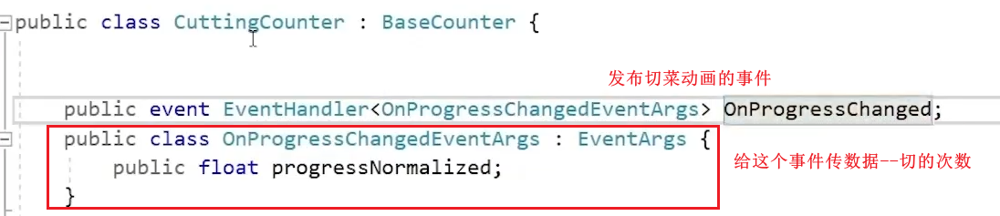

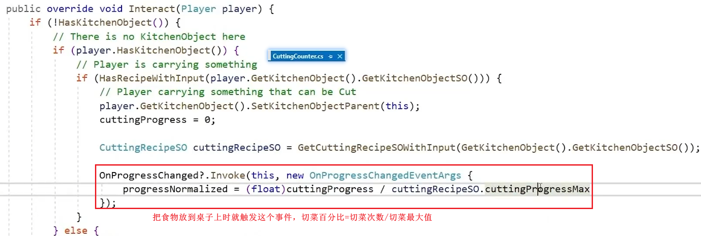

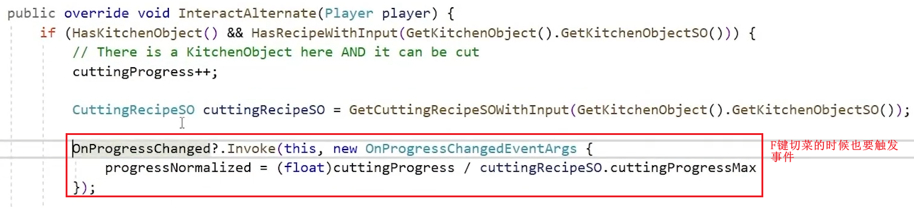

---

---

如何制作切菜动画呢？

1.创建一个切菜动画的脚本放在切菜视觉桌子上

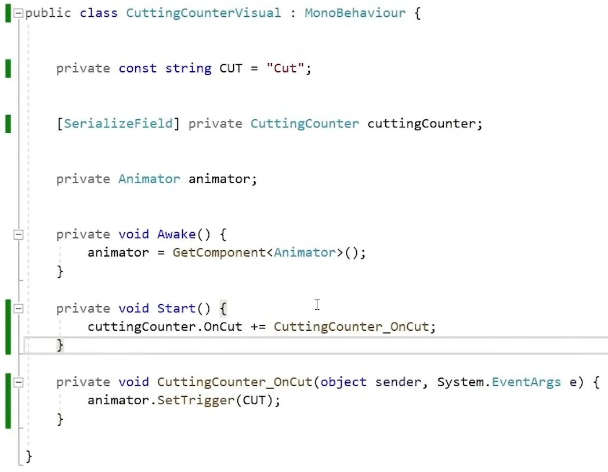

2.切菜的桌子发布事件

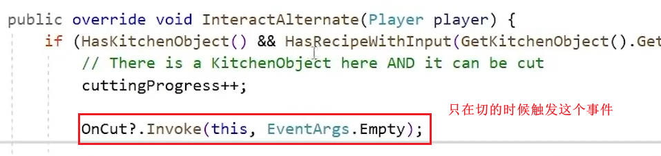
