# 28.送餐桌台与ShaderGraph

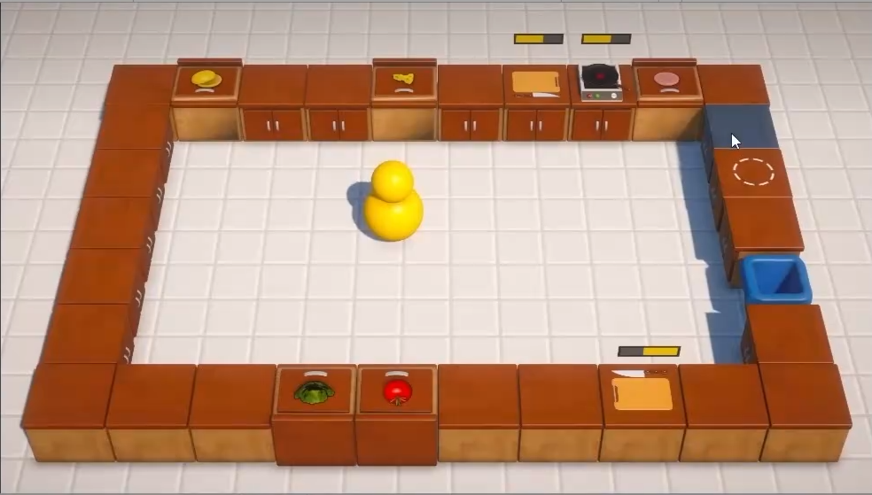

1.创建好送餐桌台

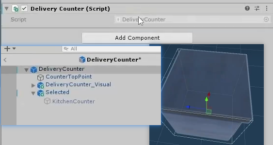

2.写好脚本，交互的时候把玩家的物品进行销毁，注：要在盘子上

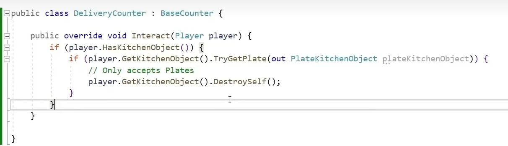

3.**ShaderGraph--着色器**

一：创建一个文件夹专门用来装着色器

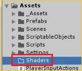

二：创建一个最基础的着色器

Lit就是会受到光照影响

Unlit不受光照影响

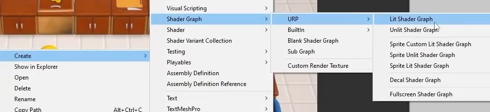

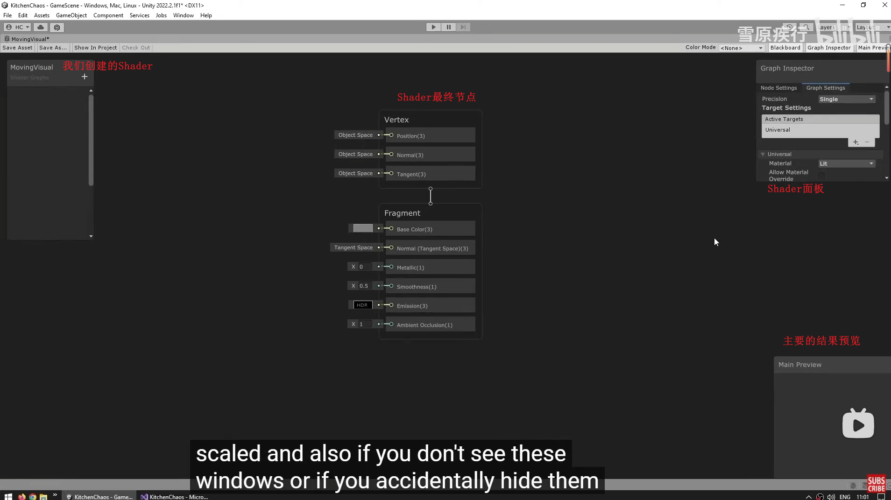

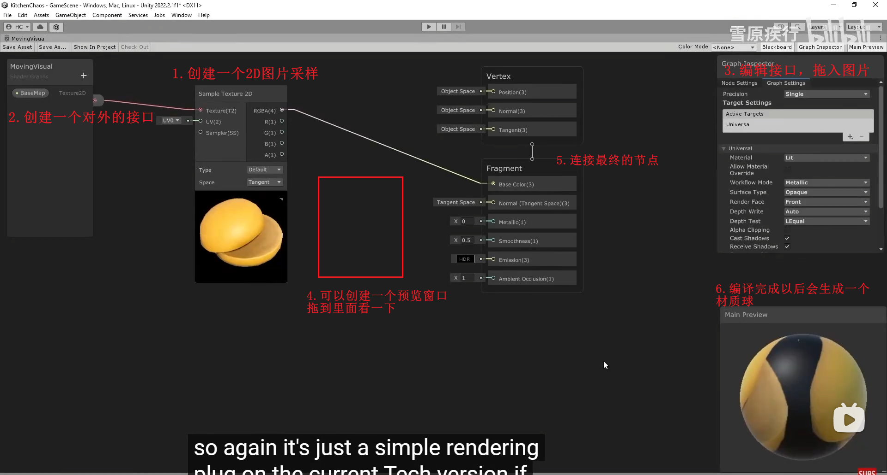

可以右键预览窗口更换显示模型

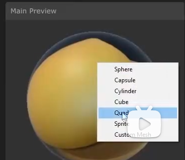

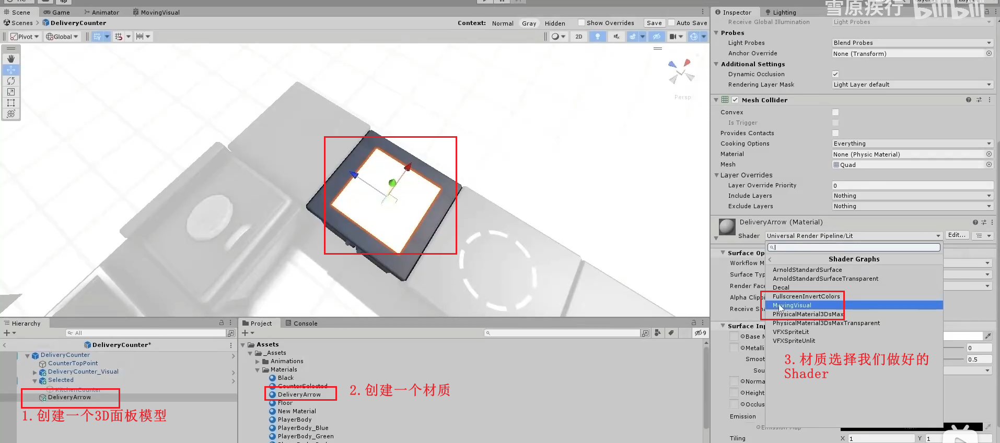

注意：在Shader里面的换图片不会影响外面编译好的材质球，重新新建一个材质球才会不一样

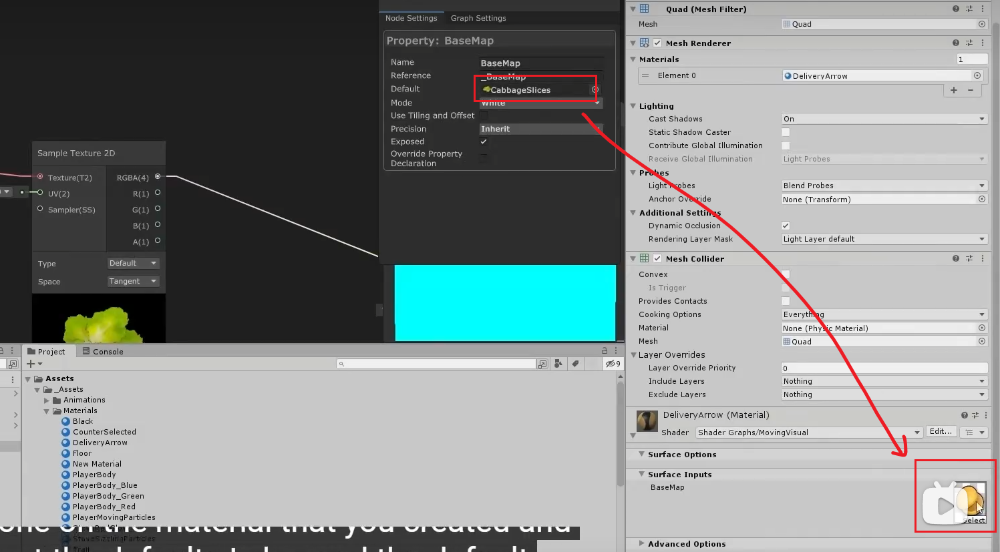

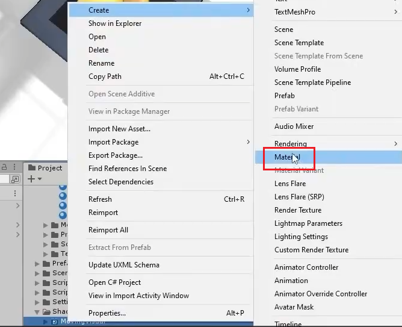

为什么还是白茫茫一片？--还没有调颜色通道

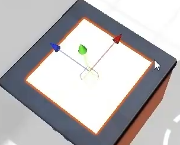

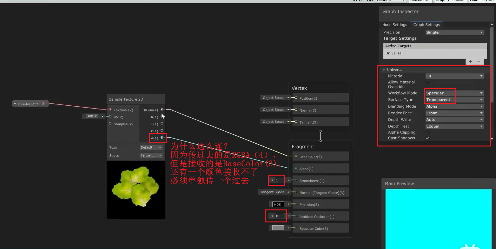

怎么让图片动起来？--不停的移到UV值就可以了

UV坐标决定了纹理如何贴在模型表面上，通常范围是 `(0,0)` 到 `(1,1)`。通过改变UV坐标（如偏移`U`或`V`的值），可以使纹理在物体表面滑动，从而产生图片移动的效果。

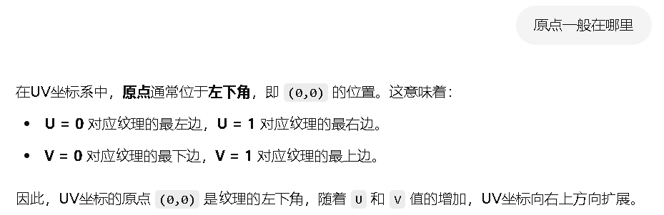

---

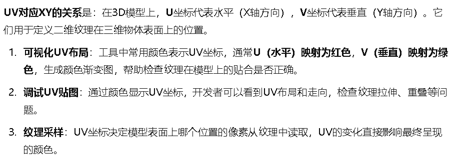

---

---

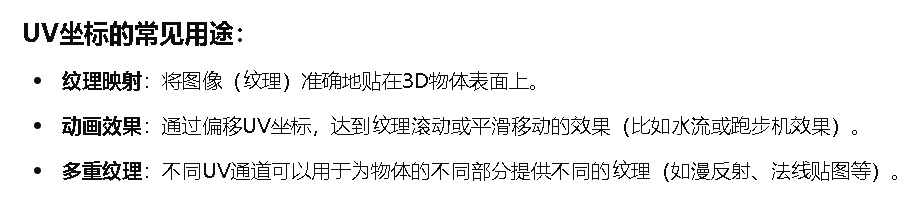

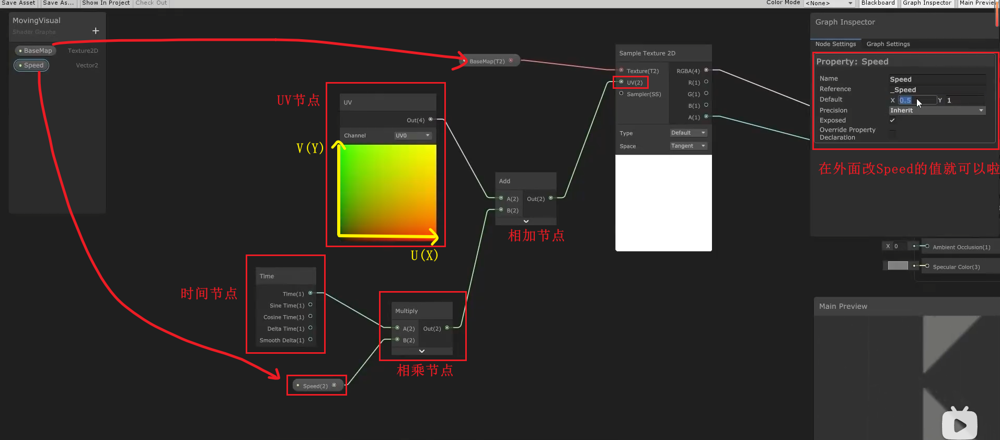

---

---

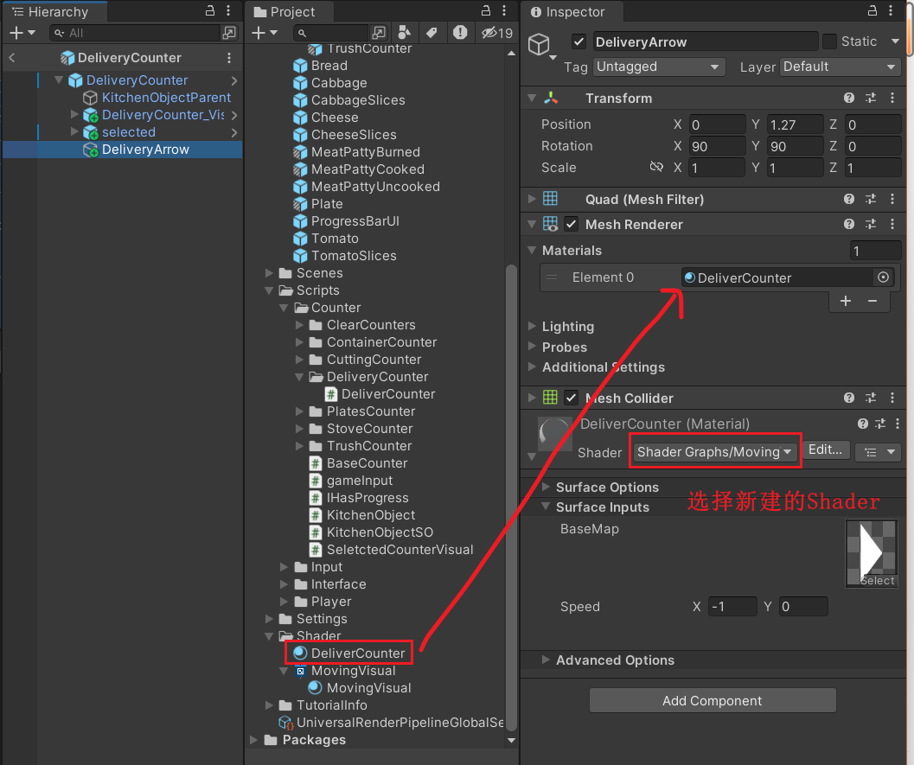

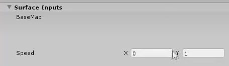

注意：加入的图片要是Repeat才行

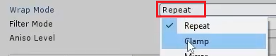
