# 3.PostProcessing

# **PostProcessing是什么？**

PostProcessing（后处理）是Unity中的一个插件，用于在场景渲染完成后对图像进行全屏处理。它可以显著提升游戏的视觉效果，模拟物理相机和电影特效

### 主要功能

1. **环境光遮蔽 (Ambient Occlusion)**：增强阴影效果，使光线无法照射到的区域变暗。
2. **屏幕空间反射 (Screen Space Reflections)**：模拟反射效果，如潮湿地板或水坑。
3. **自动曝光 (Auto Exposure)**：动态调整图像曝光，模拟人眼对亮度变化的适应。
4. **景深 (Depth of Field)**：模糊焦点外的区域，模拟相机的景深效果。
5. **色彩分级 (Color Grading)**：调整图像的色调、对比度和饱和度，增强视觉效果。

### 使用步骤

1. **导入插件**：通过Unity的Package Manager导入PostProcessing插件。
2. **设置渲染层**：在场景的Camera上添加Post-process Layer组件。
3. **添加效果器**：在Camera上添加Post-process Volume组件，并选择需要的效果.

可以通过调整这些效果的参数，来实现各种视觉效果，提升游戏的画面质量。

改名

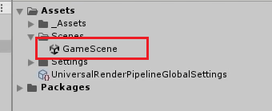

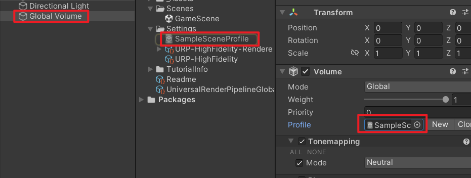

<span style="background-color: #ffaaaa">删掉这里的Profile，点击New可以新建一个我们自己的</span>

**SampleSceneProfile** 通常是在 Unity 中使用 **Post Processing** 时的 **Volume Profile** 文件。它包含一系列后期处理效果的预设配置，如颜色调整、模糊、景深等。该 Profile 定义了哪些效果会应用到场景，以及它们的参数值。

在场景中，你可以将这个 **Profile** 文件挂载到 **Volume** 组件上，Unity 会根据 **Profile** 中的设置实时应用后期处理效果。

<span style="background-color: #ffaaaa">

</span>

<span style="background-color: #ffaaaa">在unity中Global Volume是干啥的?</span>

**Global Volume** 在 Unity 中是用于控制全局后期处理效果的设置。它影响整个场景的视觉效果，如颜色校正、景深、模糊等。Global Volume 会应用到场景的所有部分，无论摄像机在哪里。通过添加和调整后期处理效果（如 Bloom、Color Grading 等），可以统一管理整个场景的视觉呈现。

<span style="background-color: #ffaaaa">怎么才能用Post Processing?</span>

在 Unity 中使用 **Post Processing** 的步骤：

1. **安装 Post Processing 包**：

   - 打开 **Package Manager**，搜索 **Post Processing**，点击 **Install**。

2. **添加 Volume**：

   - 右键场景视图，选择 **Volume > Global Volume**，然后创建一个 **Volume Profile**。

3. **启用后期处理效果**：

   - 在 Profile 中，点击 **Add Override**，选择效果（如 **Bloom**、**Color Grading**）。

4. **设置摄像机支持后期处理**：

   - 在主摄像机的 Inspector 中，勾选 **Post Processing**。

完成后，后期处理效果就会应用到场景中。

```
在 Unity 的 **Post Processing** 系统中，常用的组件包括：

1. **Bloom**：添加发光效果，使高亮区域看起来更加明亮和耀眼。

2. **Color Grading**：调整图像的颜色和对比度，创建不同的视觉风格。

3. **Depth of Field**：模拟相机镜头的景深效果，让前景清晰、背景模糊。

4. **Motion Blur**：模拟运动物体的模糊效果，增加动态感。

5. **Vignette**：在图像边缘添加渐暗效果，聚焦视觉中心。

6. **Ambient Occlusion**：增加场景的阴影效果，提升深度感和真实感。

7. **Grain**：添加颗粒效果，使图像看起来更有质感，常用于复古风格。

8. **Film Grain**：模拟胶卷效果，增强画面的复古感。

9. **Chromatic Aberration**：模拟光学镜头的色差，增加图像的艺术效果。

10. **HDR (High Dynamic Range)**：处理高动态范围图像，增强亮度和对比度。

这些组件可以组合使用，以达到想要的视觉效果。
```

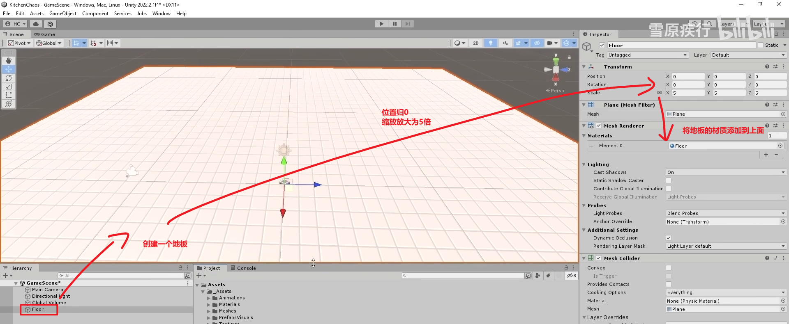

拖一些预设体观察一下是否正常

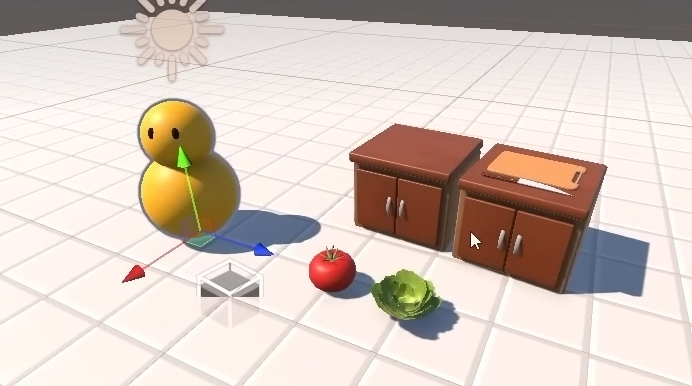

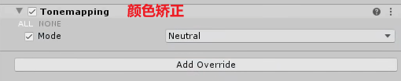

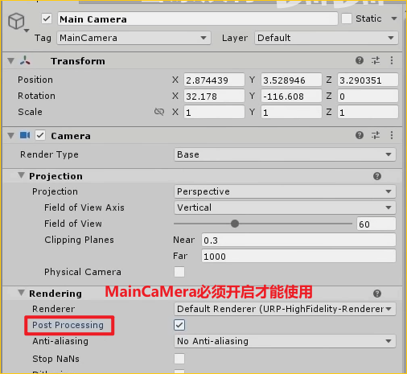

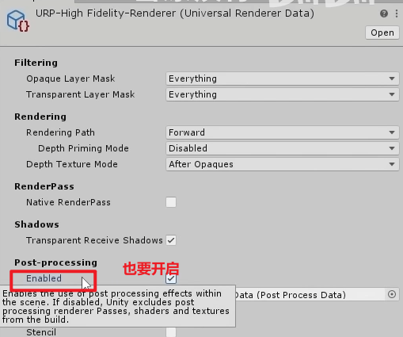

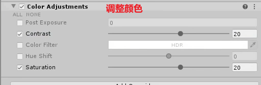

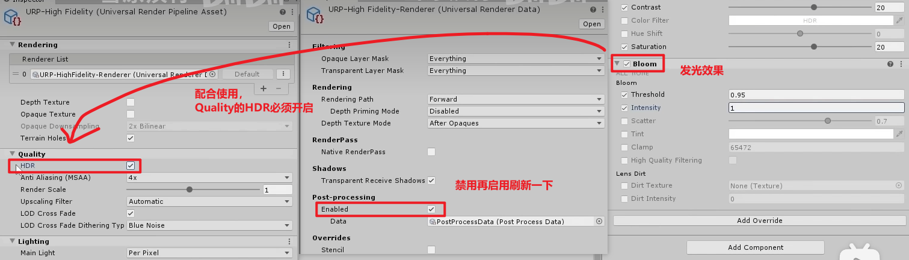

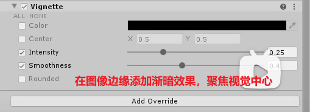

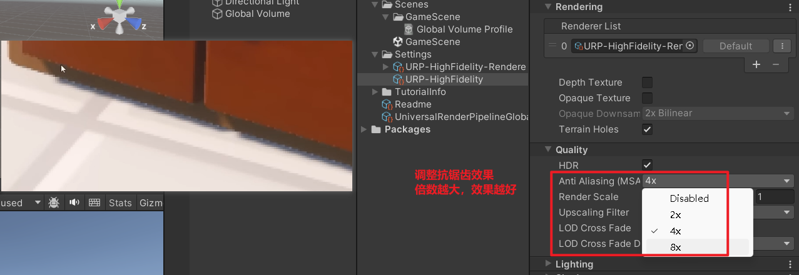

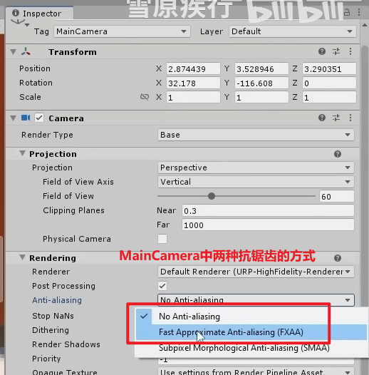

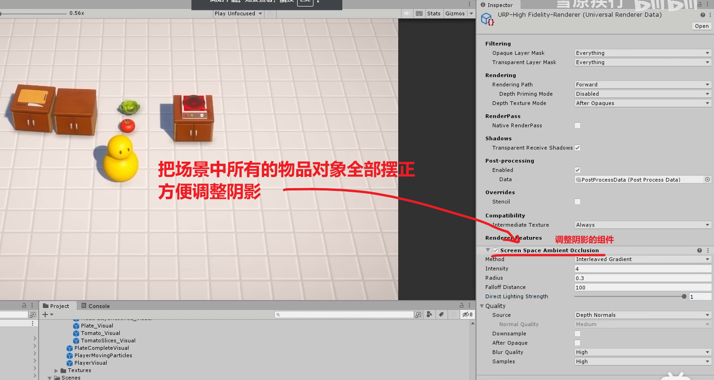

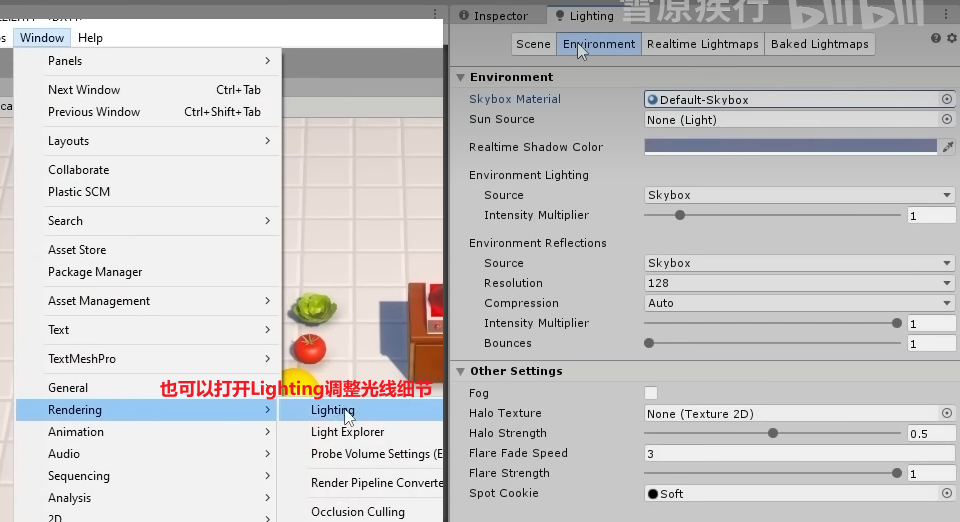

小技巧

可以复制一份处理效果的预设配置，在新的文件上加一些效果，不喜欢删掉就行，只要保留一份母件就行

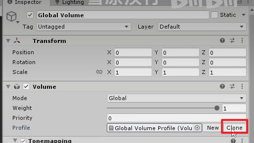
