# 34.主菜单和加载界面

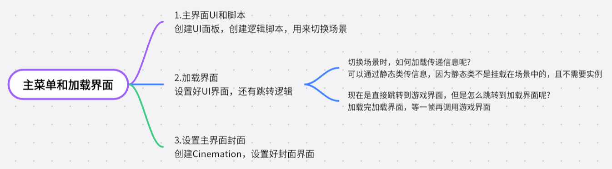

1.主界面UI和脚本

创建UI面板，创建逻辑脚本，用来切换场景

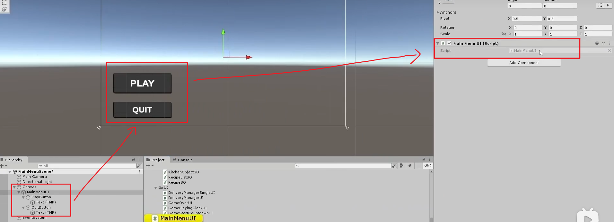

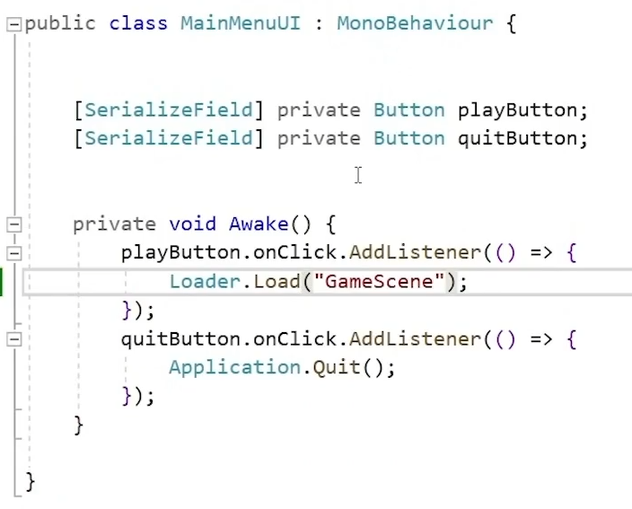

2.加载界面

设置好UI界面，还有跳转逻辑

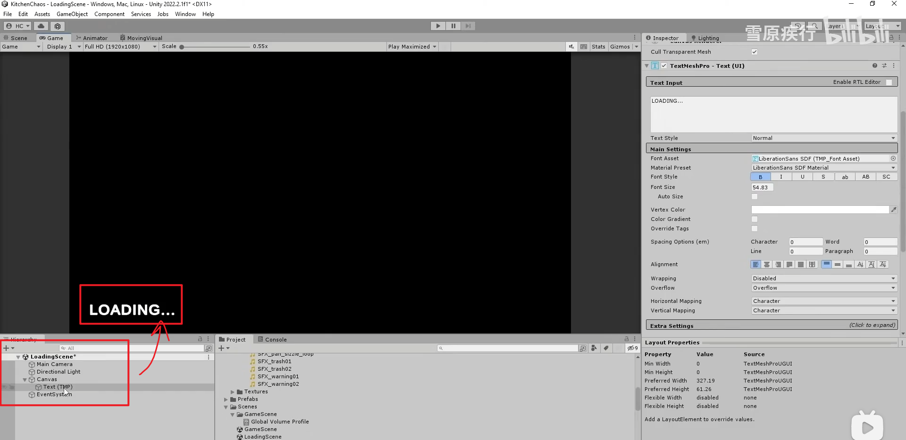

切换场景时，如何加载传递信息呢

可以通过静态类传信息，因为静态类不是挂载在场景中的，且不需要实例

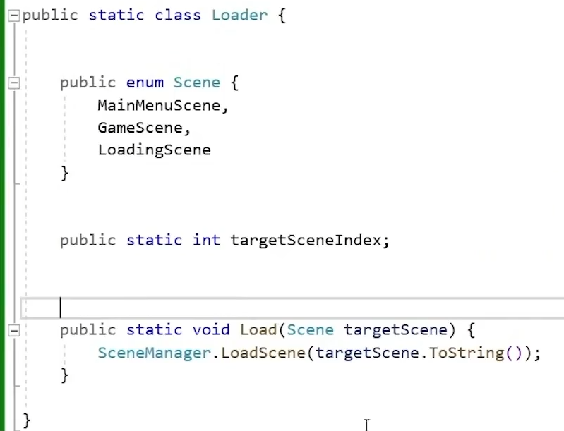

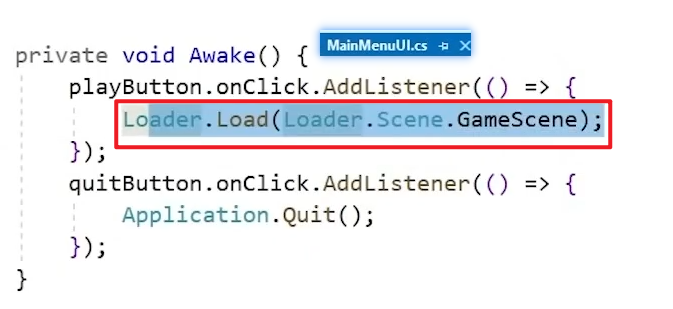

现在是直接跳转到游戏界面，但是怎么跳转到加载界面呢

加载完加载界面，等一帧再调用游戏界面

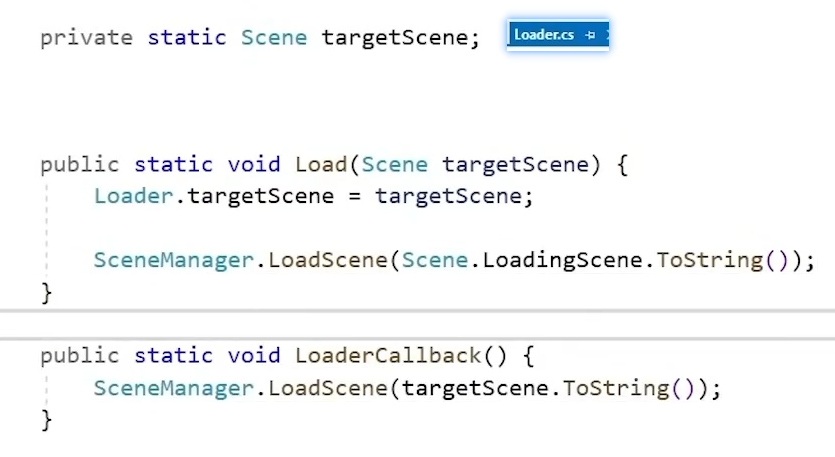

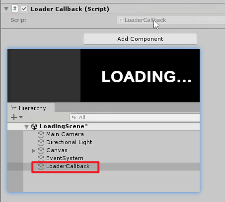

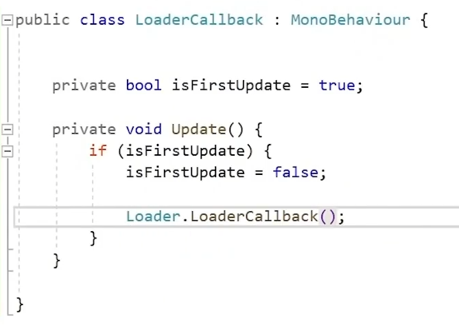

3.设置主界面封面

创建Cinemation，设置好封面界面

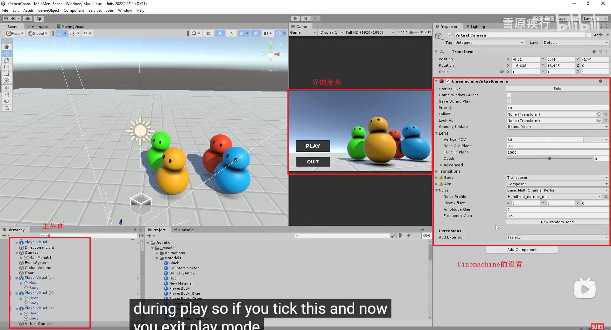

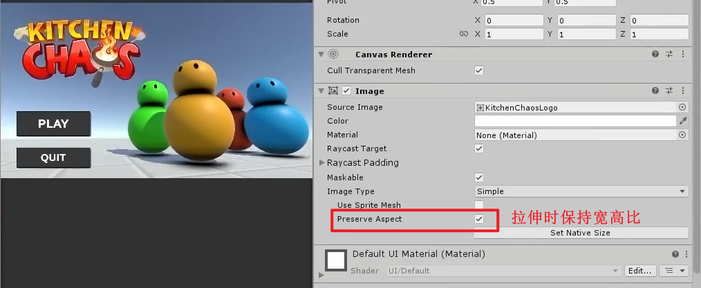
