# 38.手柄输入与导航

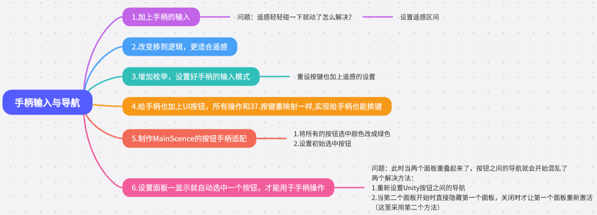

1.加上手柄的输入

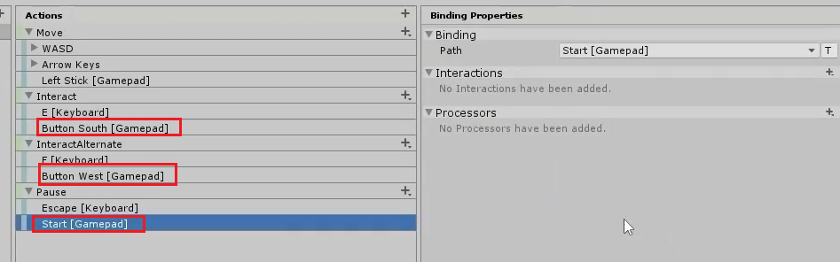

问题：遥感轻轻碰一下就动了怎么解决？

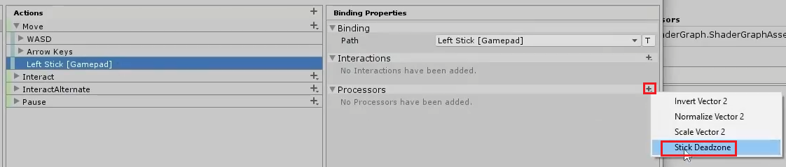

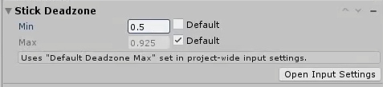

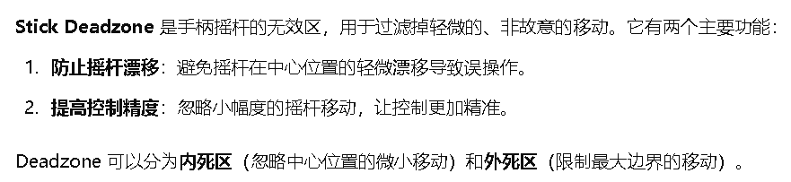

2.改变移到逻辑，更适合遥感

&& 的优先级高于 ||，注意加括号

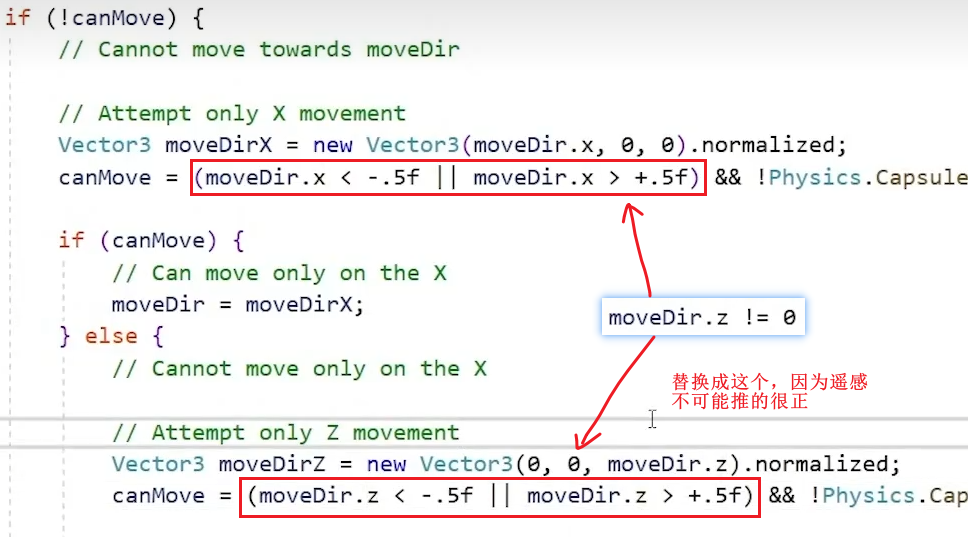

3.增加枚举，设置好手柄的输入模式

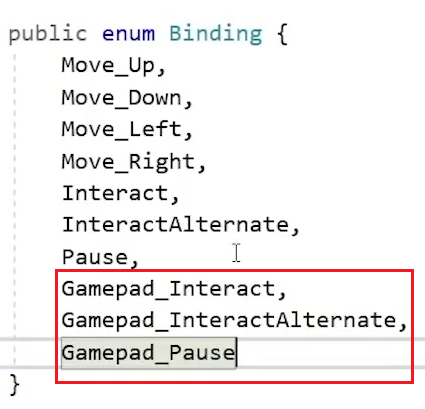

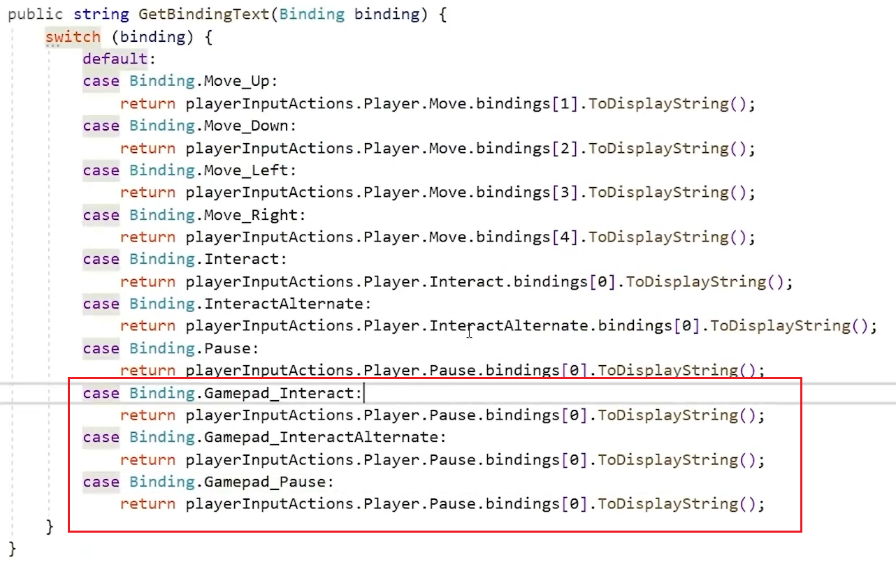

重设按键也加上遥感的设置

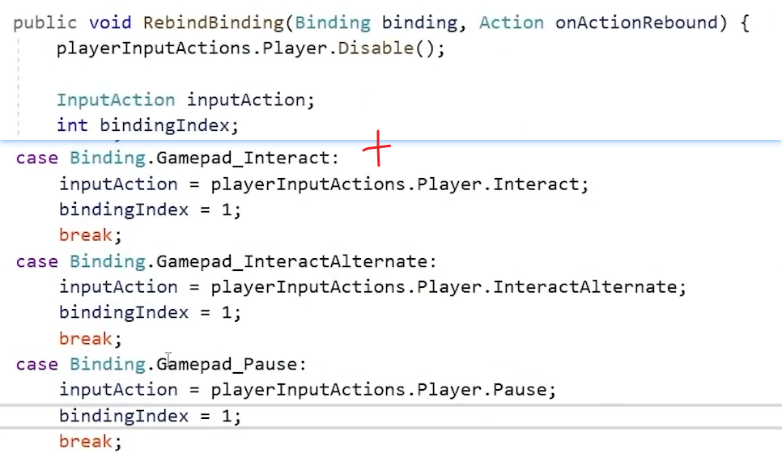

4.给手柄也加上UI按钮，所有操作和37.按键重映射一样,实现给手柄也能换键

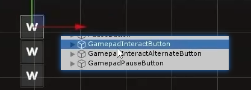

5.改掉所有按钮的选中颜色

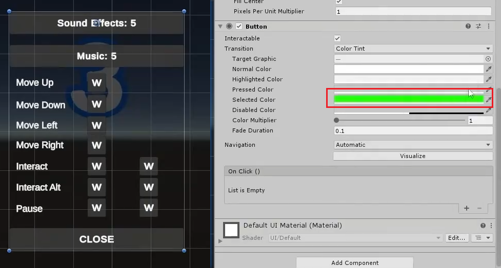

6.设置面板一显示就自动选中一个按钮，才能用于手柄操作

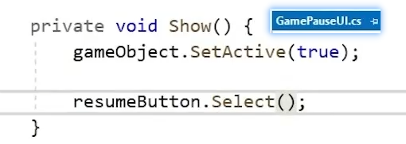

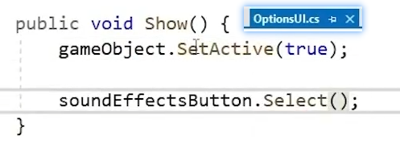

问题：此时当两个面板重叠起来了，按钮之间的导航就会开始混乱了

两个解决方法：

1.重新设置Unity按钮之间的导航

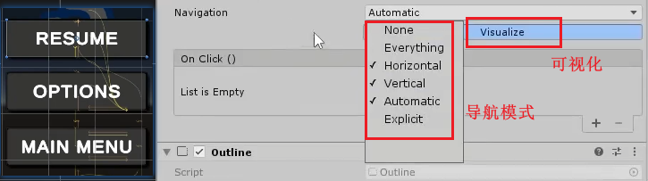

2.当第二个面板开始时直接隐藏第一个面板，关闭时才让第一个面板重新激活

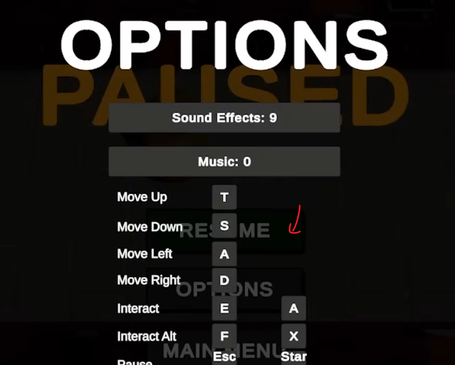

这里采用第二个方法：

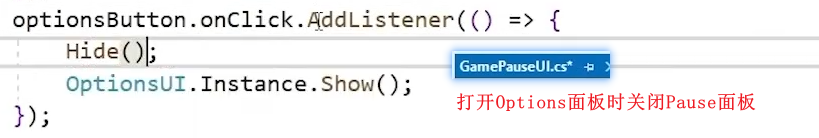

Option面板打开时接收Pause面板的Show方法，关闭Option面板的时候调用它

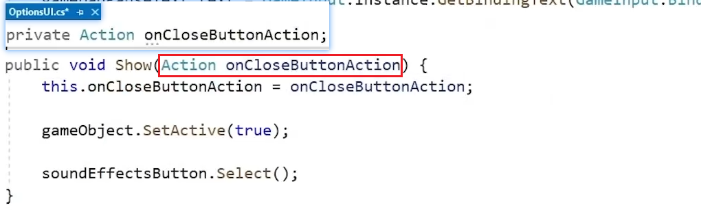

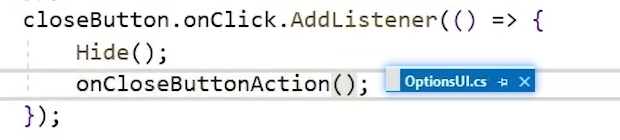

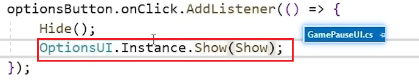

7.制作MainScence的按钮手柄适配

1.将所有的按钮选中颜色改成绿色

2.设置初始选中按钮

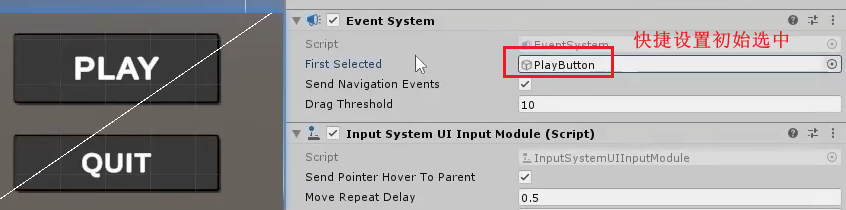
