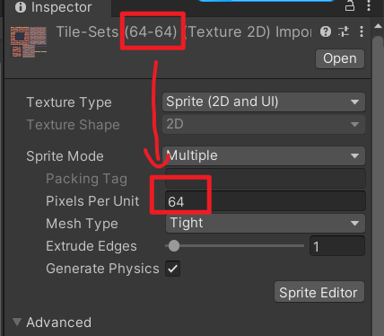
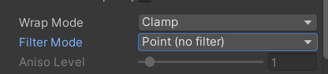
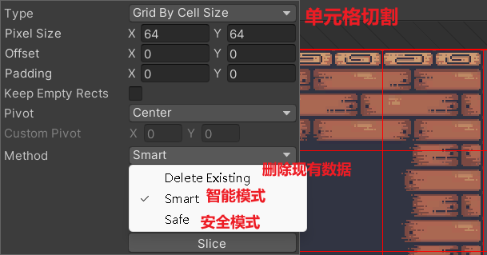

# 1.导入资源，并设置好地图图集

设置好 Pixels Per Unit (PPU)， 它表示**多少像素对应于游戏世界中的一个单位**

设置成和原图片一样大是最清晰的，设的越低越模糊

将 Wrap Mode（纹理环绕模式）和 Filter Mode（纹理过滤模式）分别设置成拉伸和 Point（ 每个像素都被直接映射到屏幕上的一个像素。放大时会产生像素化效果，适用于像素艺术风格的游戏，保留清晰的方块感。）

3.

将图集切割成64x64的图片

1. **Safe**

**你想要在现有图集中添加新的切割，而不影响或删除已经手动设置好的部分**

2. **Smart**

**你想要对图集进行重新切割，但希望 Unity 能智能处理可能出现的冲突或重复情况**

3. **Delete Existing**

**完全删除现有的切割数据，然后根据新的设置进行切割。这是最彻底的方法，适合你想要从头开始重新切割图集的情况。**
