# 10.为玩家制作炸弹

1.制作炸弹点燃、熄灭和爆炸的动画，

2.为炸弹添加碰撞器和刚体，不让其翻滚

3.设置层级，不与环境和玩家进行交互

4.创建脚本

每次创建新的脚本之前应该好好想想使用什么逻辑，应该用到什么参数

层级是玩家层且比玩家高一层，始终显示在玩家前面

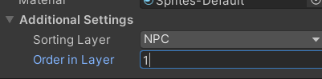

制作一个炸弹层，避免人物与环境可以碰撞炸弹

**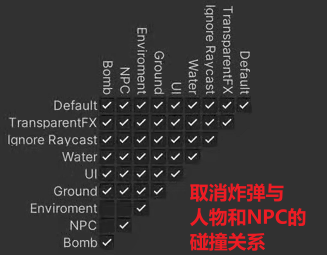**

需要播放动画，开始结束的时间，给其他物体施加力的操作

**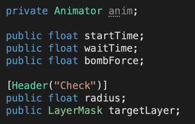**

**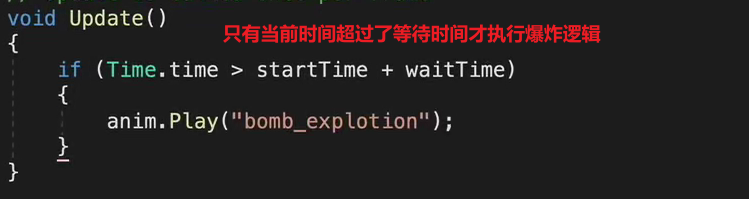**

画出范围的线

**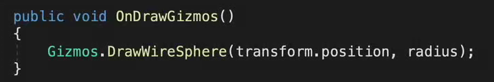**

制作爆炸效果：在动画事件中添加

**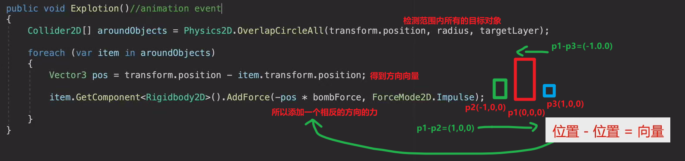**

小问题：

1.人物并没有反方向弹开

因为人物没有移动的时候，会不断的将自身x设为0，会覆盖掉施加过来的力，以后再改

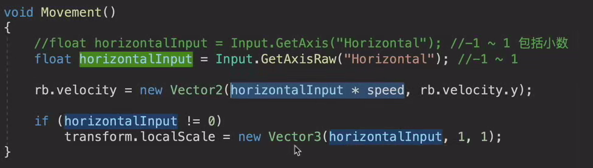

2.炸弹自身也被爆炸特效被弹开

因为爆炸检测的时候自身也被检测进去了

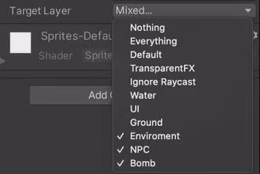

怎么办？

取消碰撞体，刚体设为静态（防止掉下去）

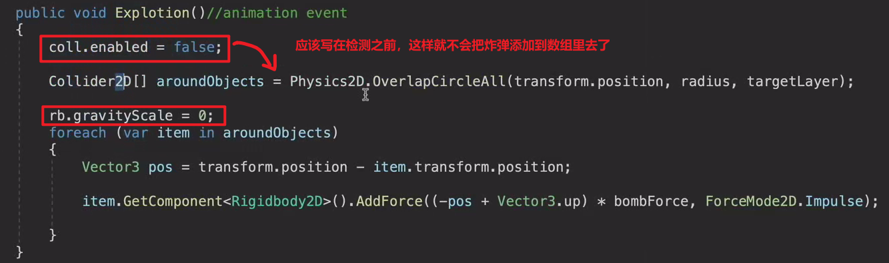

3.炸弹的方向只有左右两个方向，我们希望真实效果也有向上的力

直接简单添加一个向上的方向就可以了

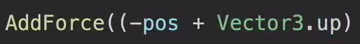

4.爆炸完了以后停留在最后一帧了，希望销毁它

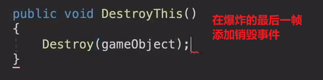
