# 12.制作敌人ai

制作敌人的ai之前，应该先考虑所有敌人的素材

拿到一套素材时，先浏览素材，脑海中有一个清晰的思路

我想要制作怎样的风格，或者怎么样的游戏性

eg:

每一个敌人面对炸弹都有自己的逻辑

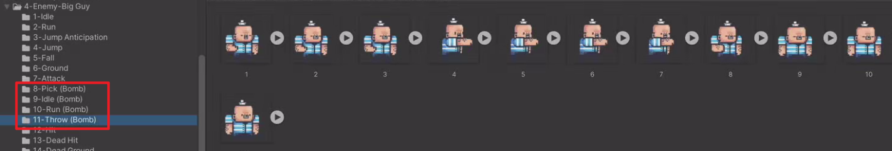

想一想有哪些代码逻辑是所有敌人都共用的，是不是可以把通用逻辑写在一个类里面，让每一个敌人都继承这个父类

1.制作动画

2.添加刚体和碰撞器

3.设置层级，不应该与玩家产生碰撞

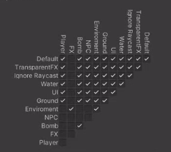

1.敌人需要两个点来回巡逻

SpriteSetiing是有人物图片的，与PointA,B同级关系不会影响

Cucumber是一个空物体，整理归纳的作用

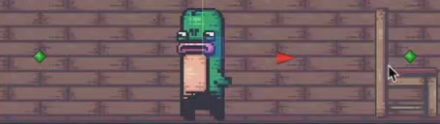

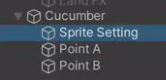

2.设置一个范围检测，如果是玩家就攻击，是炸弹就吹灭

因为是用来检测的，所以碰撞器设置为Trigger

为检测区域单独创建一个Layer，只与玩家和炸弹产生碰撞

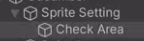

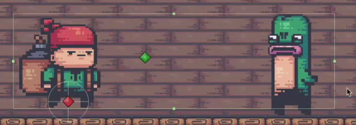

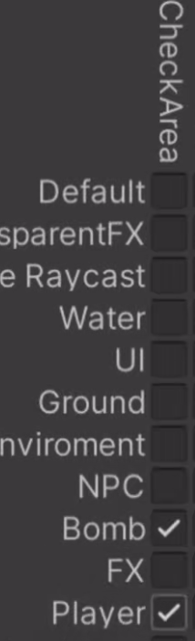

3.创建代码Eneme

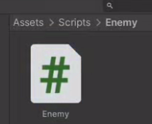

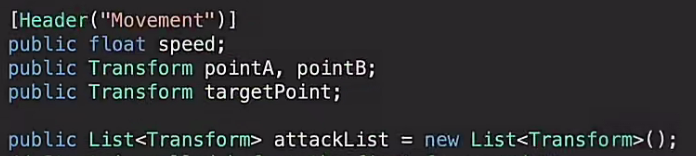

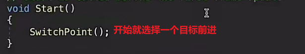

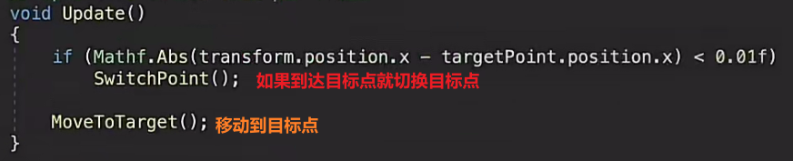

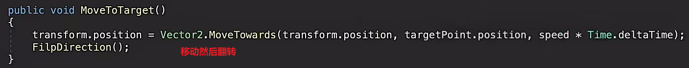

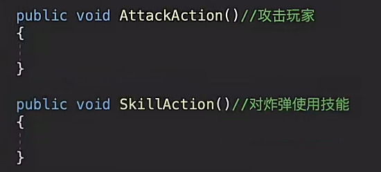

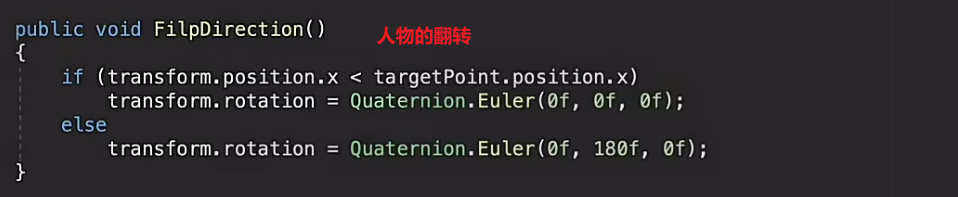

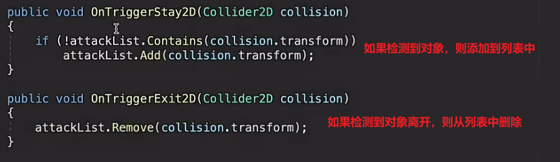

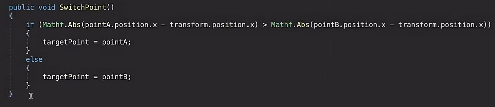

为什么可以做到只检测玩家和子对象

因为unity可以和子对象触发器叠加使用，且子对象层级物理设置只与玩家和炸弹层才生物理碰撞

触发检测只与这个物理设置有关系，与渲染层级没有关系

ji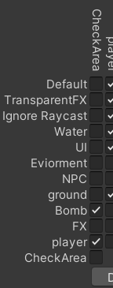
