# 30.打包到不同的平台下

安卓：

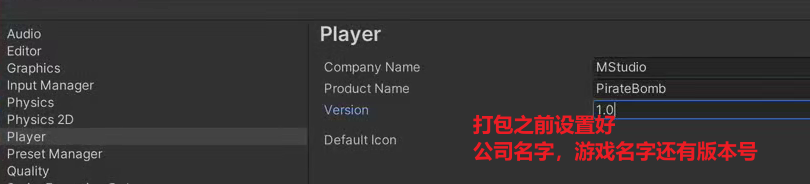

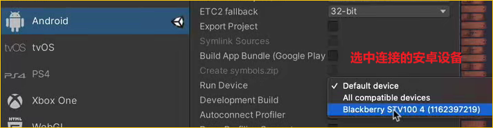

选择右横屏

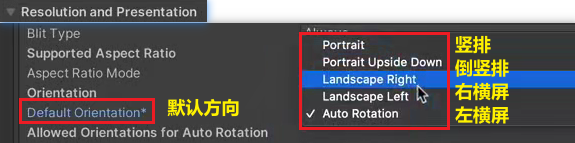

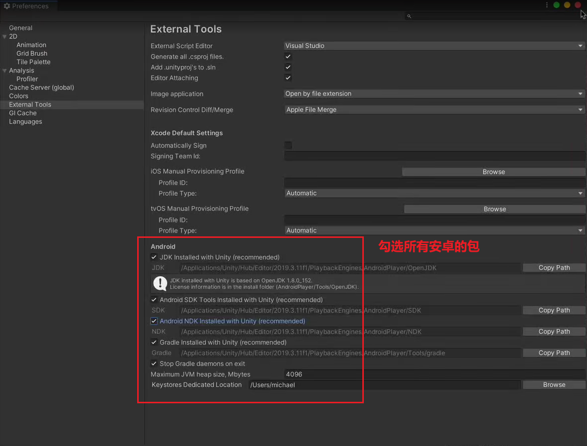

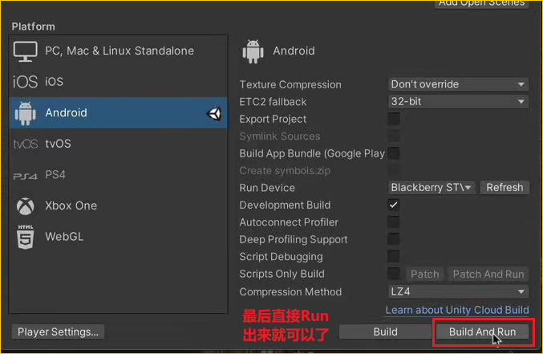

打包IOS：

首先切换ios平台

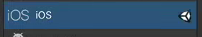

所有其他设置与安卓类似

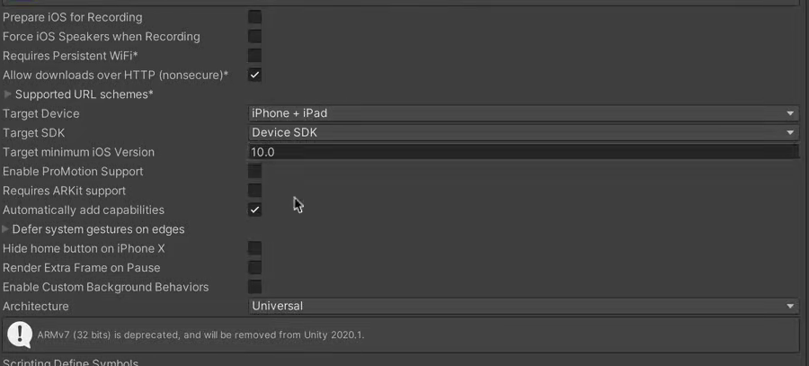

因为ios打包出来是一个xcode文件，所以我们要用xcode打包和生成

电脑中安装Xcode

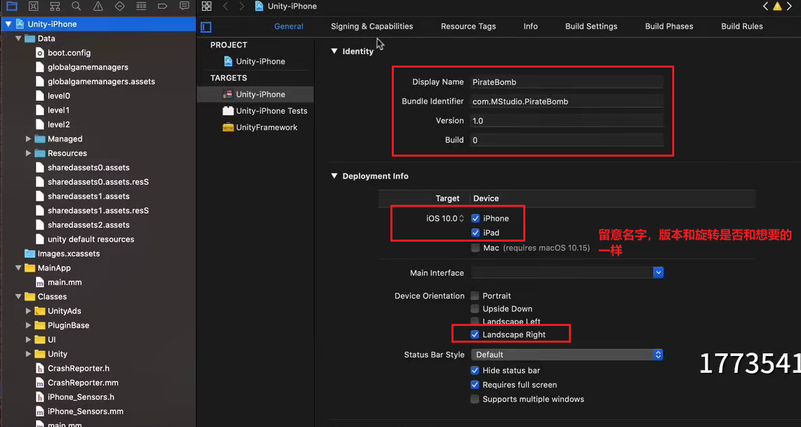

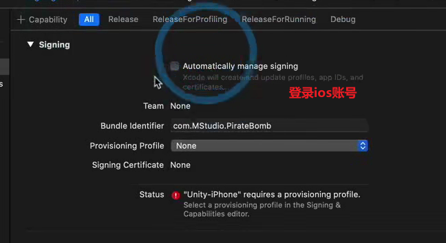

连接设备

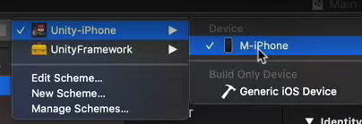

点击开始打包

如果遇到提示：

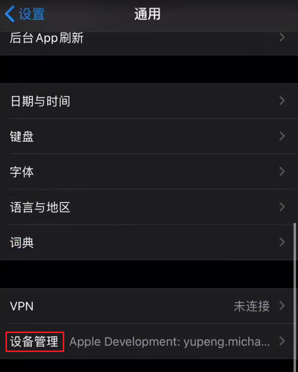

点击信任，然后再次打包

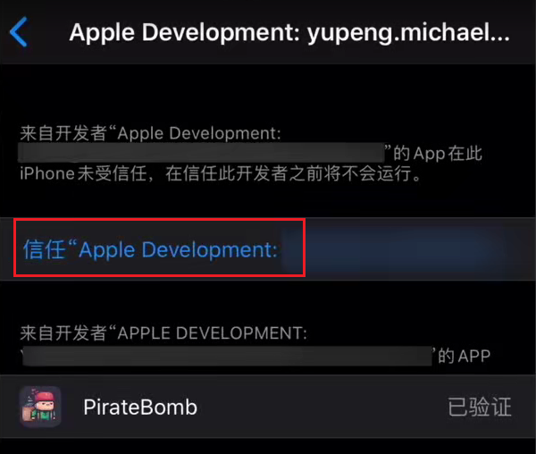

打包时，整个项目文件夹不应该有中文，否则可能报错

小问题：现在手机上可以无限跳跃
