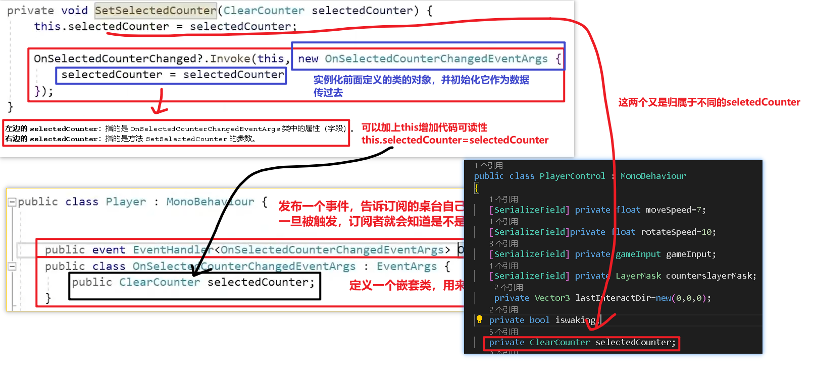

# 12.单例模式和交互视觉


---

---


如何知道玩家选中的是哪个桌台？


项目重构


1. 什么是嵌套类？ 嵌套类是定义在另一个类内部的类。这种结构帮助组织代码逻辑，保持类之间的紧密关系，并且可以通过嵌套类访问外部类的私有成员。 

2. 为什么使用嵌套类？ 

```
可以把**嵌套类**比作**盒子里的小盒子**：

1. **逻辑分组**：
   - 就像大盒子里装着小盒子（嵌套类），小盒子里的东西只跟大盒子有关系，保持整齐有序，避免乱放。
   
2. **访问控制**：
   - 小盒子（嵌套类）有钥匙可以打开大盒子的隐藏隔层（外部类的私有内容），别人看不到，只有小盒子能用。

3. **避免命名冲突**：
   - 即使不同盒子里的东西名字一样，因为它们都在自己独立的小盒子里，所以不会搞混。
```

HandleInteractions:




单例模式：


