# 16.容器桌台

可变预制体：

 把预制体做成一个可视化的基类

（基类前面加下划线_让它永远排第一）

把其他桌子预制体变成这个基类的类实现

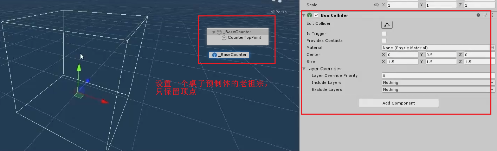

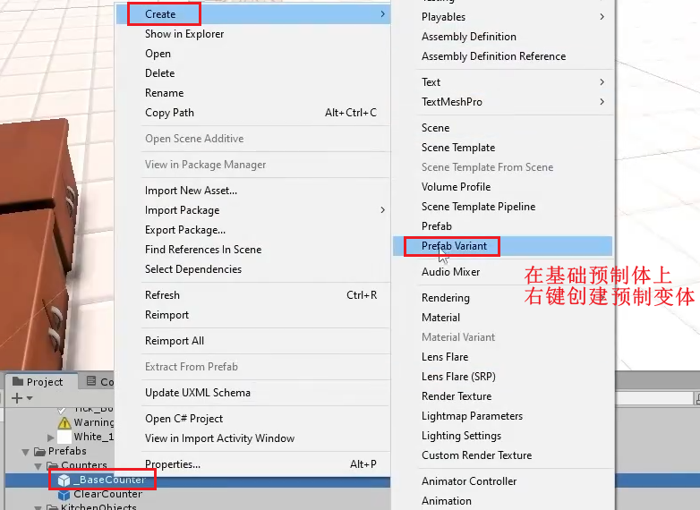

把可变预制体变成我们需要的预制体就好了，该挂脚本挂脚本，该赋值就赋值

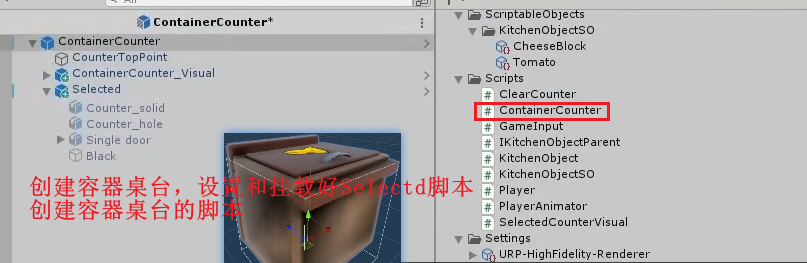

但是现在交互没有任何反应为什么？

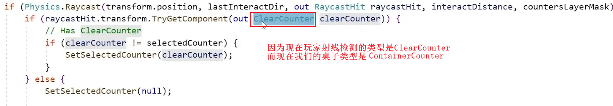

怎么做？做成接口吗

因为桌台和人之间区别很大，交互做成接口会更好，

而桌台与桌台之间连接很紧密，所以可以用继承的概念来实现交互

1.做一个桌子的基类

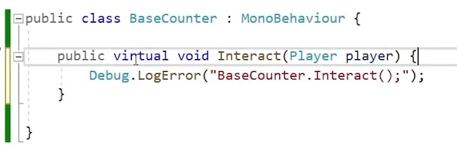

2.所有的桌台继承基类，且更改ClearCounter为BaseCounter

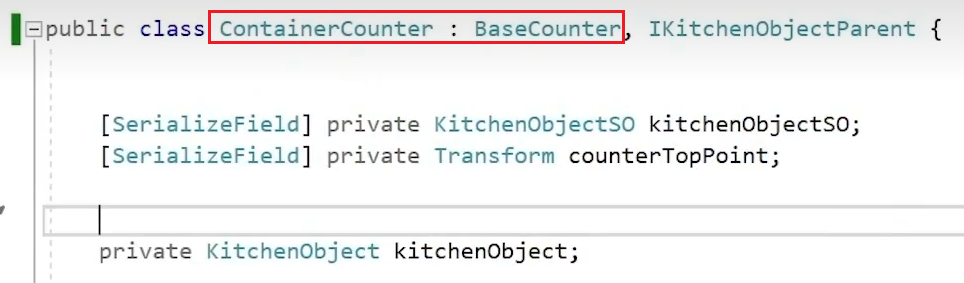

---

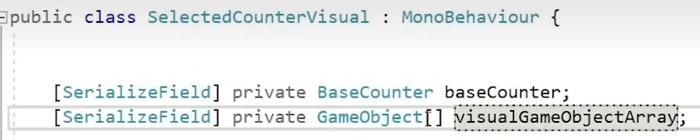

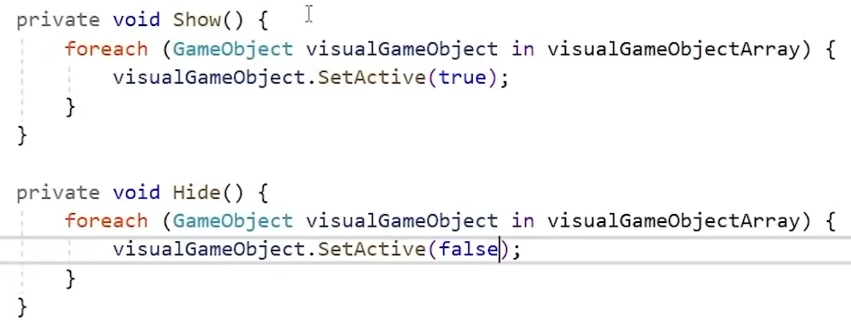

重构代码：

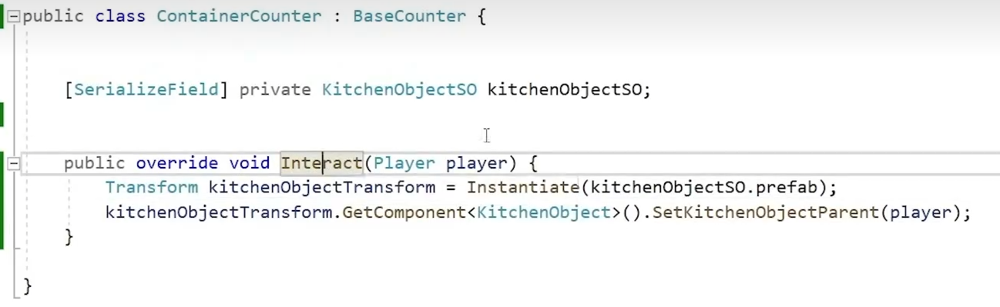

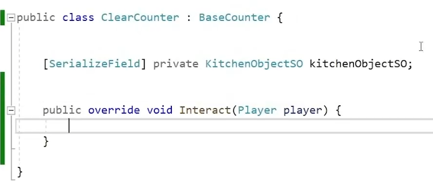

容器桌台动画设置：

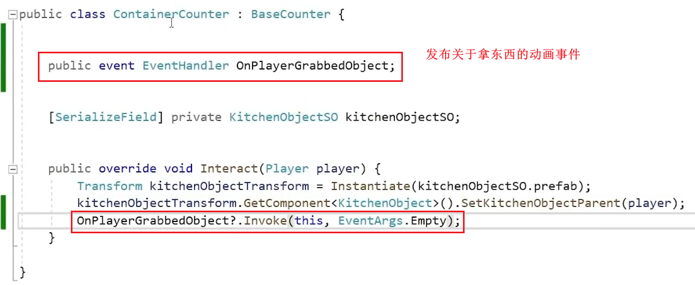

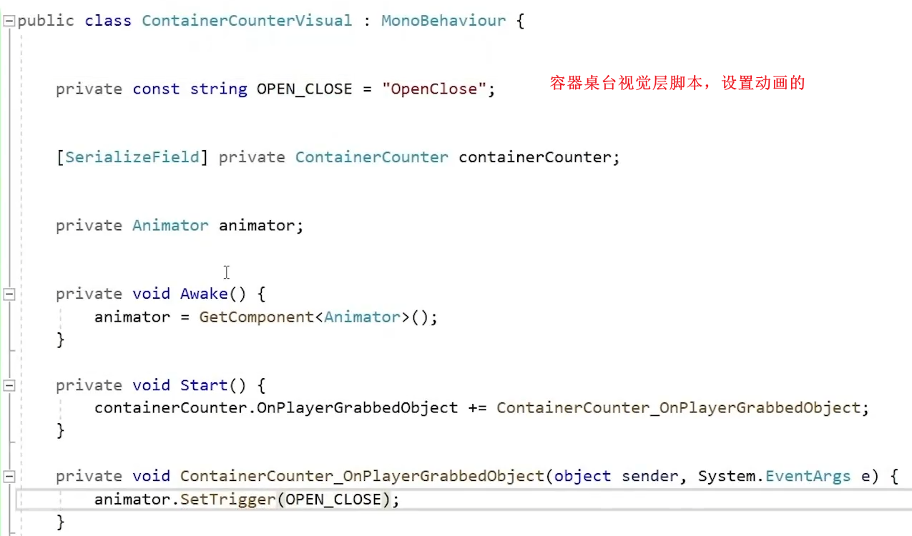
