# 23.炉灶桌台与有限状态机

1.创建炉灶卓的预制体和脚本

因为炉灶台和切菜台很像所以也创建一个SO文件，用来判断哪些能煎，煎多少秒

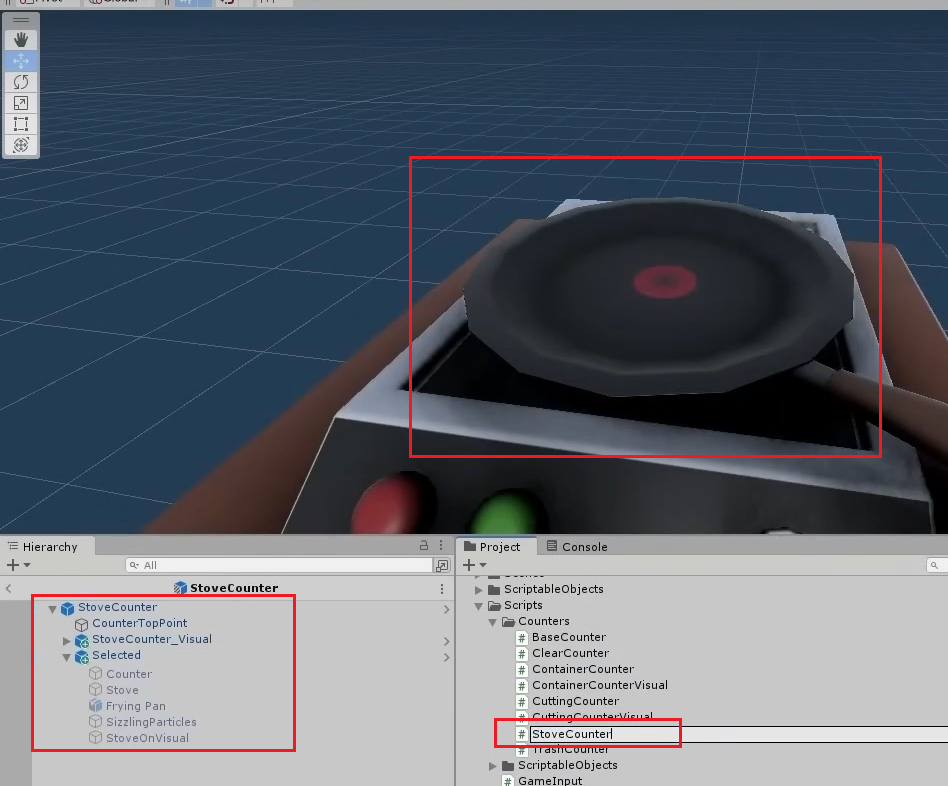

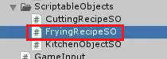

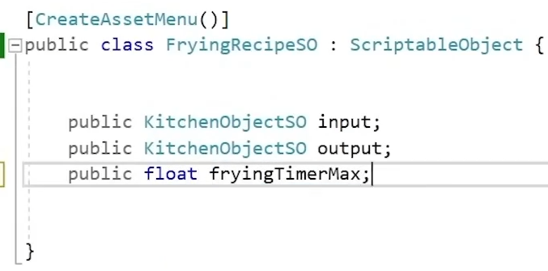

2.创建好生肉熟肉的预制体和各自的SO文件拖到SO管理文件中

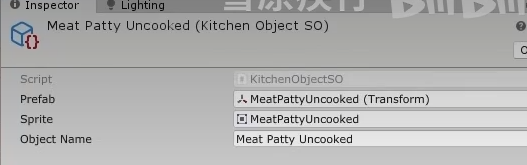

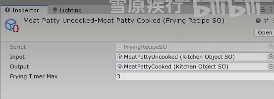

3.写炉灶卓的脚本（基础版本==切菜逻辑差不多，复制过来改一下名字）

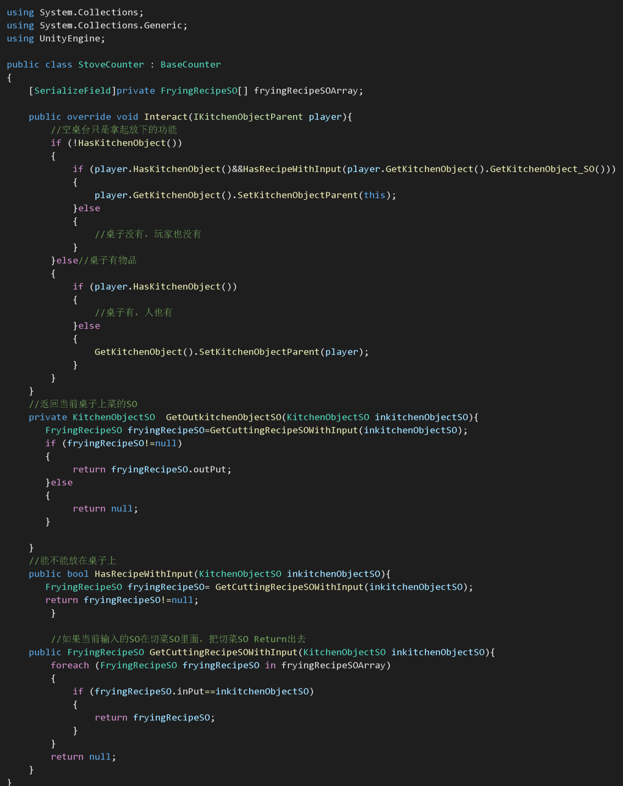

问题：现在需要一个计时器来计时

可以用协程

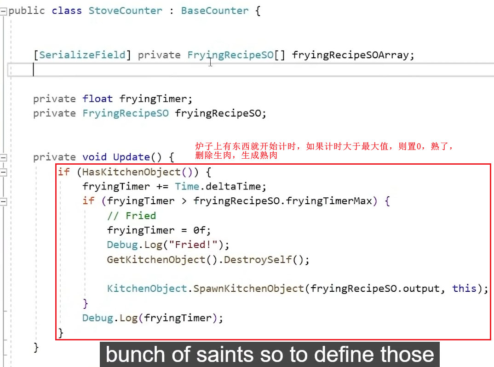

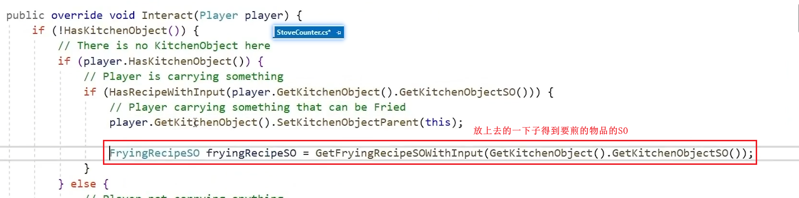

问题：现在一直在循环重复计时怎么解决？

状态机，设置几个不同的状态，可以用枚举实现

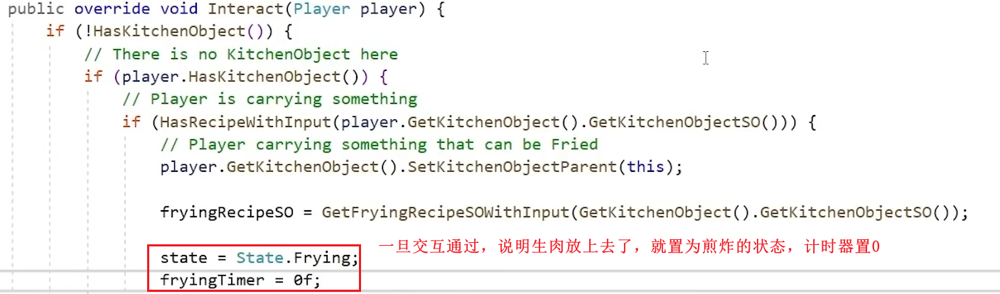

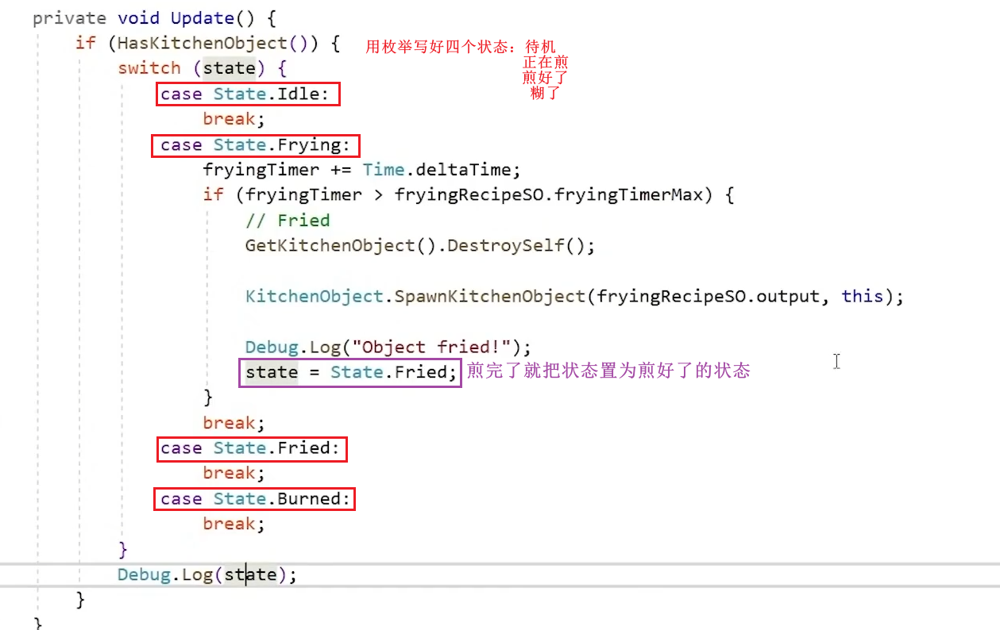

制作SO

进去的是熟肉，出来的是糊肉

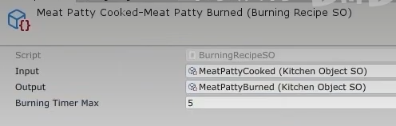

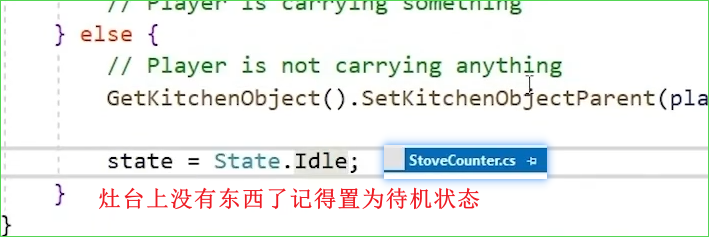

加一些粒子的动画效果：

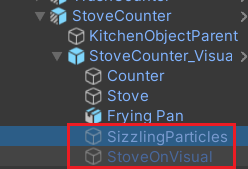

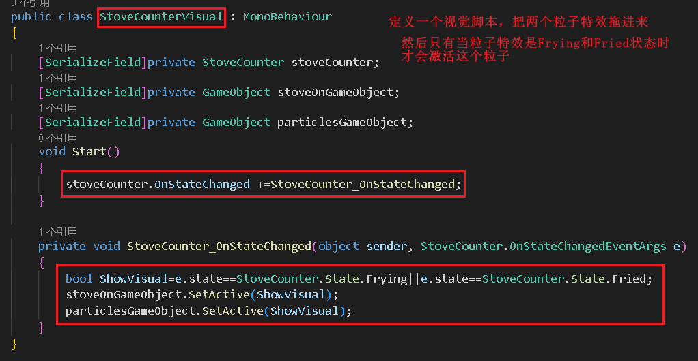

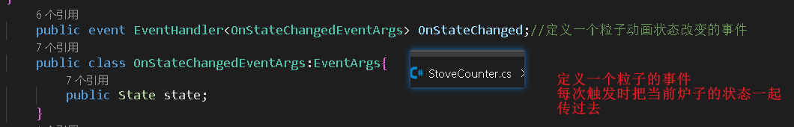

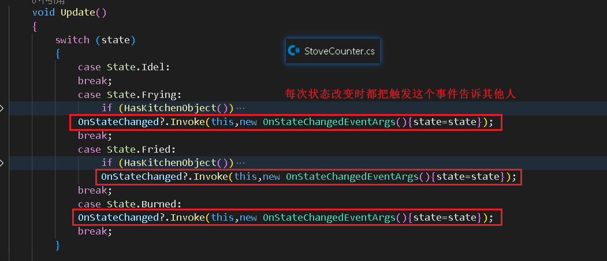

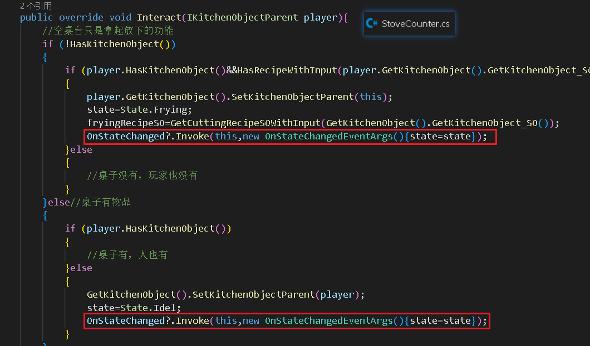

加进度条：

把之前切菜的UI设置预制体准备复用

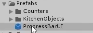

问题：接口在Inspect面板不显示，因为Unity不知道谁会实现这些接口，就不会显示在面板上，就不能拖

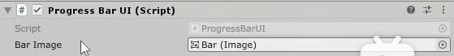

怎么办呢？--曲线救国，把GameObject拖进去，然后再得到这个接口

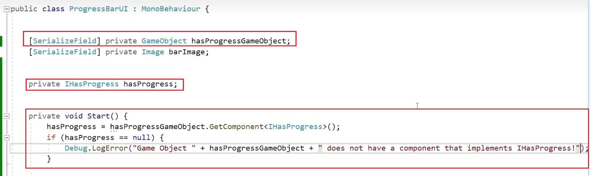

然后切菜桌台也要改一下，实现这个接口

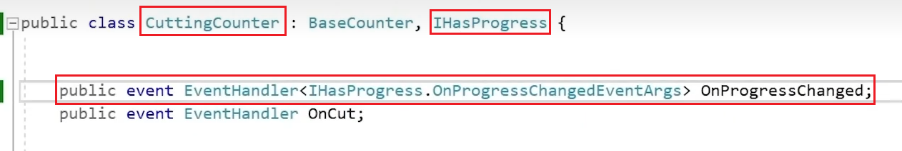

煎东西的桌台实现这个接口，和切菜桌台一样在合适的时机触发，这里是每次状态变化的时候

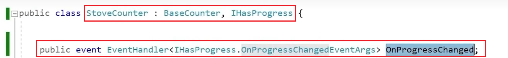

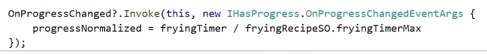

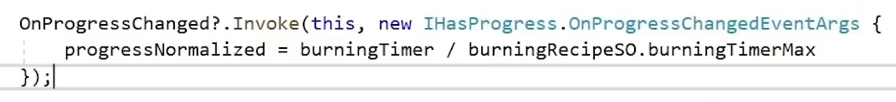

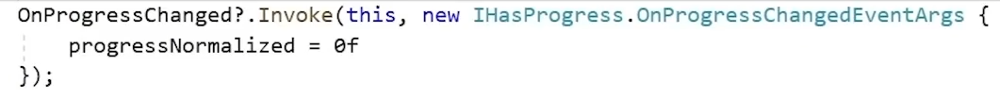

