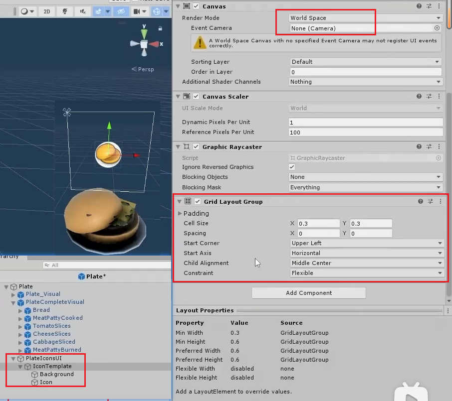
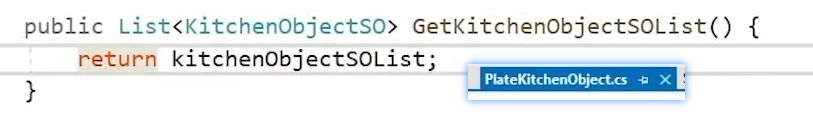
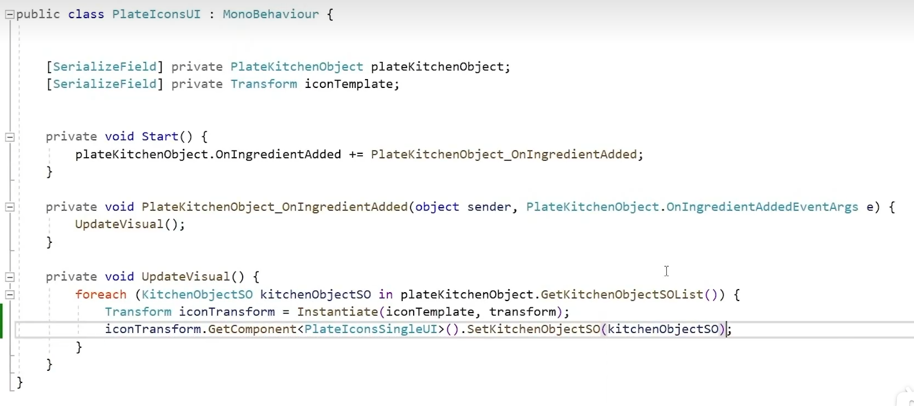
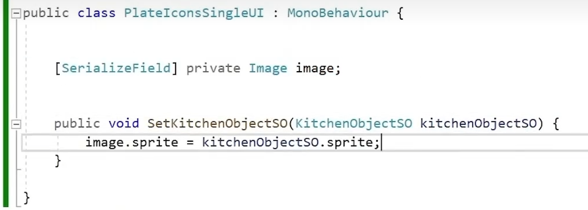
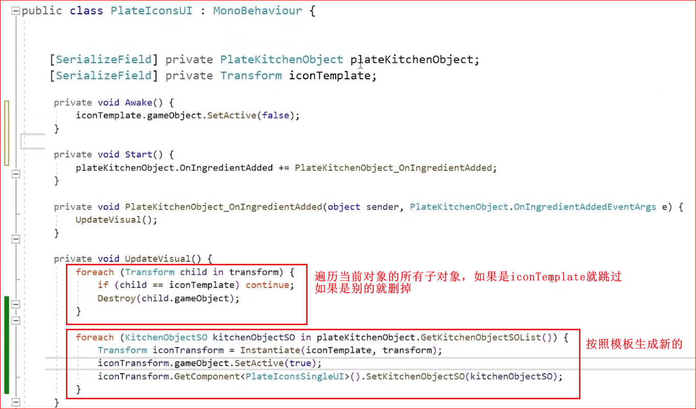
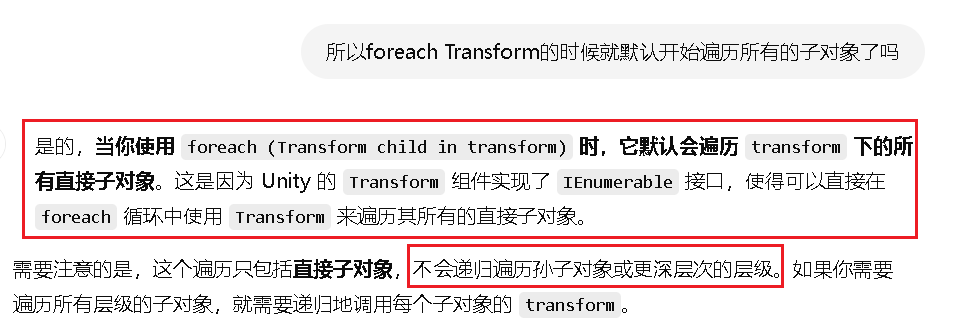
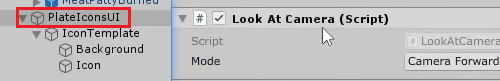

# 27.餐盘元素UI

1.为汉堡包创建可视化面板，把UI做成World模式，且用Uinity自带的布局组件Gride网格布局，设置好我们想要的模板，创建一个脚本进行管理

2.在盘子类中写一个方法，用来返回当前盘子里的物品清单

3.设置UI面板的逻辑监听盘子的事件，只要往盘子添加东西了，就触发逻辑，循环一遍返回的物品清单，逐一按照模板进行生成，并设置好显示的图片

设置图片的功能单独写一个脚本，层次分明

问题：

每次添加都会执行一遍for循环

每次生成之前都删掉旧的就可以了，但是要注意，模板不能删掉了

4.加一个之前写好的控制UI显示的脚本

