# 30.等待中的订单UI

1.创建Canvas

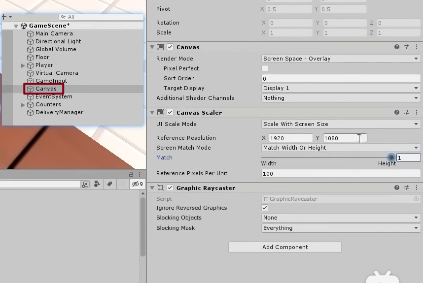

2.创建UI面板

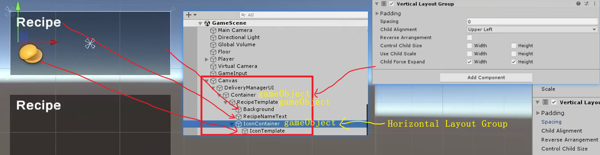

3.创建等待订单UI的脚本

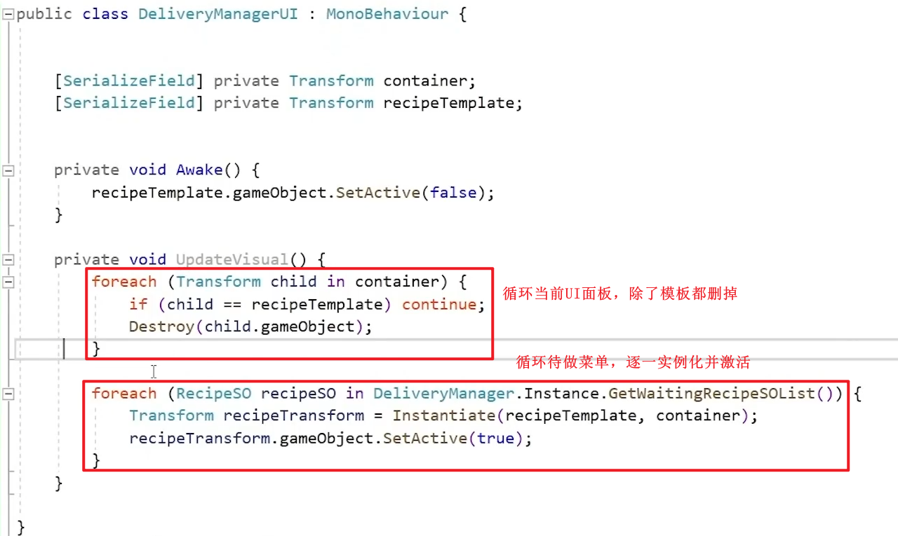

4.在DeliveryManager脚本中写一个”得到当前的代做菜单“的方法

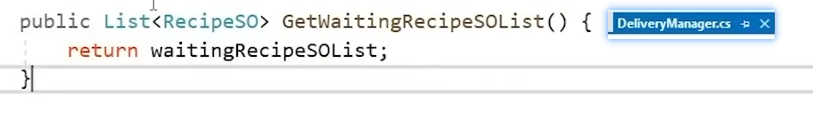

5.发布配方生成事件并订阅

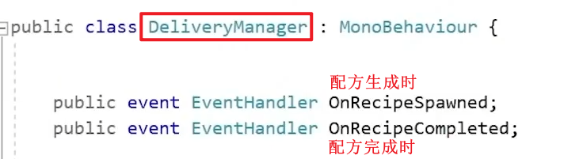

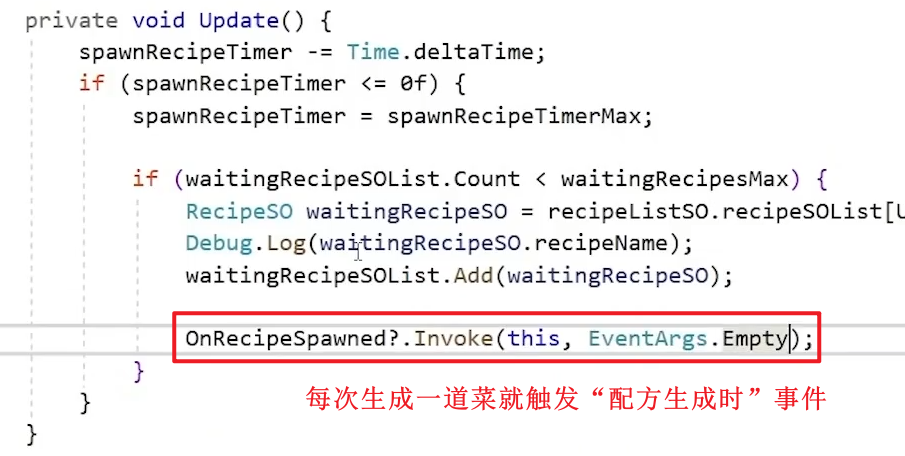

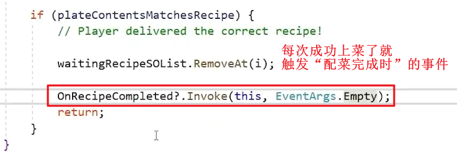

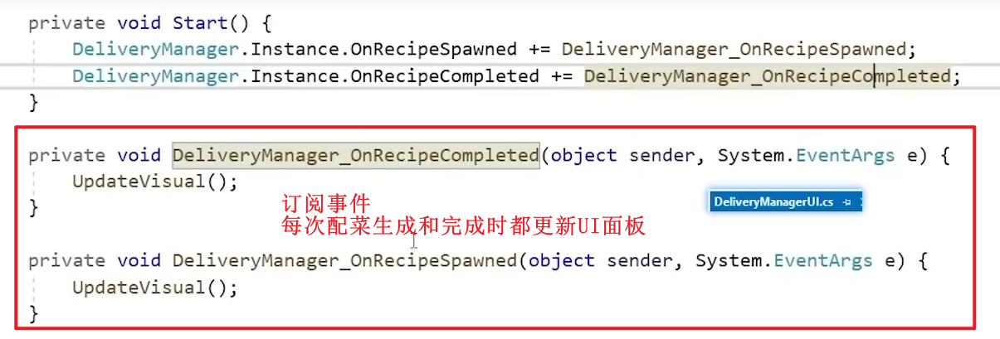

---

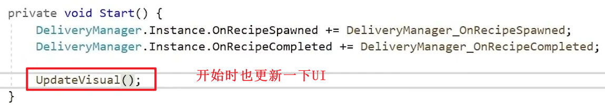

6.当前实现效果，每次生成模板内容，接下来按照数据替换模板的Sprite就可以了

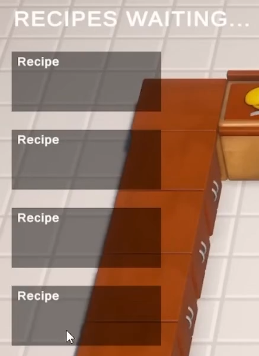

7.制作一个替换模板Sprite的脚本

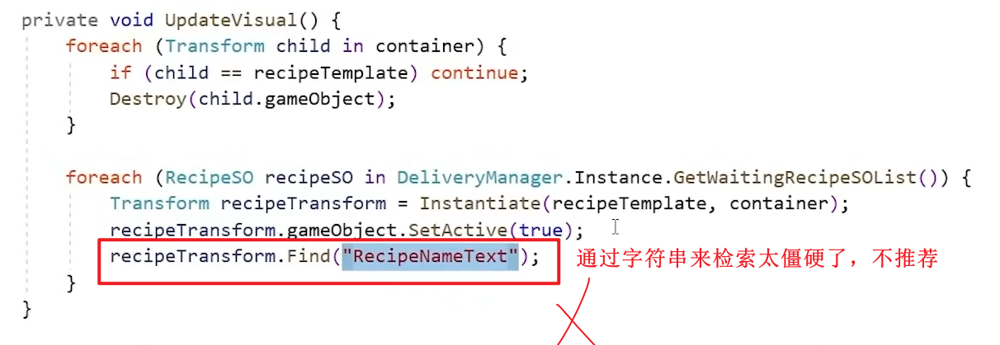

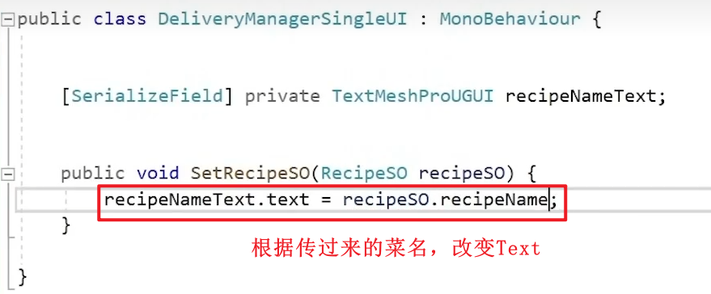

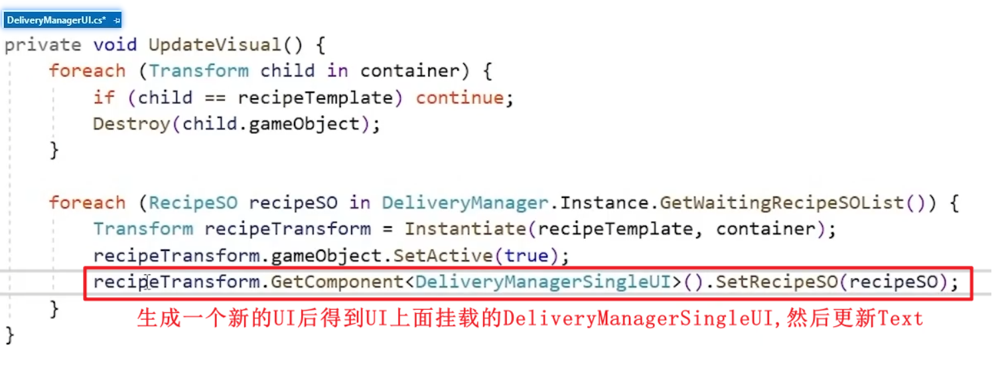

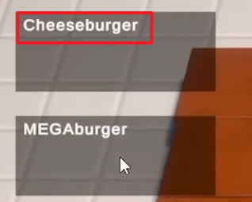

8.更新Sprite

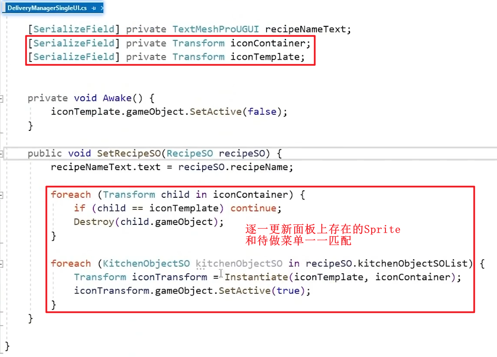

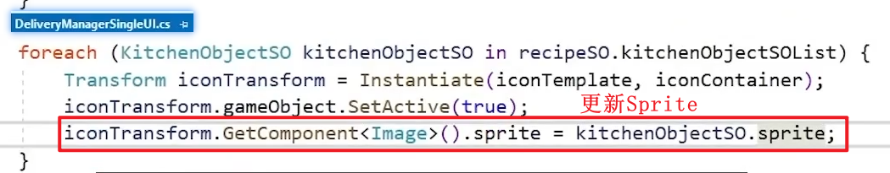

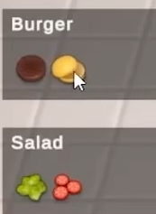

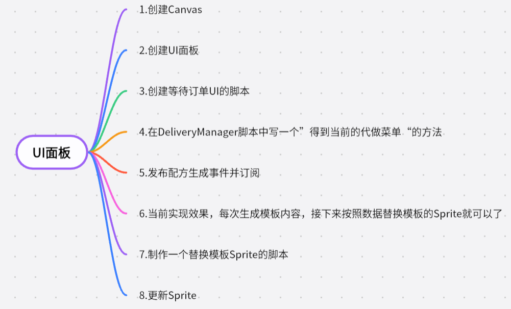
