# 31.音乐与声效

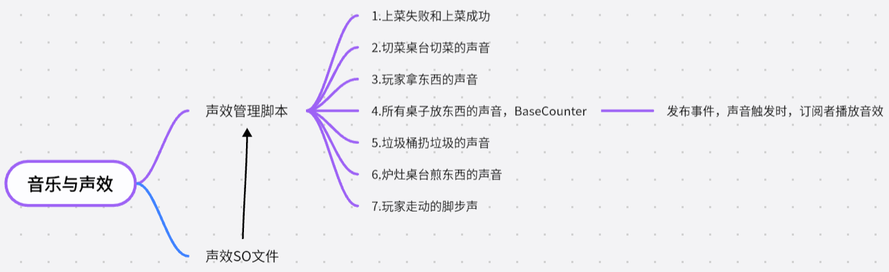

1.创建好预设体，并添加好音源 

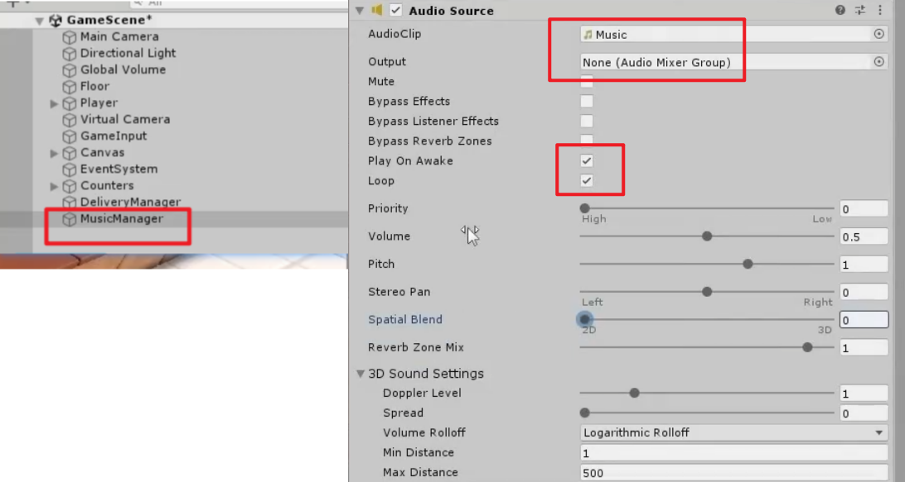

2.音乐调频插件（这里不用，只是介绍一下）

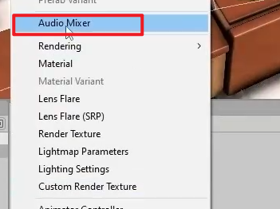

双击打开

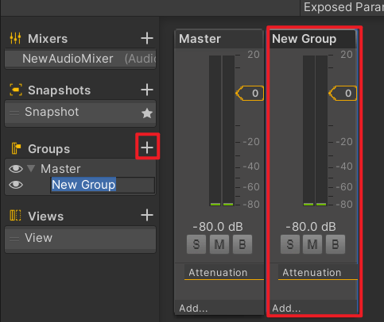

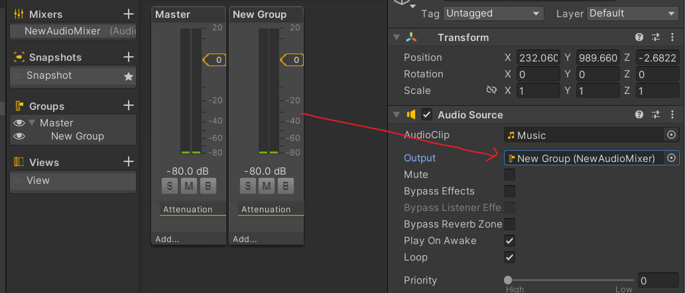

3.制作声效，首先制作一个空物体

4.制作声效管理脚本

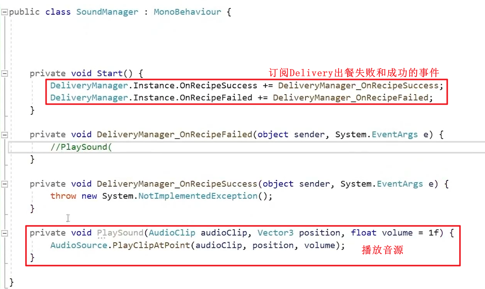

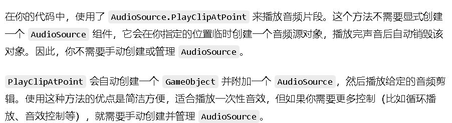

5.如何传是什么生效呢？直接传嘛，不！制作一个生效的SO文件

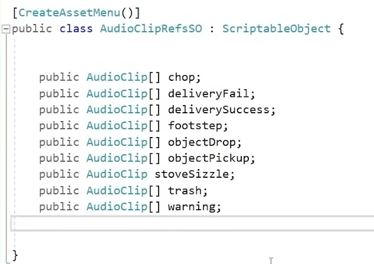

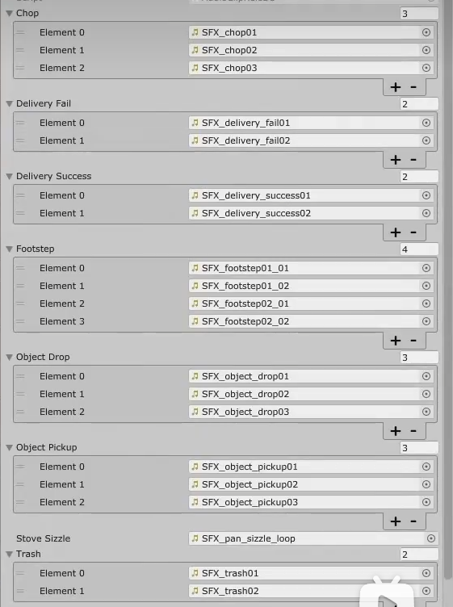

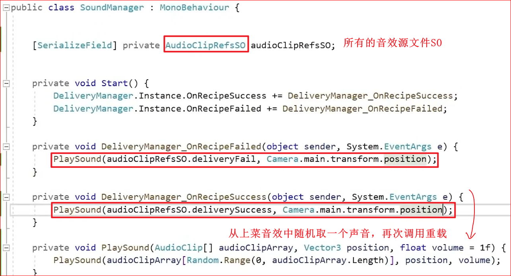

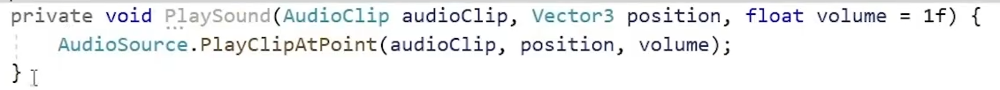

6.设置播放声音的地点是送餐桌台上：设置单例模式，然后设置位置

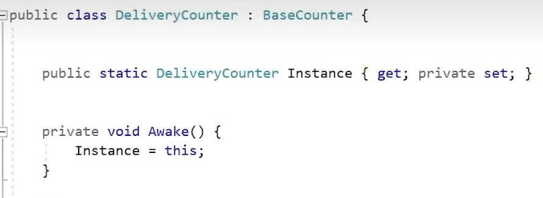

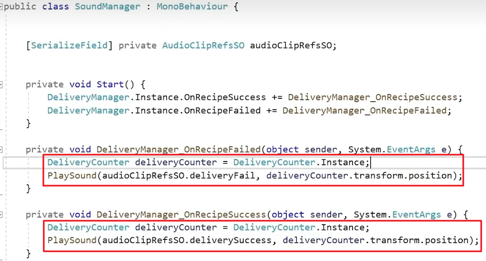

切菜桌台：

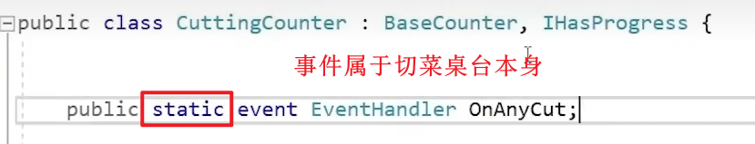

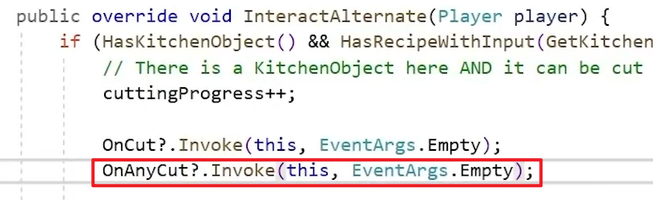

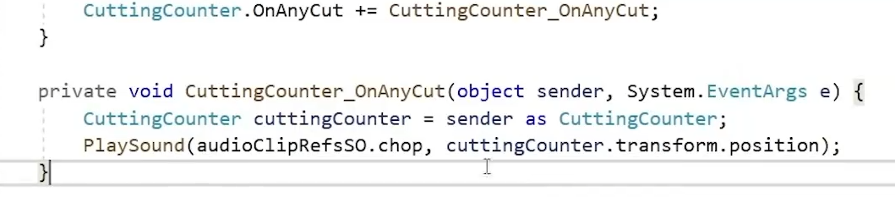

玩家：

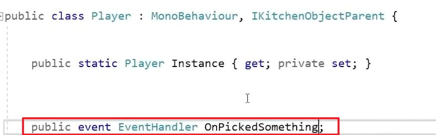

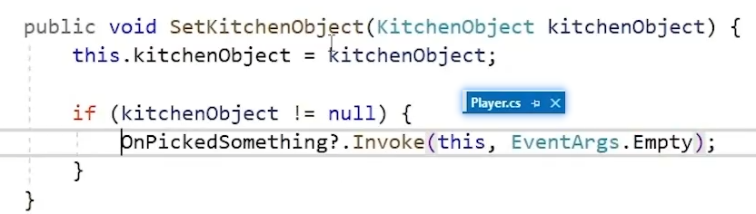

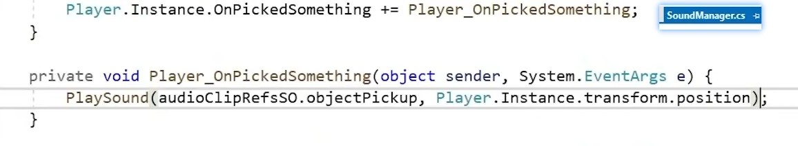

基础桌子：任何东西放到桌子上都要发出一个声音

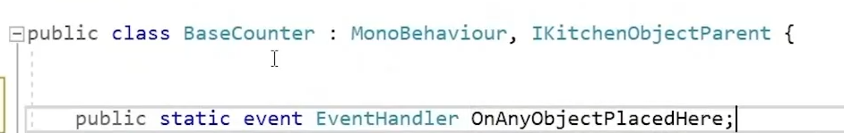

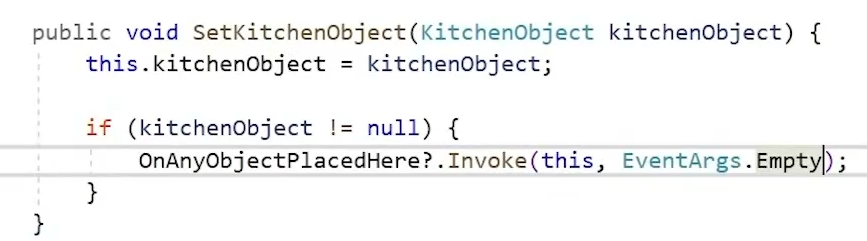

---

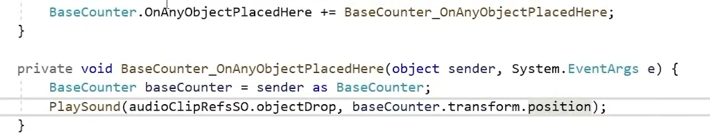

垃圾桶：垃圾桶有单独的音效

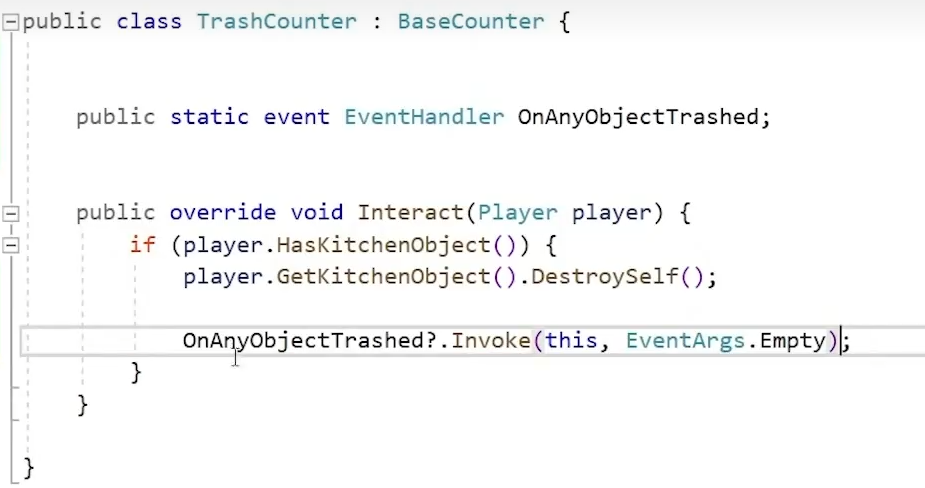

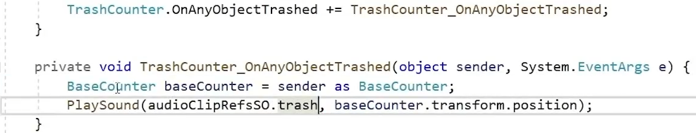

给煎桌台单独设置一个音源，并创建单独的脚本（这里只是展示更多的方法，也可以继续用SoundManager）

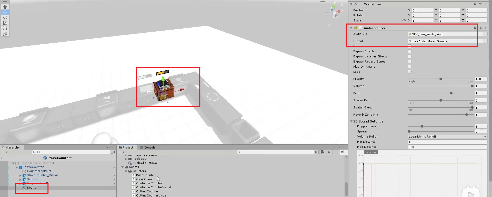

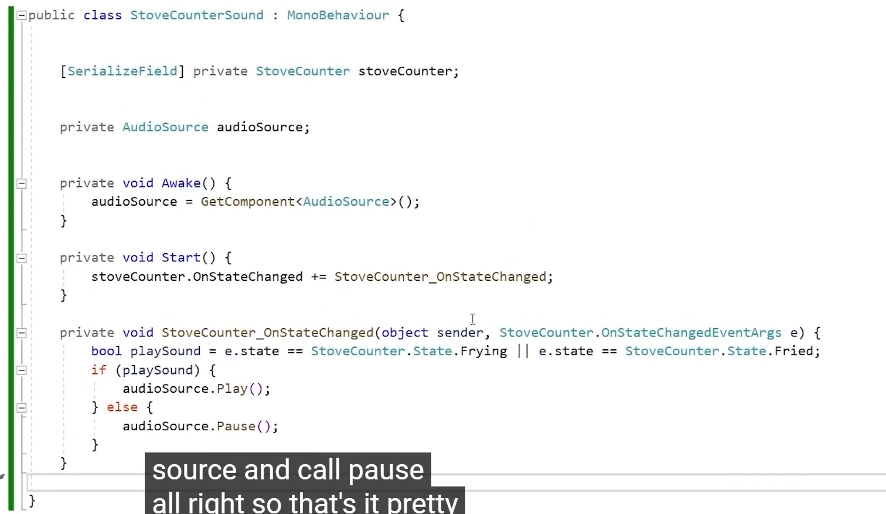

脚步声：

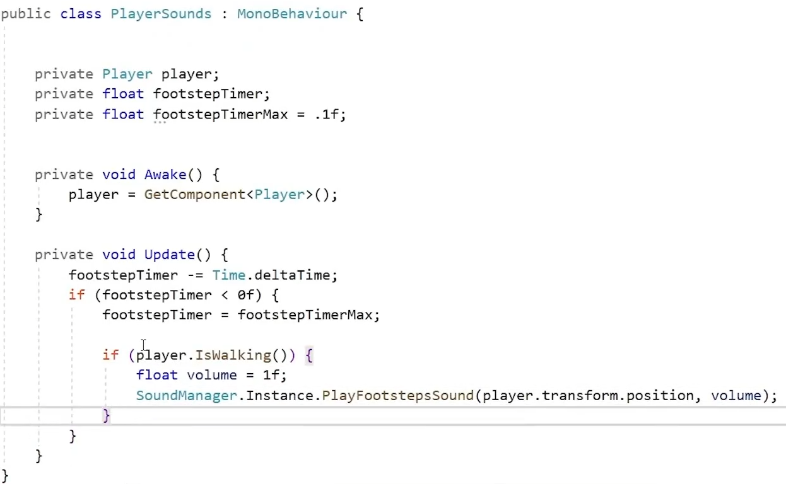

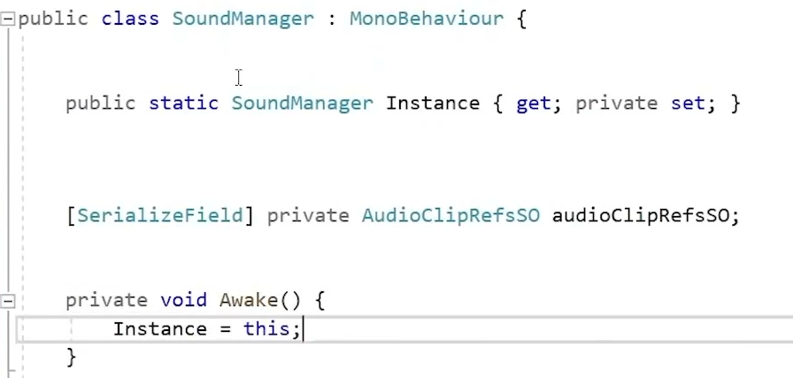

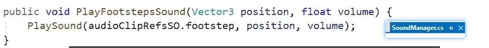
