# 32.游戏开始倒数

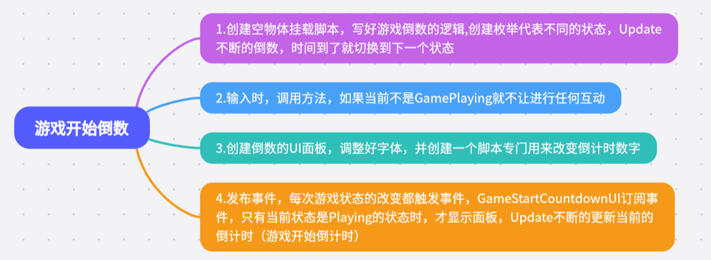

1.创建空物体挂载脚本，写好游戏倒数的逻辑,创建枚举代表不同的状态，Update不断的倒数，时间到了就切换到下一个状态

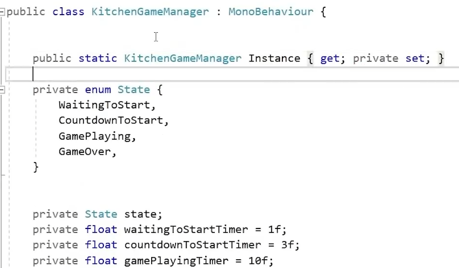

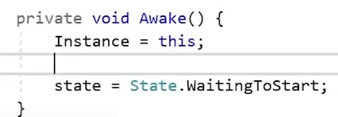

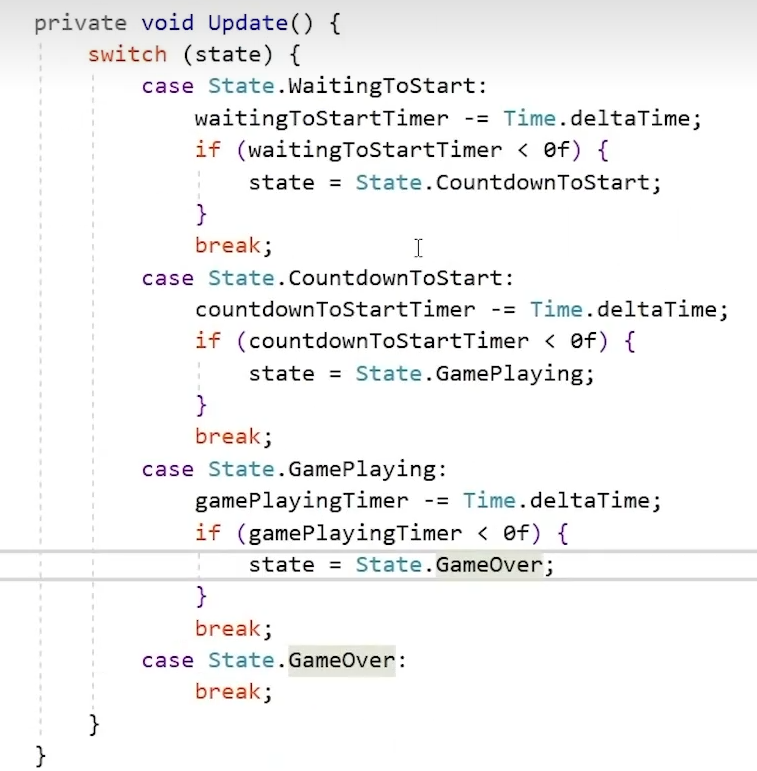

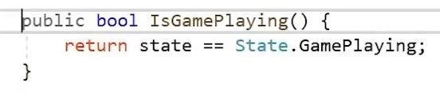

---

---

2.输入时，调用方法，如果当前不是GamePlaying就不让进行任何互动

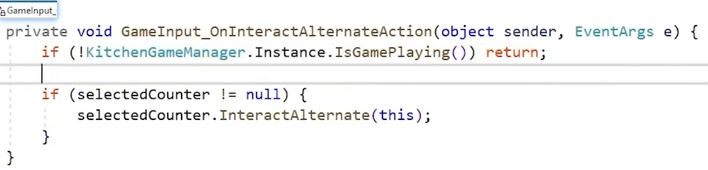

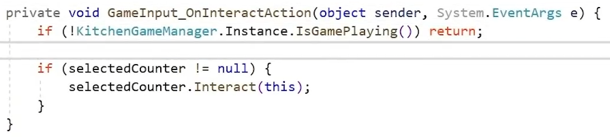

3.创建倒数的UI面板，调整好字体，并创建一个脚本专门用来改变倒计时数字

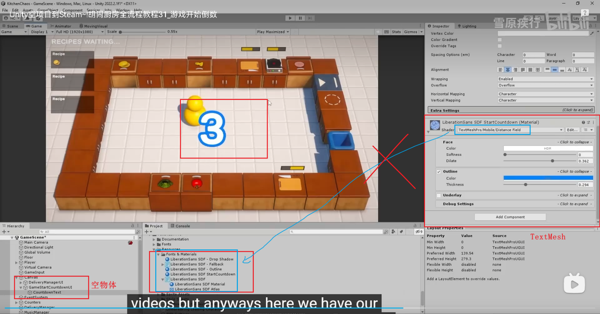

给倒计时一个单独的材质球，如果改变了不影响其他物体

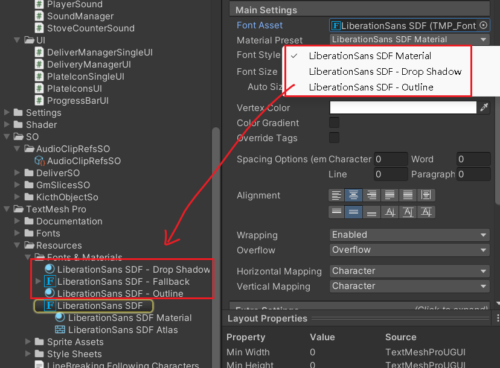

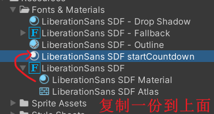

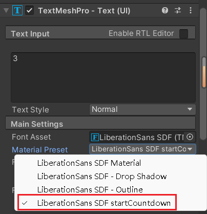

4.发布事件，每次游戏状态的改变都触发事件，

订阅事件，只有当前状态是Playing的状态时，才显示面板，Update不断的更新当前的倒计时（游戏开始倒计时）

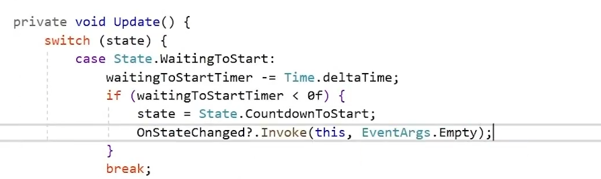

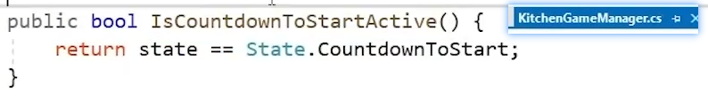

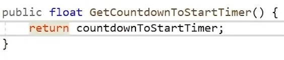

---

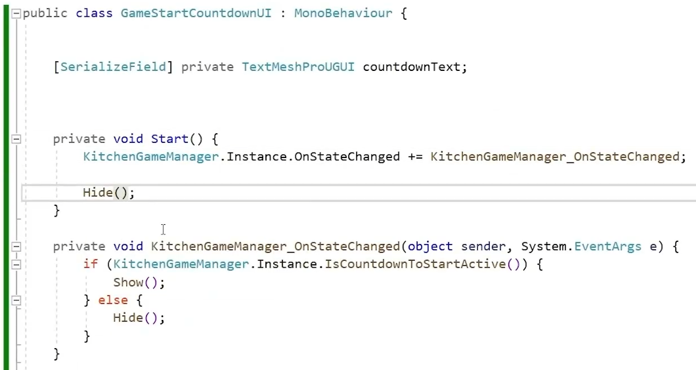

