# 35.暂停和回到主界面

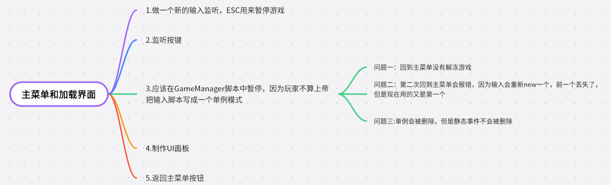

1.做一个新的输入监听，ESC用来暂停游戏

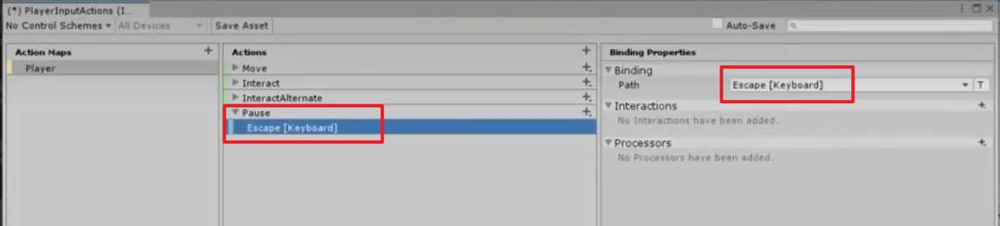

2.监听按键

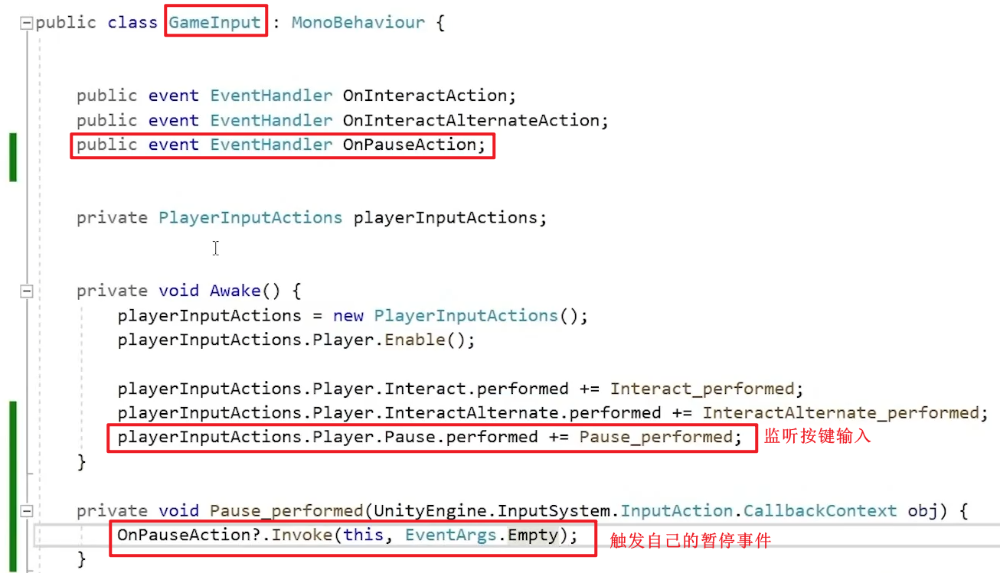

3.应该在GameManager脚本中暂停，因为玩家不算上帝

把输入脚本写成一个单例模式

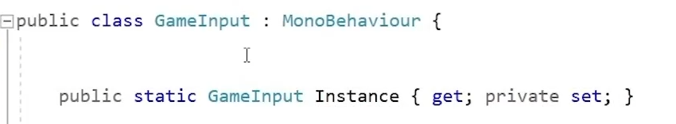

---

---

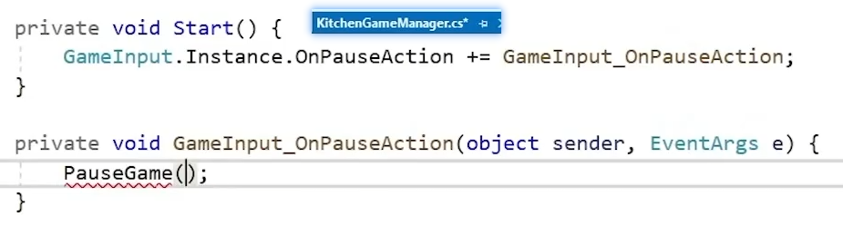

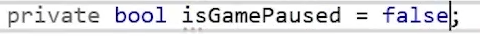

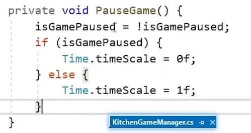

4.制作UI面板

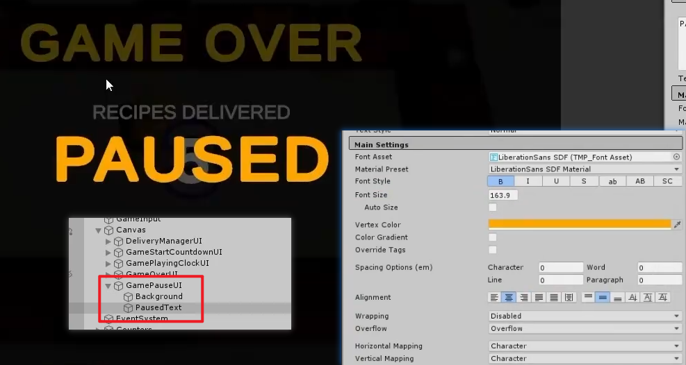

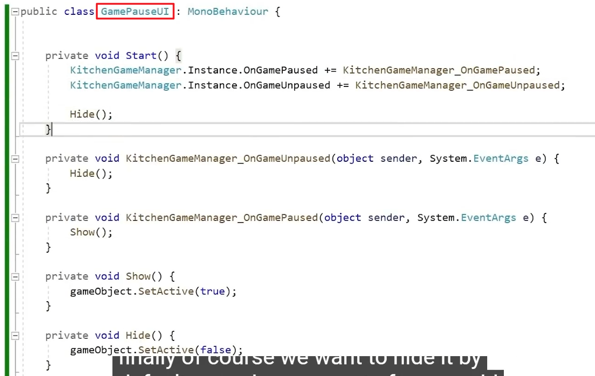

---

---

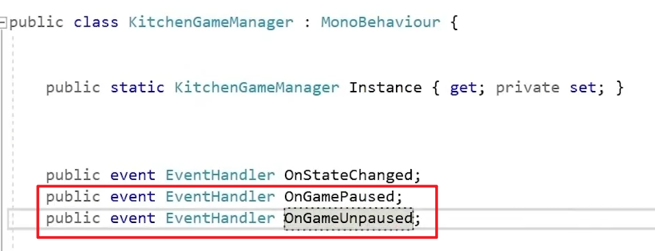

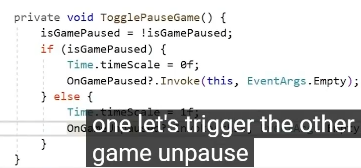

5.返回主菜单按钮

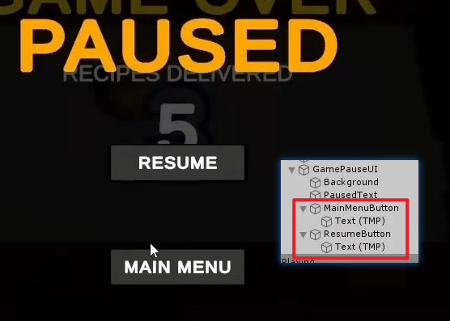

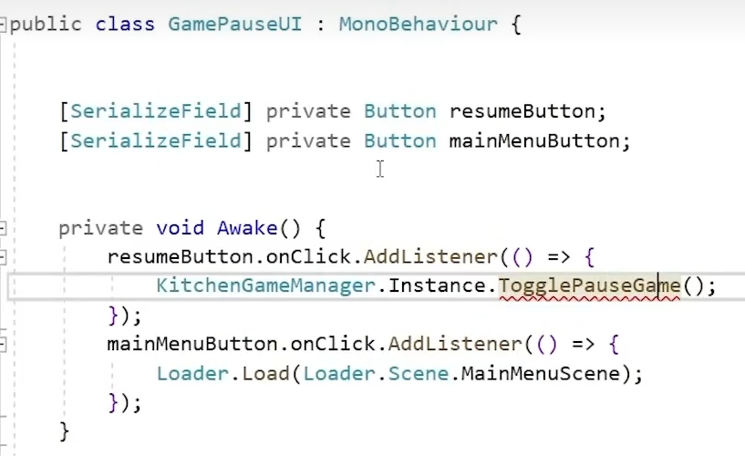

6.问题一：回到主菜单没有解冻游戏

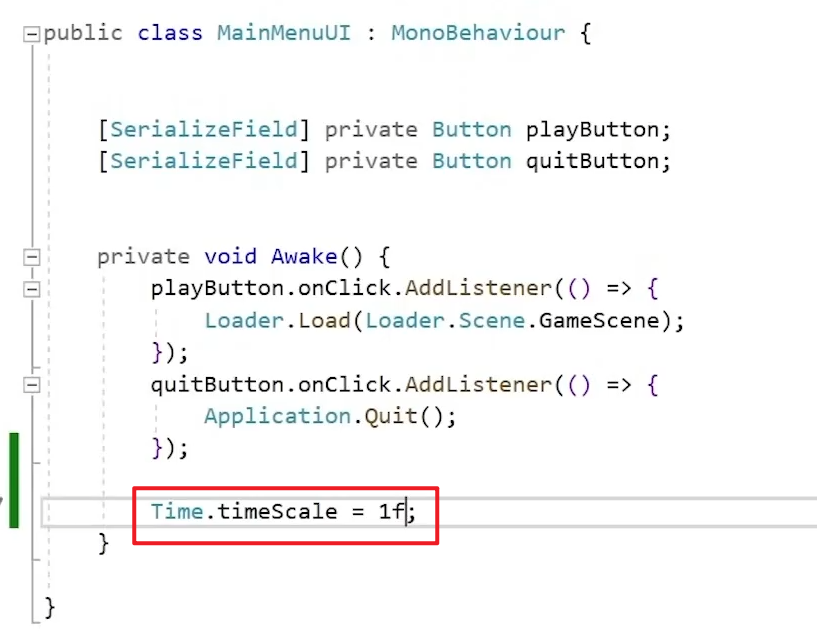

问题二：第二次回到主菜单会报错，因为输入会重新new一个，前一个丢失了，但是现在用的又是第一个

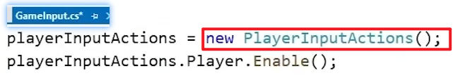

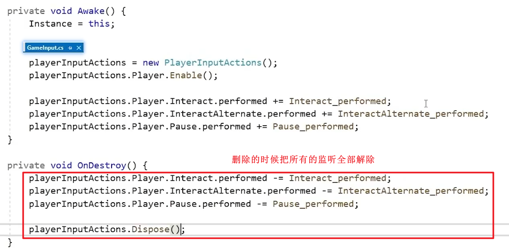

问题三:单例会被删除，但是静态事件不会被删除

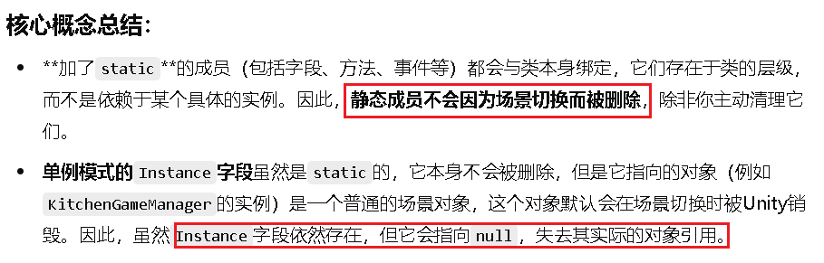

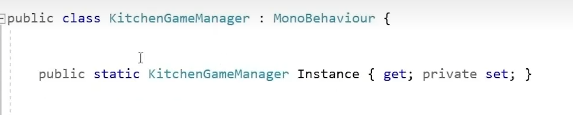

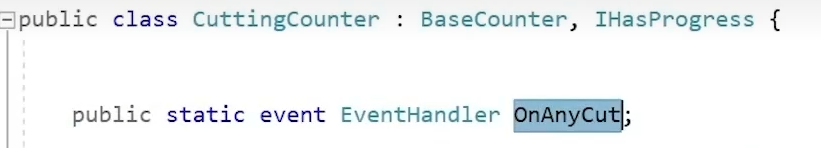

测试：

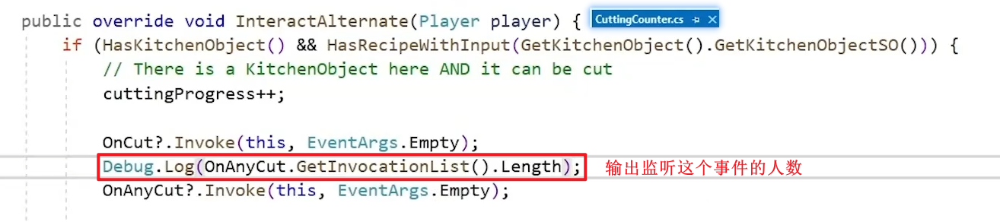

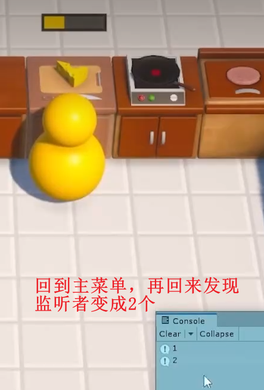

解决方法：

每次回到主菜单就把所有的事件置空

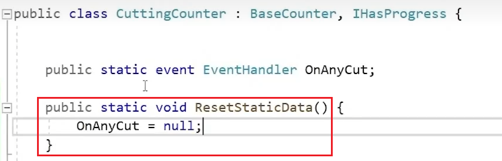

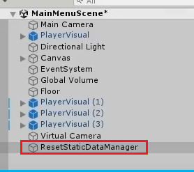

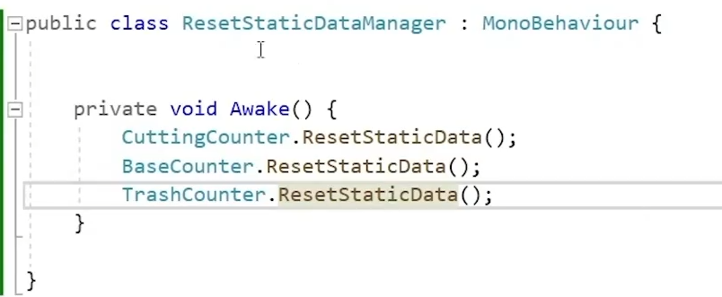

---

---

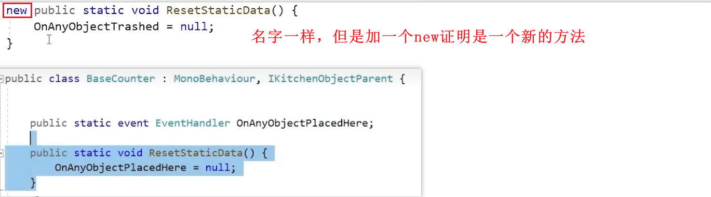
