# 37.按键重映射

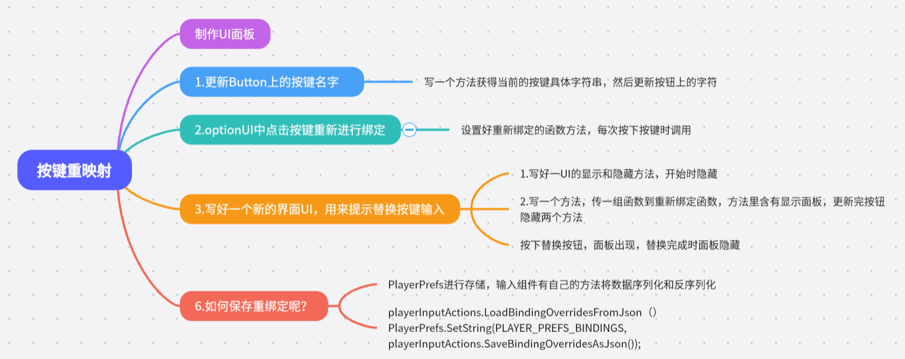

制作UI面板

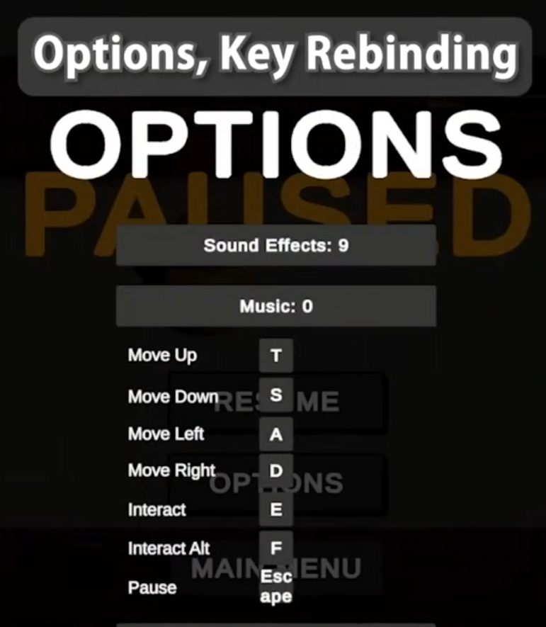

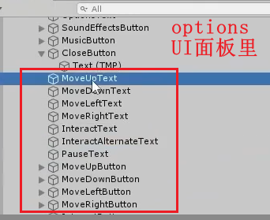

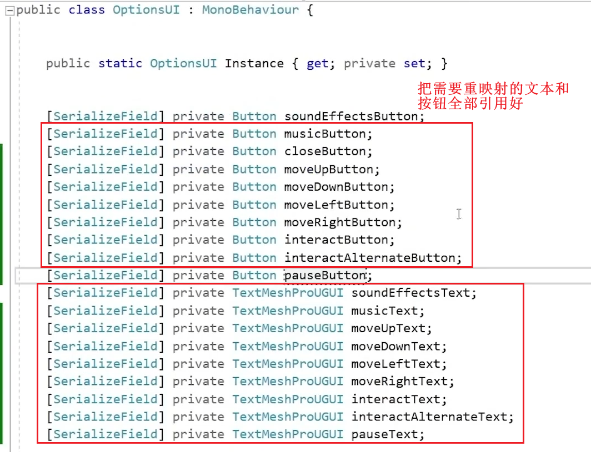

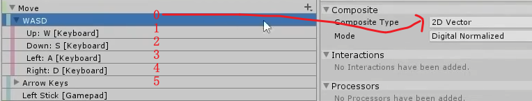

映射插件的运行逻辑，

- **bindings[0]**：负责整个 2D Vector Composite 组合，输出 Vector2，代表所有方向的输入。
- **bindings[1]**：对应 Up（上方向）的按键，比如 W 键。
- **bindings[2]**：对应 Down（下方向）的按键，比如 S 键。
- **bindings[3]**：对应 Left（左方向）的按键，比如 A 键。
- **bindings[4]**：对应 Right（右方向）的按键，比如 D 键。

举例说明

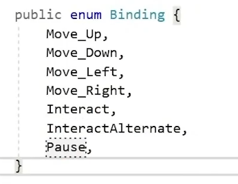

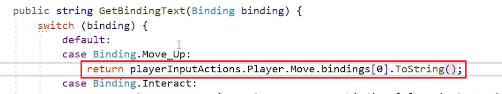

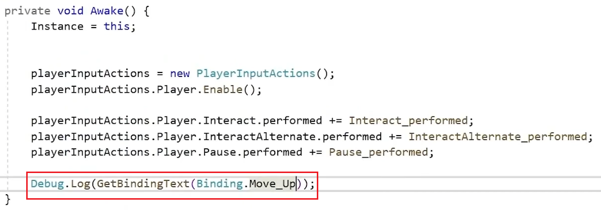

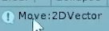

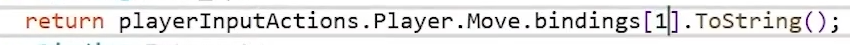

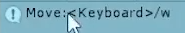

具体操作：

1.得到具体绑定的按键是什么

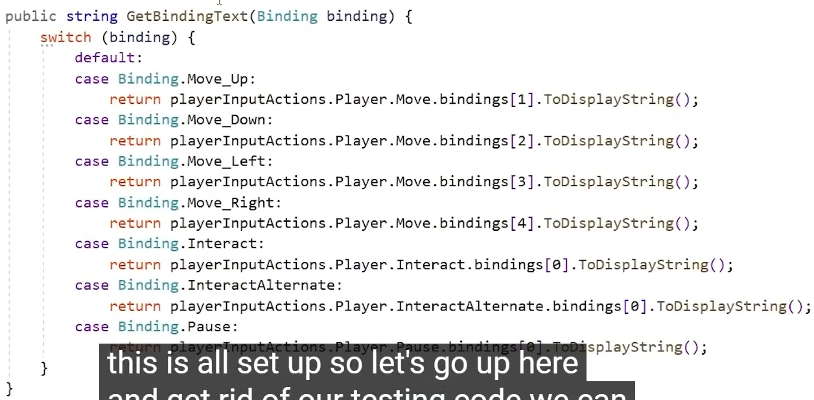

2.把当前屏幕上显示的文字拿到显示的绑定键

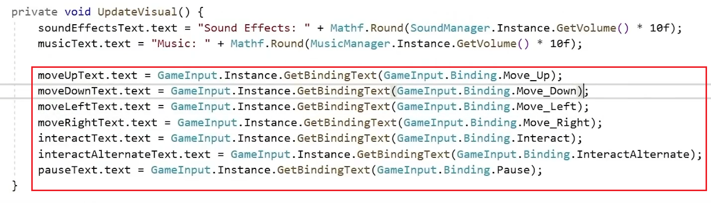

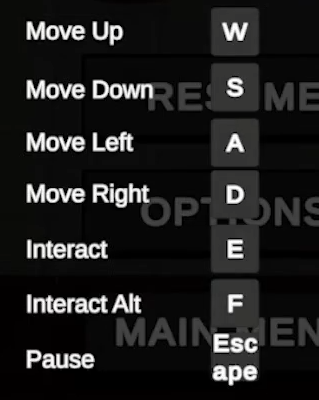

3.设置好重新绑定的函数方法

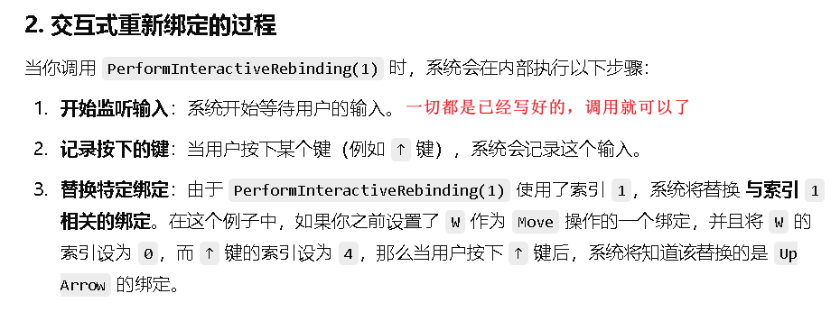

之前需要手动释放callback，现在似乎不需要了

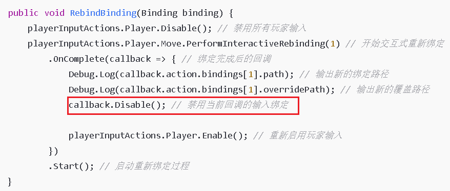

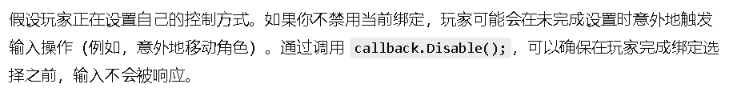

4.optionUI中点击按键重新进行绑定

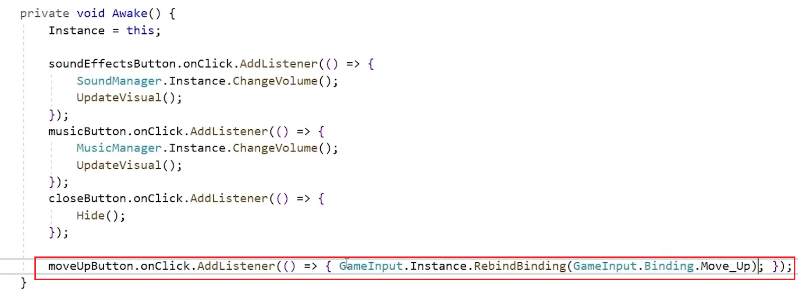

5.做好视觉反馈，知道自己按下了按钮

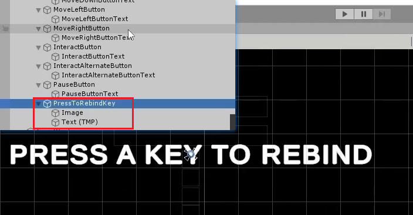

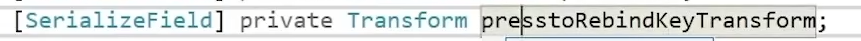

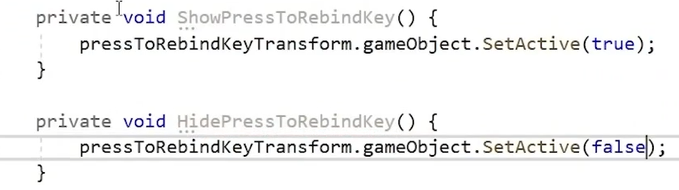

开始时隐藏

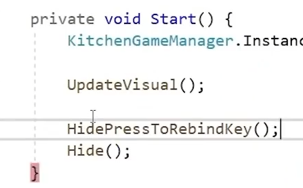

按下按钮的时候调用方法，重绑定，然后显示面板

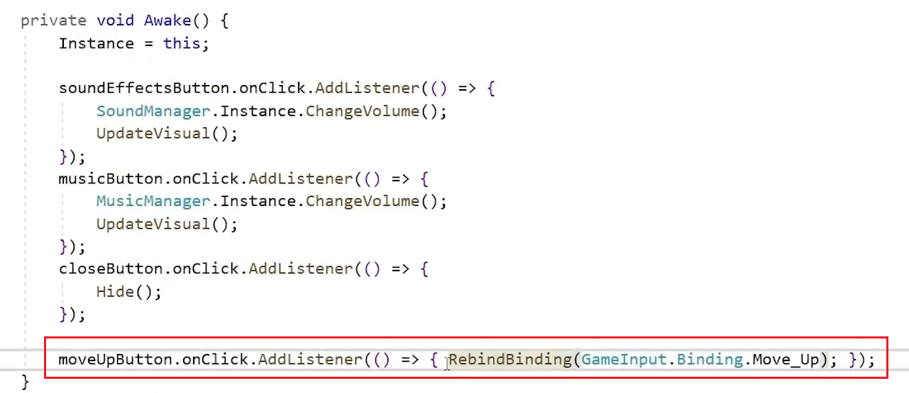

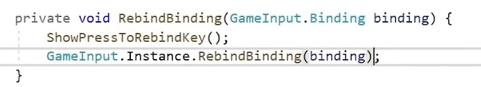

改动重新绑定的方法，接收一个方法，当绑定完了之后，调用这个方法，隐藏掉界面

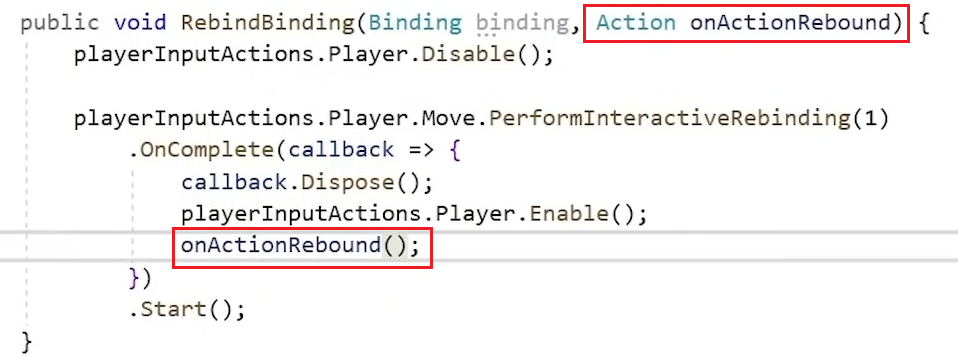

函数带括号是要立即执行，这里只要把方法传过去，但是不用立即执行，所以不带括号

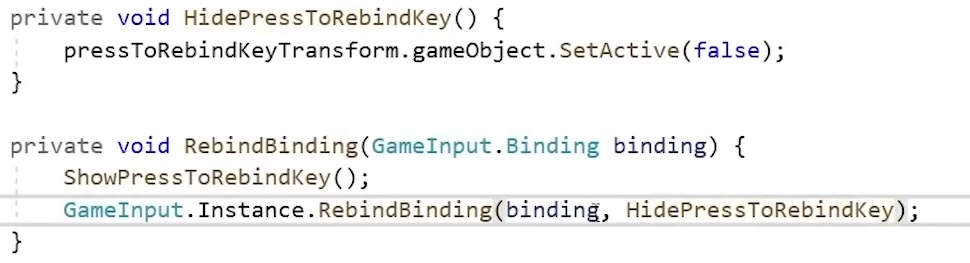

可以用Lambda表达式，传一些方法过去，打包成一个方法传过去，那边依次执行，隐藏自己的同时更新UI

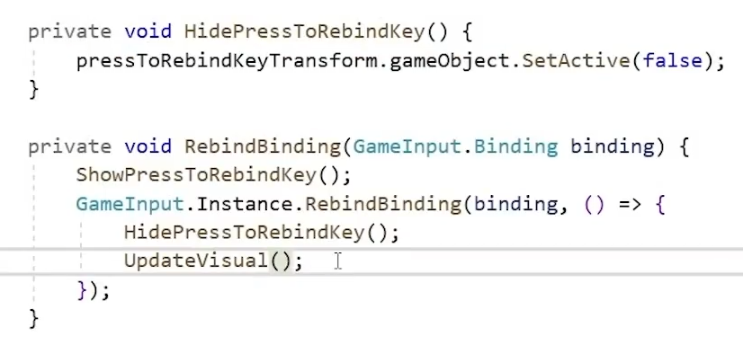

、

6.补全其他的监听

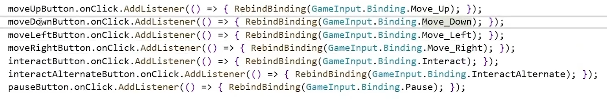

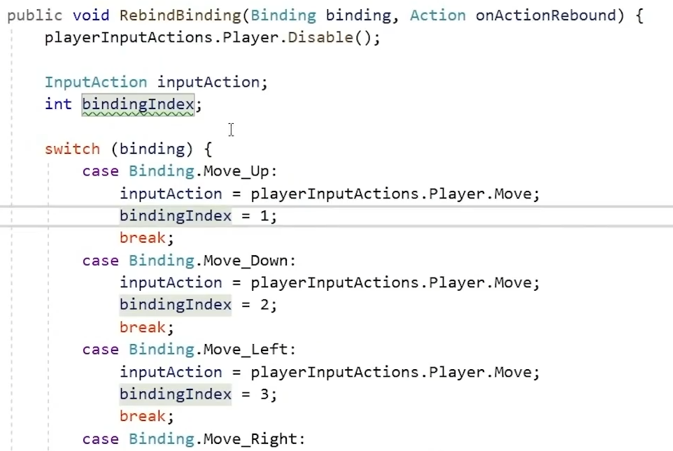

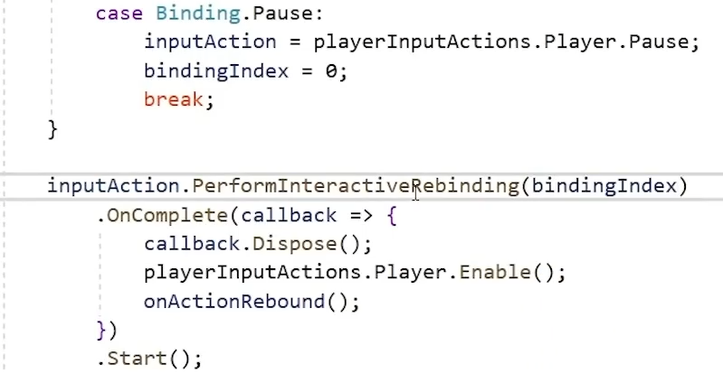

6.如何保存重绑定呢？

可以用PlayerPrefs

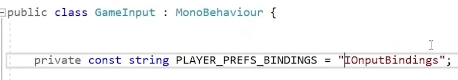

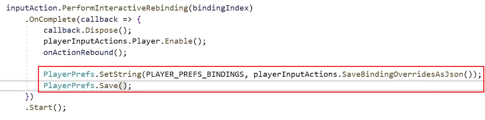

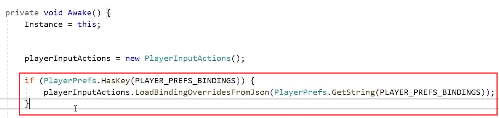
