# 7.全新InputSystem

首先重构输入代码，将输入代码从PlayerControl剥离出去

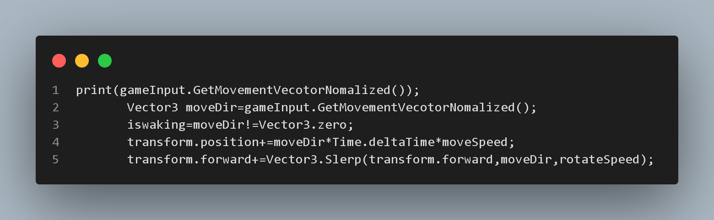

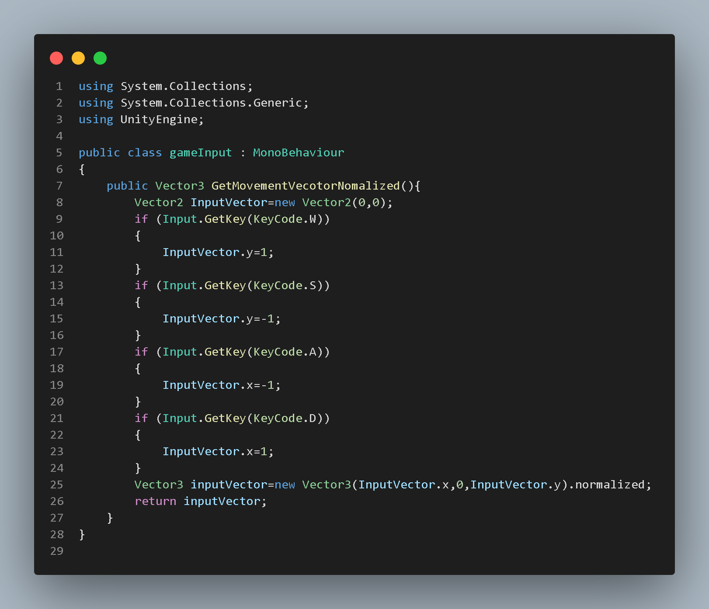

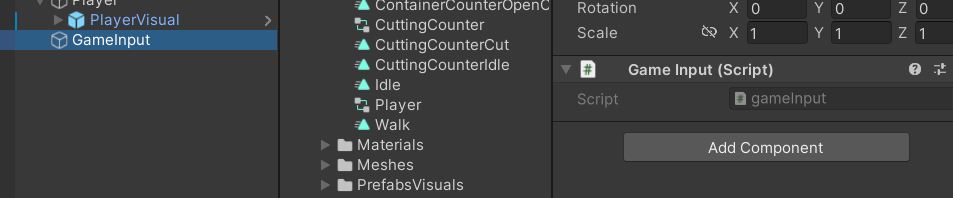

安装新的input

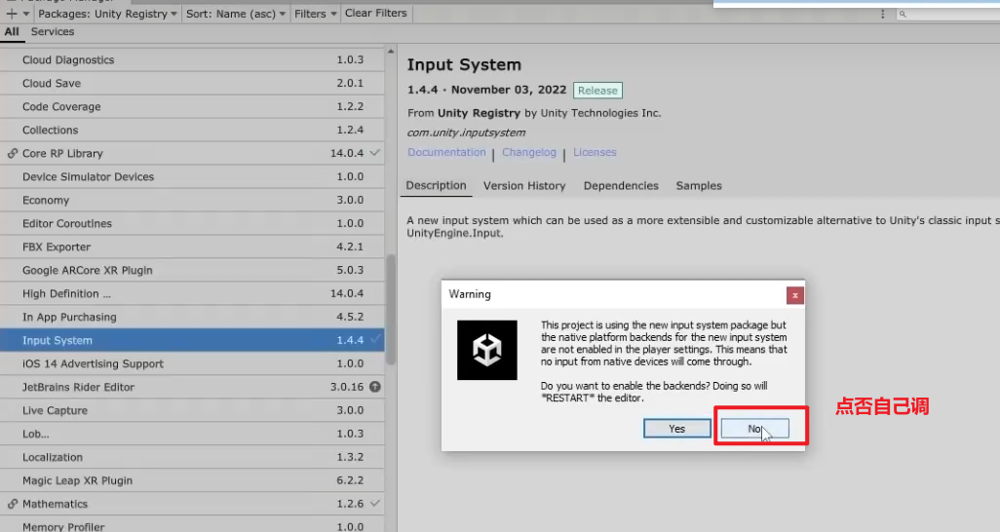

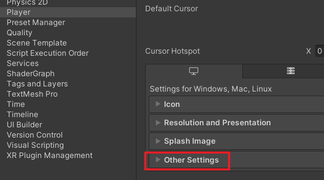

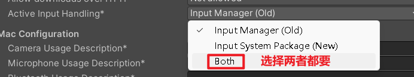

方法一：

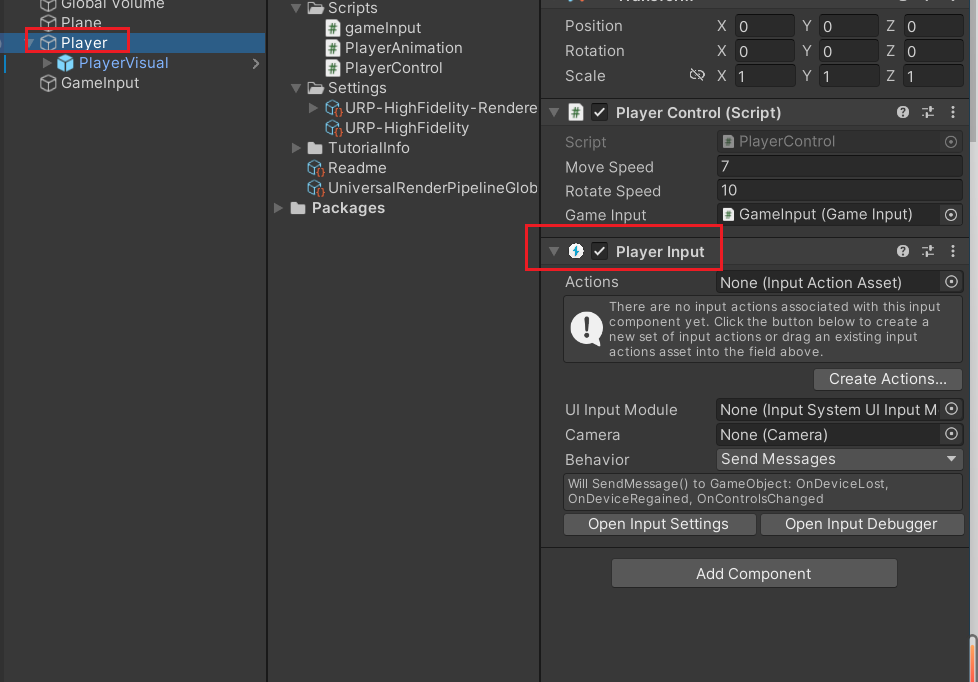

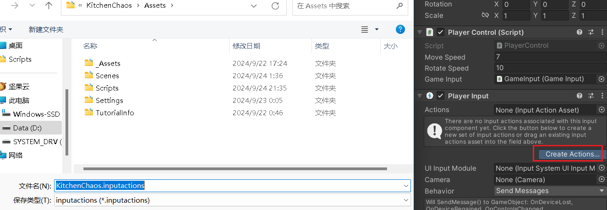

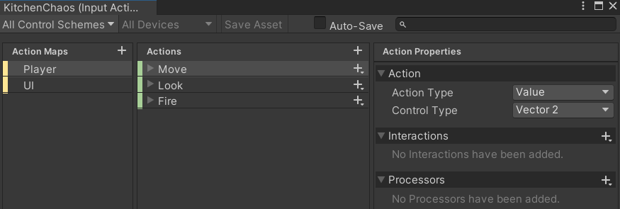

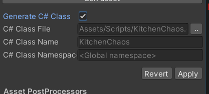

方法二：创建一个.inputactions文件来定义游戏控制的映射（如按键、触摸、手柄）

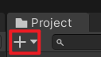

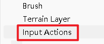

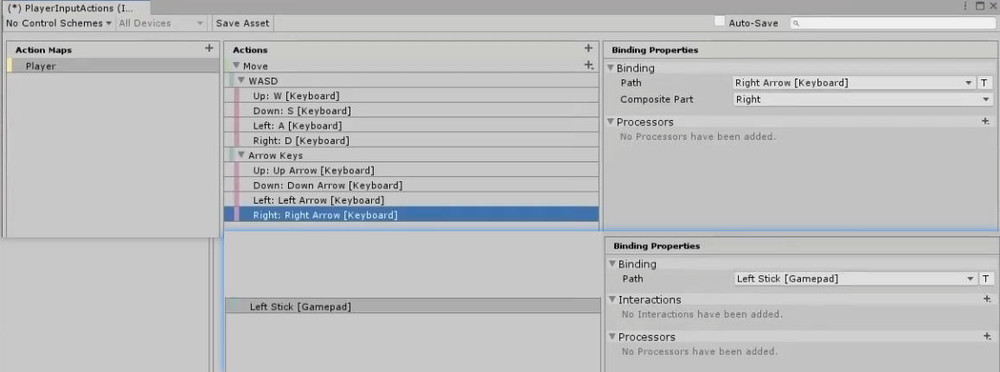

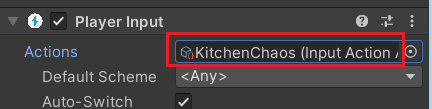

1. **添加绑定（Add Binding）**：用于添加一个简单的输入绑定。你可以将某个按键或输入设备的操作绑定到一个特定的动作上。
2. **添加正/负绑定（Add Positive/Negative Binding）**：用于添加一个输入绑定，可以处理正负两种输入。例如，处理摇杆的左右移动或按键的按下和释放。
3. **添加一个修饰符的绑定（Add Binding With One Modifier）**：用于添加一个带有一个修饰符的输入绑定。修饰符通常是指需要同时按下的另一个按键，例如Ctrl、Shift或Alt。
4. **添加两个修饰符的绑定（Add Binding With Two Modifiers）**：用于添加一个带有两个修饰符的输入绑定。例如，需要同时按下Ctrl和Shift再按下某个按键才能触发的操作。

1. **绑定（Binding）**：
    - 点击“绑定”旁边的加号（+）按钮，添加一个新的绑定。
    - 选择你想要绑定的输入设备和按键。例如，可以选择键盘上的某个按键或游戏手柄上的按钮。
2. **交互（Interactions）**：
    - 点击“交互”旁边的加号（+）按钮，添加一个交互类型。
    - 交互类型可以是“按下”、“长按”等，这些选项可以帮助你定义输入的具体行为。例如，选择“按下”可以设置按键被按下时触发的动作。
3. **处理器（Processors）**：
    - 点击“处理器”旁边的加号（+）按钮，添加一个处理器。
    - 处理器用于修改输入值，例如，可以添加一个“归一化”处理器来将输入值标准化。

生成一个按键控制的类

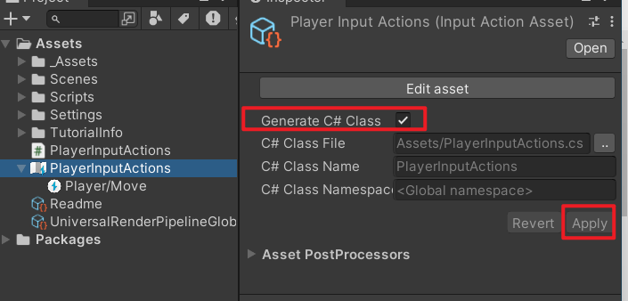

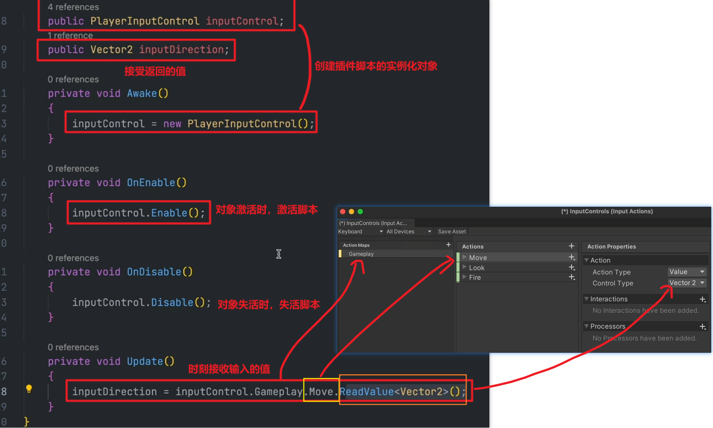
